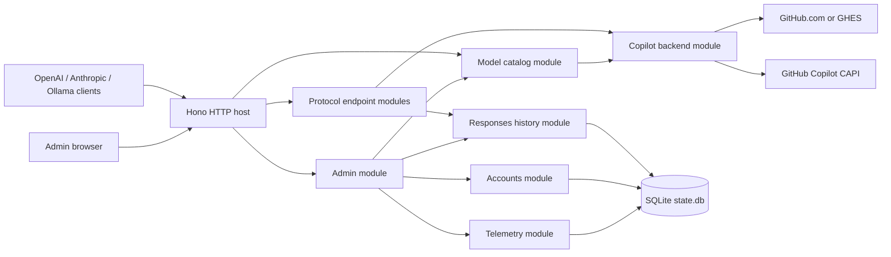
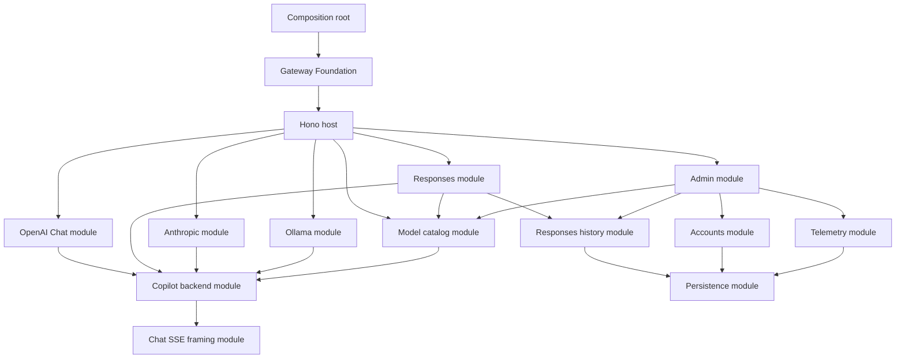

# ghc-gateway 目标架构

## 1. 文档定位

本文定义 ghc-gateway 重构后的模块、接口、状态归属、路由、依赖方向和运行时技术栈。
它不重复协议字段映射；以下生产规范仍是可观察行为的唯一来源：

- [Ollama Chat → Chat Completions](./ollama_chat_to_chat_completions.md)
- [Anthropic Messages → Chat Completions](./claude_messages_to_chat_completions.md)
- [OpenAI Chat Completions native proxy](./openai_chat_completions.md)
- [OpenAI Responses → Chat Completions](./codex_response_to_chat_completions.md)
- [OpenAI Responses 上游路由](./openai_responses_routing.md)
- [GitHub Copilot 模型列表](./github_copilot_model_listing_apis.md)
- [Gateway HTTP contracts](./gateway_http_contracts.md)

`docs/cc-switch/` 和 `docs/litellm/` 是来源说明，不是运行时 profile。架构与生产规范冲突时，
生产规范优先。

## 2. 决策摘要

| 范围 | 决策 |
| --- | --- |
| Runtime | Node.js 24 LTS，ESM |
| 语言 | strict TypeScript |
| HTTP framework | Hono + `@hono/node-server` |
| 上游 HTTP | Undici；CAPI models 使用低层 `request`，其他请求按协议选择 `fetch`/`request` |
| 管理前端 | Svelte 5 + Vite + TypeScript，静态构建 |
| 持久化 | SQLite WAL + `better-sqlite3`，显式 SQL migration |
| 流模型 | `AsyncIterable` + Web `ReadableStream`，pull-based backpressure |
| JSON | 保留 object member 顺序和 number lexeme 的 wire JSON module |
| Runtime validation | Protocol 使用显式 WireJson decoder；Admin/config 使用 TypeBox，不 coercion |
| 日志 | 结构化 JSONL；10 MiB × 5，且文件最长保留 7 天 |
| 分发 | npm；运行时只有一个 Node.js 进程 |

选择 Hono 的原因是它以 Web Standard `Request`/`Response` 为 interface，TypeScript 支持好，
核心较小，并且不会要求协议 module 依赖 framework-specific context。Hono 只负责路由和
middleware；协议精确字节输出不使用会改变序列化结果的便捷 JSON/SSE helper。

管理前端不使用 SvelteKit server。Vite 构建后的静态文件由同一个 Hono app 提供，因此后台运行时
没有第二个 JavaScript server。

### 2.1 项目身份与命令

- 项目名称：`ghc-gateway`。
- npm package：`@ljie-pi/ghc-gateway`，初始版本 `0.1.0`。
- npm 只发布一个 executable：`ghcg`。
- 新实现不保留 `ghcp-ollama`、`ghcp-gateway`、`ghcpo`、`ghcpo-server` 或同名 alias。
- 默认 data directory 为 `~/.ghc-gateway`，环境变量统一使用 `GHC_GATEWAY_` 前缀。

CLI 使用一个 executable 和分组 subcommands：

```text
ghcg serve
ghcg start
ghcg stop
ghcg restart
ghcg status
ghcg auth login [--host <domain>]
ghcg auth login poll <flow-id>
ghcg auth logout [--account <account-id>]
ghcg auth status
ghcg accounts list
ghcg accounts use <account-id>
ghcg accounts remove <account-id>
ghcg models list [--account <account-id>]
ghcg models current
ghcg models set <model-id>
ghcg config get [key]
ghcg config set <key> <value>
ghcg admin open
```

所有 commands 接受 global `--data-dir`，locator priority 为
`--data-dir > GHC_GATEWAY_DATA_DIR > ~/.ghc-gateway`；不扫描其他目录或端口。只有 `serve/start` 接受
`--port` 与 `--log-level`。

`serve` 在前台运行并处理 graceful shutdown。`start` 自行启动一个 detached daemon；
`stop/restart/status` 使用 PID、process start time、instance nonce 和认证的 loopback control
endpoint 验证进程身份，不能只凭 PID 终止进程。只有一个 daemon 进程，不保留 watchdog，也不自动
重启。Web 管理页面是配置与监控的主要交互界面；CLI 负责进程、认证、账号、模型、配置和自动化。
Foreground `serve` 写 stderr；daemon 写结构化 JSONL，单文件最大 10 MiB，最多 5 个文件且最长
保留 7 天。Admin Events 读取 SQLite Operational Events，不直接 tail log files。

Control routes 与 public routes 共用同一个 loopback listener，使用 protected
`X-GHCG-Control-Token`/`X-GHCG-Instance-Nonce`。Linux、Windows、macOS 的 process-start identity、
stale/conflict/unreachable 状态和 10 秒 graceful-then-verified-force-stop 算法由 master spec 固定。
Foreground `serve` 与 managed daemon 都发布 protected runtime identity；auth/accounts/models/config/
admin CLI commands 只调用运行中 gateway 的 control transport，不在第二个进程中打开 SQLite 或 secret
file。`stop/restart` 只管理 detached daemon。

这是 clean break：不读取或导入旧 data path，用户必须重新登录和配置。README 在代码、CLI 和
cutover 行为完成后统一更新，避免文档先于可运行行为。

## 3. 设计目标

1. 完整支持七份生产规范，不用公共抽象改写协议特有语义。
2. raw HTTP/SSE、typed Chat chunks、协议状态机和 downstream wire serialization 各自有明确归属。
3. 每个请求的状态独占；跨请求状态只能通过显式 interface 修改。
4. 同一 GitHub Copilot backend 提供 Chat Completions 与 native Responses；Responses planner 决定
   直接调用 native endpoint，还是使用 Chat bridge。
5. 协议代码按行为纵向聚合，避免 `controllers/services/repositories` 式横向跳转。
6. 公共 interface 小而深，调用者不需要了解 tool、reasoning、terminal 或 serializer 内部状态。
7. 缓存、history、日志、指标和流队列全部有界。
8. GitHub.com 与 GHES 使用同一个 account model，但凭据、OAuth URL 和 REST URL 按环境正确派生。
9. Web 配置与监控不绕过应用 module，也不读取或返回 secret。

## 4. 非目标

- 不实现用户可任意切换的 protocol profile、按名称猜测 capability 或 legacy compatibility branch；
  允许由固定 model routing metadata 决定 native Responses/Chat bridge。
- 不创建会丢失信息的通用 message/canonical model。
- 不提供动态 protocol plugin loader。
- 不支持未被生产规范定义的 `/responses`、`/models` 或 compact aliases。
- 不引入 Redis、PostgreSQL、ORM、消息队列或第二个后台进程。
- 不把 Hono、SQLite driver 或 Undici 包装成没有第二个实现的通用 framework interface。
- 不在 architecture layer 统一各协议的公开错误 DTO。
- 首版不支持多进程或多实例共享可变状态。

## 5. 公开路由

### 5.1 推理与模型路由

| Method | Route | 协议 | 行为 |
| --- | --- | --- | --- |
| `POST` | `/v1/chat/completions` | OpenAI Chat Completions | 原生 Chat 路径；stream 为 OpenAI SSE |
| `POST` | `/v1/responses` | OpenAI Responses | 按 model metadata 选择 native Responses 或 Chat bridge |
| `POST` | `/v1/messages` | Anthropic Messages | 转换为 Chat；返回 Anthropic JSON/SSE |
| `GET` | `/v1/models` | OpenAI/Anthropic Models | 默认 OpenAI shape；存在 `anthropic-version` 时为 Anthropic shape |
| `POST` | `/api/chat` | Ollama Chat | 转换为 Chat；返回 Ollama JSON/NDJSON |
| `GET` | `/api/tags` | Ollama List Models | 同一 Copilot model catalog 的 Ollama 表示 |
| `GET` | `/api/version` | Ollama probe | 只提供兼容版本信息，不参与模型转换 |

路由一致性服从“协议事实标准优先”：

- OpenAI 和 Anthropic-compatible routes 使用 `/v1/...`。
- Ollama 官方协议使用 `/api/...`，不增加 `/v1/ollama/...` 这类非标准 alias。
- 不注册 `/models`、`/responses`、`/openai/v1/responses`、`/claude/v1/messages`、
  `/v1/responses/compact` 或尾斜杠 alias。
- Query string 不参与 route 匹配；是否允许具体 query 由对应生产规范决定。
- 首版 listener 固定为 loopback；全部 inference routes 不要求 gateway API key。
- 所有首字节前的解析、限制、admission、timeout 和 error presenter 行为由
  [Gateway HTTP contracts](./gateway_http_contracts.md) 统一定义。

### 5.2 管理与运行状态路由

| Method | Route | 用途 |
| --- | --- | --- |
| `GET` | `/admin/*` | Svelte 静态管理页面 |
| `POST` | `/admin/api/v1/auth/bootstrap` | 一次性 token 换取 Admin Session |
| `GET` | `/admin/api/v1/auth/session` | 当前 Admin Session 与 CSRF metadata |
| `POST` | `/admin/api/v1/auth/logout` | 注销当前 Admin Session |
| `GET` | `/admin/api/v1/status` | 版本、uptime、认证状态、活动请求和资源概览 |
| `GET` | `/admin/api/v1/usage` | 按小时聚合的 request/token/error/latency 数据 |
| `GET`/`PUT` | `/admin/api/v1/config` | 读取和 revision-CAS 更新 runtime config |
| `GET` | `/admin/api/v1/accounts` | 账号与默认账号列表 |
| `POST` | `/admin/api/v1/device-flows` | 启动 github.com/GHES device flow |
| `GET` | `/admin/api/v1/device-flows/:flowId` | 轮询 device flow |
| `DELETE` | `/admin/api/v1/accounts/:accountId` | 移除 credential/preference/cache，保留 identity/usage |
| `PUT` | `/admin/api/v1/accounts/default` | 原子切换默认账号 |
| `GET` | `/admin/api/v1/models` | 指定账号的 catalog 与 preferred model |
| `POST` | `/admin/api/v1/models/refresh` | 显式失效指定账号的 model catalog |
| `PUT` | `/admin/api/v1/models/preferred` | revision-CAS 更新账号 preferred model |
| `GET`/`DELETE` | `/admin/api/v1/history` | Responses History 使用量和显式清理 |
| `GET` | `/admin/api/v1/events` | 分页读取 Operational Events |
| `GET` | `/admin/api/v1/events/stream` | 管理页面单向监控 SSE |
| `GET` | `/healthz` | 进程存活 |
| `GET` | `/readyz` | SQLite、配置和必要依赖是否完成初始化 |

管理接口使用独立的 `/admin/api/v1` namespace，不能与兼容协议 route 混用 middleware 或错误
envelope。UI 固定提供 Overview、Accounts、Models、Configuration、Responses History 和 Events
六个视图。

## 6. 系统上下文



OpenAI Chat、Anthropic、Ollama 以及 Responses 的 bridge plan 调用 Chat Completions upstream；
Responses native plan 直接调用 GitHub Copilot Responses upstream。Chat DTO 只是在 bridge 路径中的
wire pivot，不是把所有下游协议统一成同一种 domain model。

## 7. 总体 module 设计

采用“最小 Gateway interface + 显式协议纵向 modules”：



依赖只能沿箭头方向。Protocol modules 不 import Hono、SQLite、`process.env` 或具体 HTTP client。

### 7.1 Gateway Foundation

Gateway Foundation 是进程对外的 deep module：

```ts
export interface Gateway {
  fetch(request: Request): Promise<Response>;
  close(): Promise<void>;
}

export async function createGateway(
  config: Readonly<GatewayConfig>,
  routes: readonly RouteRegistration[],
  dependencies: Readonly<GatewayDependencies>,
): Promise<Gateway>;
```

`fetch` 后隐藏：

- 路由和 middleware；
- request scope 与 cancellation；
- account binding；
- 所有协议转换和 stream state；
- GitHub/Copilot transport；
- history 与 catalog cache；
- exact wire serialization；
- 管理 API 和静态资源。

`close()` 幂等。它停止接收新请求、取消在途 upstream、等待有界 grace period，然后关闭 HTTP pool、
SQLite 和日志资源。

Gateway Foundation 通过 additive optional mount 接入管理面，而不修改协议 `RouteRegistration`：

```ts
export interface AdminRequestContext {
  readonly requestId: string;
  readonly signal: AbortSignal;
  readonly listenerOrigin: LoopbackOrigin;
  readonly activity: GatewayActivity;
}

export type LoopbackOrigin = `http://127.0.0.1:${number}`;

export interface AdminModule {
  handle(request: Request, context: Readonly<AdminRequestContext>): Promise<Response>;
  mintBootstrap(): AdminBootstrapResult;
  close(): void;
}

export type AdminBootstrapResult =
  | { readonly kind: "issued"; readonly token: string; readonly expiresAt: string }
  | { readonly kind: "capacity" }
  | { readonly kind: "closed" };

export interface AdminStaticModule {
  handle(request: Request, signal: AbortSignal): Promise<Response>;
}
```

`GatewayDependencies` 可选接受 `admin?: AdminModule` 与 `adminStatic?: AdminStaticModule`。现有 callers 省略
它们时行为不变；`RouteRegistration.body` 仍只有 `"none" | "wire-json-object"`，已实现 protocol factories
与 wire behavior 不变。

Host 在 protocol route matching 前把 exact `/admin/api/v1` 与 `/admin/api/v1/*` 交给
`AdminModule.handle`。RM-21 的 `adminStatic` 只在 Admin API matching 后处理 `GET /admin/*`；未匹配的
`/admin/api/v1/*` 永远不能变成 SPA HTML。Host 拥有 Admin request ID、caller/shutdown abort 和 active
listener Origin；Admin module 从 `RuntimeConfigStore` 捕获当前 body limit，并拥有管理 JSON parsing、TypeBox
validation、authentication、error envelope 与 SSE lifecycle。

### 7.2 Protocol endpoint modules

每个公开推理协议导出 endpoint 与 failure presenter，并由 Gateway Foundation 显式注册：

```ts
export interface DecodedHttpRequest {
  readonly url: URL;
  readonly headers: Headers;
  readonly body?: WireJsonObject;
}

export type ProtocolEndpoint = (
  request: Readonly<DecodedHttpRequest>,
  scope: Readonly<RequestScope>,
) => Promise<Response>;

export type FailurePresenter = (
  failure: Readonly<GatewayFailure>,
  requestId: string,
) => Response;

export interface RouteRegistration {
  readonly method: "GET" | "POST" | "PUT" | "DELETE";
  readonly path: string;
  readonly admission: "none" | "inference";
  readonly body: "none" | "wire-json-object";
  readonly presentFailure: FailurePresenter;
  readonly endpoint: ProtocolEndpoint;
}
```

```ts
createOpenAiChatRoute(dependencies): RouteRegistration;
createResponsesRoute(dependencies): RouteRegistration;
createAnthropicMessagesRoute(dependencies): RouteRegistration;
createOllamaChatRoutes(dependencies): readonly RouteRegistration[];
```

这四个 factories 具有相同调用形状，但不继承 `BaseAdapter`，也不要求内部实现同一组
`convertRequest/parseResponse/parseStreamChunk` methods。统一调用形状来自 Fetch interface，
不是人为统一协议语义。

每个 endpoint module 内部隐藏：

1. request decoding 和协议特有 validation；
2. upstream execution planning；
3. 需要 bridge 时的 request/response conversion；
4. native 或 bridge stream request-local state；
5. protocol/native wire encoder；
6. protocol公开错误映射；
7. exact clock/UUID/token-counter 调用时机。

Gateway Foundation 拥有 body read、WireJson parse、admission 和 commit boundary。各 Protocol Endpoint
Module 拥有自己的 failure presenter；需要 single header 的协议以 exact value 校验，Fetch 合并后的
duplicate value 无法通过。Hono route 只做显式注册：

```ts
registerRoute(app, createResponsesRoute(dependencies));
```

固定 route 数量较少，显式注册比 protocol registry 更易读。增加第五种协议时新增一个纵向 module 和
一条 route，不修改现有协议 implementation。

### 7.3 Request scope

```ts
export interface RequestScope {
  readonly requestId: string;
  readonly signal: AbortSignal;
  readonly config: Readonly<RuntimeConfigSnapshot>;
}
```

Scope 只包含所有请求都真正需要的宿主信息，并在 admission 时捕获 immutable runtime config。
Protocol-specific context、ToolContext、reasoning
configuration、original request 和 stream cursors 留在对应 protocol module，不能加入
`RequestScope`。

### 7.4 Responses request planning

Responses module 内部必须有一个明确的 request-planning seam；不能让 converter 自行读取 model
catalog、默认模型或全局配置。[Responses 上游路由规范](./openai_responses_routing.md) 独占
`planResponsesExecution(request, resolvedModel, target)` 与
`NativeResponsesPlan | ChatBridgePlan` 的 canonical definitions；本文件不重新定义 prepared plan。

Execution order 是：decode request → bind one account → capture its catalog → resolve one model → bind the same
account's Copilot target → plan once。Alias、默认模型或 deployment mapping 不得在 planning 后再次改变
model；不得按 `gpt-*`、vendor 或 hostname 猜测。

Native plan 复用 canonical plan 中的 original request、ResolvedModel、URL 和 stream flag，不访问本地
history 或 Chat converter。

ChatBridgePlan 继续严格执行原顺序：

1. 保存客户端显式 `prompt_cache_key`；
2. 调用 Responses history enrichment；
3. 把 planning 前唯一解析的 `ResolvedModel.upstreamModel` 同步写入 request 与 request context；
4. 构造 immutable ToolContext；
5. 从 provider/model 配置解析 ReasoningConfig；
6. 调用纯 request converter；
7. 根据已绑定 target 的 host/path 注入 prompt cache key。

Chat request、ResponseContext 与 StreamContext 由 bridge request conversion slice 构造，不属于 planner
output。Shared Responses DTO/decoder 在 planner、native、history 和 bridge 之前只有一个 owner。

Request、response 和 stream contexts 保持协议规范规定的独立类型；不得合并成通用
`ProviderContext` 或 `Capabilities`。

## 8. Copilot backend module

Copilot backend 是协议 modules 使用的唯一 remote seam：

```ts
export interface CopilotBackend {
  bind(
    account: Readonly<BoundAccount>,
    signal: AbortSignal,
  ): Promise<BoundCopilot>;
}

export interface BoundCopilot {
  readonly accountId: AccountId;
  readonly target: Readonly<CopilotTarget>;

  completeChat(request: Readonly<ChatRequest>): Promise<ChatResponse>;
  openChatStream(request: Readonly<ChatRequest>): Promise<UpstreamByteStream>;
  completeResponses(
    request: Readonly<NativeResponsesUpstreamRequest>,
  ): Promise<UpstreamByteResponse>;
  openResponsesStream(
    request: Readonly<NativeResponsesUpstreamRequest>,
  ): Promise<UpstreamByteStream>;
}
```

`AccountDirectory.bindDefault()` 在一次请求内先选择并固定 `BoundAccount`；model catalog 与
`CopilotBackend.bind(account, signal)` 必须消费同一个 account。返回的 `BoundCopilot` 固定 credential
和 target；请求执行期间默认账号变化不能影响它。

Production adapter 隐藏：

- GitHub.com/GHES credential 选择；
- Copilot token 刷新；
- CAPI endpoint discovery 和 fallback；
- 固定出站 headers；
- timeout、redirect、取消和连接复用；
- secret redaction；
- `/chat/completions` 与 `/responses` URL 构造。

Tests 使用 scripted adapter，分别返回 Chat JSON、native Responses JSON，或可按 byte boundary
控制的 upstream stream。

Model catalog 通过独立、较窄的 source seam 获取 CAPI 数据，不扩大推理 interface：

```ts
interface CopilotModelsSource {
  fetch(
    accountId: AccountId,
    signal: AbortSignal,
  ): Promise<CapiModelsResponse>;
}
```

Production adapter 复用同一 credential provider 和 HTTP pool；tests 使用 scripted source。

### 8.1 Credential provider internal seam

模型目录规范要求的 credential interface 保留为 Copilot backend 的内部 seam，并补充取消参数：

```ts
interface CopilotCredentialProvider {
  resolveDefaultAccountId(signal: AbortSignal): Promise<AccountId | null>;
  getValidTokenForAccount(
    accountId: AccountId,
    signal: AbortSignal,
  ): Promise<SecretToken>;
  getApiEndpointForAccount(
    accountId: AccountId,
    signal: AbortSignal,
  ): Promise<string>;
}
```

账号不存在、credential 无效、token endpoint 401、网络错误和 timeout 必须保持不同错误类别。
Protocol modules 不知道 token 的存储方式。

## 9. Streaming 架构

### 9.1 Pipeline

Chat bridge pipeline：

```text
upstream Uint8Array
  -> incremental UTF-8 decoder
  -> SSE framer
  -> SSE event
  -> Chat SSE decoder
  -> ChatStreamFrame
  -> protocol-local stream state
  -> protocol-local wire encoder
  -> downstream Uint8Array
```

Native Responses pipeline：

```text
upstream Responses SSE Uint8Array
  -> Responses SSE framing
  -> native event validation
  -> output-index item-ID normalization
  -> Responses SSE encoder
  -> downstream Uint8Array
```

Native Responses 不进入 Chat SSE decoder，也不重新构造 Chat-bridge Responses item lifecycle。
它只按 `output_index` 把 sub-event 和 `output_item.done` 的 ID 统一到
`output_item.added.item.id`，其余 event fields、usage 和 ordering 保持不变。Client abort 和
backpressure 仍由同一个 stream pump 管理。

```ts
export type ChatStreamFrame =
  | { readonly kind: "chunk"; readonly chunk: ChatChunk }
  | { readonly kind: "error"; readonly value: WireJson | string }
  | { readonly kind: "done" };
```

Async iterator 正常结束与 `kind:"done"` 是不同信号。这样可以同时表达：

- Ollama 对 `[DONE]`、truncation 和唯一 terminal owner 的要求；
- Anthropic 的 `start/consume/finish` lifecycle；
- Responses ChatBridgePlan 的 typed chunk iterator 与 item lifecycle；
- OpenAI Chat 对 shared typed Chat frames 的低开销 OpenAI SSE re-encoding。

Raw SSE module 只处理 bytes、UTF-8、BOM、换行、field、multi-data、error frame 和 `[DONE]`。
它不生成 Ollama、Anthropic 或 Responses object。Bridge typed converters 永远不读取 `data:` 或
残余 UTF-8 bytes。Native Responses 使用独立的 Responses SSE parser 和 stream-scoped item-ID map。

### 9.2 Backpressure 与取消

所有 stage 使用 pull-based `AsyncIterable`，一次最多向前读取一个尚未消费的 item。将 iterator
转换成 `ReadableStream` 时，`pull()` 才调用 `iterator.next()`；不创建无界 event queue。

客户端断开时：

1. abort request scope；
2. 取消 upstream fetch；
3. 调用当前 iterator 的 `return()`；
4. 释放 decoder、protocol state 和 timer；
5. 不再输出 error 或 success terminal。

任何 module 都不能通过 callback 在 writer 未消费前继续积压 chunks。

### 9.3 Response commit

Stream writer 显式跟踪 `responseCommitted`：

- 首个 downstream byte 前失败：返回该协议的普通 HTTP error。
- 首个 byte 后失败：由对应 protocol module 决定是否追加协议内错误或直接关闭。
- Client abort：所有协议都直接关闭，不追加任何 bytes。

| 协议 | 已开始输出后的失败 |
| --- | --- |
| Ollama | 非 abort 时恰好追加一个安全 NDJSON error；不再输出 `done:true` |
| Anthropic | 关闭连接；不合成 `event:error` 或 `message_stop` |
| Responses Chat bridge | 关闭连接；不合成 `response.failed` |
| Responses native | 关闭连接；不把 native failure 改写成 Chat bridge events |
| OpenAI Chat | 关闭连接；不合成 `[DONE]` |

### 9.4 Protocol-local terminal ownership

- Ollama reducer 是 `Done` 的唯一消费者和 terminal owner。
- Anthropic converter 维护 start、active block、pending finish/usage 和 exactly-once stop。
- Responses Chat bridge converter 独立维护 response、reasoning、message、tool item、output index
  和 `sequence_number`。
- Responses native stream 不创建 bridge state machine，也不读写本地 Responses history。
- OpenAI Chat stream 采用 native fast path，但仍经过 shared incremental Chat SSE parser 和 OpenAI
  re-encoder；不做 byte-blind passthrough，也不创建其他协议的状态机。

这些状态机不能合并成通用 `StreamTransformer`。

## 10. JSON 与 DTO

### 10.1 Wire JSON

普通 `JSON.parse()` 会重排 integer-like object keys，并把所有 JSON number 转为 JavaScript
`number`。这不足以满足 ordered arguments、canonical JSON 和 byte golden 要求。

HTTP body reader 因此输出保留 member 顺序和 number lexeme 的语法 AST：

```ts
export type WireJson =
  | null
  | boolean
  | string
  | { readonly kind: "number"; readonly lexeme: string }
  | { readonly kind: "array"; readonly items: readonly WireJson[] }
  | {
      readonly kind: "object";
      readonly members: readonly Readonly<{
        key: string;
        value: WireJson;
      }>[];
    };
```

Wire JSON module 是 in-process deep module，负责：

- 有界解析；
- source member order；
- missing/null/false/0/empty 的区分；
- compact JSON；
- Unicode code-point canonical key sort；
- ordered object serialization；
- 将通过验证的值转换成 protocol DTO。

它不是 protocol canonical model。Protocol modules 仍直接从自己的 request DTO 转到 Chat DTO。

### 10.2 TypeScript 约束

至少启用：

```json
{
  "strict": true,
  "noUncheckedIndexedAccess": true,
  "exactOptionalPropertyTypes": true,
  "useUnknownInCatchVariables": true,
  "noImplicitOverride": true,
  "verbatimModuleSyntax": true
}
```

- Event、frame、error category 和 state phase 使用 discriminated unions。
- `unknown` 只允许出现在 HTTP、SQLite JSON 和 remote response seams。
- 不使用 `as any` 或宽泛 coercion 绕过协议 validation。
- 不用 Zod/TypeBox 的默认 coercion 替代规范中的精确转换规则。
- 只有规范明确要求透传动态字段时使用 `Record<string, unknown>`。

### 10.3 Serializer locality

不同 wire behavior 留在协议 module：

- Ollama：Go-compatible field order、`omitempty`、HTML escaping、RFC3339Nano 和每 object 一个 LF。
- Anthropic：Python default `json.dumps` spacing、`ensure_ascii=true` 和精确 SSE event 文本。
- Responses Chat bridge：Responses event envelope、managed IDs、item ordering 和严格递增 sequence。
- Responses native：保留上游 usage/events，只归一化同一 output index 的 item IDs。
- OpenAI Chat：原生 JSON/SSE 和一个成功 `[DONE]`。

不能用一个全局 `serializeResponse(protocol, value)` 条件矩阵实现这些差异。

## 11. 协议 module 职责矩阵

| Module | Request-local state | Shared state | Downstream wire |
| --- | --- | --- | --- |
| OpenAI Chat | request planning、incremental Chat SSE parser 与 terminal | 无 | JSON / normalized OpenAI SSE |
| Responses native | resolved model、native request、output-index item-ID map | 无 | Native Responses JSON/SSE |
| Responses Chat bridge | original request、ToolContext、reasoning config、item states、IDs、sequence | Responses history | Converted Responses JSON/SSE |
| Anthropic | original model、active block、tool partial JSON、pending finish/usage、UUID | 无 | JSON / Anthropic SSE |
| Ollama | original model、finish、usage、content/reasoning fragments、sparse tools、clock | 无 | JSON / NDJSON |
| Model catalog | request-bound account、fetch generation | per-account catalog cache | OpenAI/Anthropic Models / Ollama Tags JSON |

协议规范明确引用同一算法时才共享 helper，例如指定的 tool-result media extraction。名称相似但
defaults、ordering、errors 或 bytes 不同的逻辑先保留在协议目录内。

## 12. Responses history

### 12.1 Interface

```ts
export interface ResponsesHistory {
  enrich(
    request: Readonly<ResponsesRequest>,
    signal: AbortSignal,
  ): Promise<ResponsesRequest>;

  record(
    record: Readonly<ResponsesHistoryRecord>,
    signal: AbortSignal,
  ): Promise<void>;
}
```

Admin 使用单独的 `ResponsesHistoryAdmin` interface 查询统计和清理，避免推理路径获得不需要的
管理能力。

该 module 只注入 Responses ChatBridgePlan。NativeResponsesPlan 使用上游
`previous_response_id`/`encrypted_content`，不访问本地 history。

### 12.2 持久化语义

- SQLite 是 source of truth，重启后 history 仍可恢复。
- 整个 store 最多 512 个 responses，按全局插入顺序淘汰。
- TTL 可配置，默认 7 天；过期记录在 lookup 时视为不存在。
- `previous_response_id` lookup 优先；call-ID fallback 只在全部未过期记录中唯一命中时使用。
- Response、ordered call items 和 call-ID index 在一个 transaction 中写入。
- 启动、lookup 和 record 时清理过期项；正确性不依赖后台 timer。
- 不增加 read-through memory cache，除非 profiling 证明 SQLite lookup 是瓶颈。

TTL、expiry lookup 和测试同时写入 Responses bridge 生产规范；architecture 不单方面覆盖协议行为。

建议 schema：

```text
responses(
  response_id,
  insertion_seq,
  created_at,
  expires_at,
  PRIMARY KEY(response_id)
)

response_calls(
  response_id,
  ordinal,
  call_id,
  kind,
  item_json,
  PRIMARY KEY(response_id, ordinal)
)

INDEX response_calls(call_id)
UNIQUE INDEX responses(insertion_seq)
INDEX responses(expires_at)
```

Chat bridge non-stream 在完整 Responses response 转换成功后、发送成功 body 前提交。Chat bridge
stream 在每个 Semantic Checkpoint 对应的 `response.output_item.done` 发送前同步提交 minimal
history，并在 `response.completed` 前完成最终事务；提交失败时不发送该 checkpoint 或成功 terminal。
已经发送的更早 events 不回滚，也不合成 `response.failed`。未完成的 token、reasoning 或 tool
argument fragments 不持久化，进程重启后不恢复当前 Stream Execution。

## 13. Model catalog

Model catalog 是独立 deep module：

```ts
export interface CopilotModelCatalog {
  get(accountId: AccountId, signal: AbortSignal): Promise<CatalogSnapshot>;
  invalidate(accountId: AccountId): void;
  clear(): void;
}
```

它隐藏：

- 对 credential provider 返回的 endpoint 字面追加 `"/models"`，不在 catalog module 解析、清理或
  规范化 endpoint；
- CAPI `/models` 请求和严格解析；
- account-scoped cache 与 generation；
- 无 TTL、无 single-flight 的固定行为；
- success-empty cache；
- invalidation 后旧在途请求不得写回；
- 30 秒 connect timeout、600 秒 total timeout；
- 使用 Undici 低层 `request`，不声明压缩编码且不自动解压响应；
- 最多 10 次 redirect 及跨 host/effective-port secret header stripping；
- 单个合法 `Retry-After`；
- 不公开的 Responses routing metadata：`mode` 与 `supported_endpoints`；
- `/v1/models` 的 OpenAI/Anthropic serializers 与 `/api/tags` serializer。

两个公开 routes 和三种 model serializers 始终读取同一 `CatalogSnapshot`，不维护静态模型表，
不排序、不去重。Responses native capability 只读取固定 routing metadata，不按模型名称或 vendor
推断。

OpenAI Chat、Anthropic Messages 和 Responses 共用一次性 model resolution：missing model 只使用当前
Bound Account 的 valid、仍可见 preferred model；显式 model 必须是 non-empty string 且精确存在于
captured catalog，否则返回 protocol-native 404 model-not-found，不静默 fallback。Ollama 保持其生产
规范要求的显式 non-empty model，不使用该 preference fallback。

`CatalogSnapshot.fetchedAt` 在每次成功 fetch 时只读取一次 clock。Logical
`DEFAULT_MODEL_CREATED_AT_TIME` 在 production 固定为 `1677610602`；tests 可注入替代值。该值只影响
`/v1/models` 的兼容字段，不参与 cache key，也不是 runtime config。

## 14. GitHub.com 与 GHES 环境

### 14.1 单一环境解析

用户只配置 GitHub domain。其他 URL 和 OAuth client ID 由 `GitHubEnvironmentResolver` 一次性
派生，避免多个环境变量互相矛盾：

```ts
export type GitHubEnvironment =
  | {
      readonly kind: "github.com";
      readonly host: "github.com";
      readonly webBaseUrl: "https://github.com";
      readonly apiBaseUrl: "https://api.github.com";
      readonly clientId: "Iv1.b507a08c87ecfe98";
    }
  | {
      readonly kind: "ghes";
      readonly host: string;
      readonly webBaseUrl: `https://${string}`;
      readonly apiBaseUrl: `https://${string}/api/v3`;
      readonly clientId: "Ov23li8tweQw6odWQebz";
    };
```

| 概念 | github.com | GHES |
| --- | --- | --- |
| `GITHUB_HOST` | `github.com` | 用户配置的 `<domain>`，可包含显式 port |
| `GITHUB_API_HOST` | `https://api.github.com` | `https://<domain>/api/v3` |
| `CLIENT_ID` | `Iv1.b507a08c87ecfe98` | `Ov23li8tweQw6odWQebz` |
| `DEVICE_CODE_ENDPOINT` | `https://github.com/login/device/code` | `https://<domain>/login/device/code` |
| `ACCESS_TOKEN_ENDPOINT` | `https://github.com/login/oauth/access_token` | `https://<domain>/login/oauth/access_token` |

`GITHUB_API_HOST` 表示 GitHub REST base URL，不是 Copilot CAPI endpoint。Copilot endpoint 仍按账号
通过 `/copilot_internal/user` discovery；失败时使用生产规范规定的 github.com/GHES fallback。

GHES input 只接受 domain 或 `domain:port`，不接受 path、query、fragment 或 embedded credentials。
OAuth 和 GitHub REST URLs 使用 `URL` 构造，不做字符串拼接。CAPI models URL 是生产规范要求的例外，
必须对已规范化 endpoint 字面追加 `"/models"`。

### 14.2 固定 Copilot client identity

访问 GitHub Copilot/CAPI 时使用以下固定 identity：

| 配置 | 值 |
| --- | --- |
| `editorInfo.name` | `vscode` |
| `editorInfo.version` | `1.110.1` |
| `editorPluginInfo.name` | `copilot-chat` |
| `editorPluginInfo.version` | `0.38.2` |
| `copilotIntegrationId` | `vscode-chat` |

对应 headers：

```http
copilot-integration-id: vscode-chat
editor-version: vscode/1.110.1
editor-plugin-version: copilot-chat/0.38.2
user-agent: GitHubCopilotChat/0.38.2
x-github-api-version: 2025-10-01
```

这些值集中定义在 Copilot backend module，不从客户端入站 headers 读取，也不允许管理页面单独修改。
需要 vision header 时，由协议 request analysis 产生 typed flag，再由 backend 添加固定
`Copilot-Vision-Request` header。

Native Responses 另外添加 `openai-intent: conversation-panel`、每请求唯一 `x-request-id`、
`x-vscode-user-agent-library-version: electron-fetch`、由 input 推导的 `x-initiator`，以及需要时的
vision header。它仍使用上表的新 client identity versions，不继承 LiteLLM 固定提交中的旧版本值。

### 14.3 Token 与 endpoint 生命周期

- Stable `AccountId` 由 normalized GitHub host 与 immutable numeric user ID 组成；login/display name
  变化不改变 identity。
- 默认最多保存 8 个 accounts，配置硬上限为 32。
- 每个 account 独立保存 preferred model。Catalog refresh 后该 model 不再可见时标记 invalid，并要求
  用户重新选择，不能静默选择第一项。
- github.com 使用有效 Copilot session token；剩余时间 `< 60s` 时按账号刷新，恰好 60 秒仍有效。
- GHES 使用保存的 GitHub OAuth token，不执行 Copilot token exchange。
- 同账号 token refresh 和 endpoint discovery 分别使用 mutex，并在锁内二次检查。
- 不使用全局 30 秒 refresh interval；按需刷新减少后台工作和常驻状态。
- endpoint discovery 的 cache/fallback 规则严格遵守模型目录生产规范。
- 删除账号时清除 credential、preferred model、endpoint 和 model catalog，但保留稳定 account
  metadata 与 Usage Buckets；同一 identity 再次登录时继续关联原统计。Responses History 当前为全局
  store，只能通过 retention policy 或显式 history clear 删除。Removed identity 在最后一个 retained
  Usage Bucket 过期后可清理；deterministic AccountId 仍保证未来重新登录得到同一 key。

## 15. Persistence 与配置

### 15.1 SQLite

一个 `state.db` 保存：

- schema migrations；
- 非 secret account metadata；
- 默认账号和模型 preference；
- Web 可修改配置及 revision；
- Responses History；
- Usage Buckets；
- Operational Events。

使用 WAL、`synchronous=FULL`、foreign keys、busy timeout、单一主线程 connection、prepared
statements 和短事务。不使用 ORM。事务内禁止网络 I/O 与大型 JSON transformation。
`better-sqlite3` 直接位于 persistence implementation 内；不创建只有一个 adapter 的
`DatabasePort`。

`node:sqlite` 达到 stable 前不作为 production dependency。若真实 workload 的 event-loop delay
p95 超过 10 ms，才评估将同一个 persistence implementation 移入 worker thread；迁移后必须重新通过
RSS gate，且 protocol interfaces 不变。

OAuth token、Copilot token 和其他 secrets 不存入普通 settings table。Secret storage 使用独立
`CredentialStore` seam；production adapter 在 `~/.ghc-gateway` 使用 atomic replace、Unix `0600`
或 Windows current-user-only ACL，tests 使用 memory adapter。

### 15.2 Runtime config

配置更新流程：

```text
parse
  -> validate complete candidate
  -> SQLite transaction with revision check
  -> build immutable runtime snapshot
  -> atomic snapshot swap
  -> invalidate only affected caches
```

失败时继续使用旧 snapshot，不能部分应用。Protocol stream 在开始时捕获 snapshot；请求进行中配置
变化不改变其行为。

配置来源分为：

- Startup config：`CLI > environment > default`，包括 port、data directory 和 log level，只在重启后
  生效。
- Runtime config：SQLite 是唯一 source of truth；环境变量只在首次初始化时 seed，包括资源限制与
  retention。Default account 与 per-account preferred model 使用独立 revisioned stores，不属于
  `RuntimeConfigSnapshot`。

### 15.3 Usage 与运行事件

Usage Bucket key：

```text
UTC hour + accountId + protocol + resolvedModel + outcome
```

每个 bucket 只保存 request/error counts、input/output/cache tokens、latency sum/max 和可计算的聚合
字段；不保存 request ID、prompt、response、tool arguments 或任意高基数 label。默认保留 90 天，
最多 100,000 rows，任一限制先到即清理。删除 credential 不删除 bucket；同一 stable account identity
重新登录后继续关联。

Operational Event 是脱敏 diagnostic metadata，写入 SQLite，默认保留 7 天且最多 512 条。它与
Responses History 不同，不能用于恢复协议上下文。

Semantic Checkpoint 同步等待 transaction commit。Usage Buckets 和 Operational Events 可由单 writer
合并为短批次；graceful shutdown 在有界时间内 flush，hard crash 可以丢失尚未提交的非关键批次。

## 16. 管理页面

### 16.1 技术栈

- Svelte 5；
- TypeScript；
- Vite；
- 纯静态 SPA；
- 不使用 SvelteKit server；
- 页面较少时不增加 client router，以 tabs/state 切换视图。

构建产物随 npm package 发布，由 Hono 提供 `/admin/*`。浏览器内存不计入 gateway daemon RSS；
关闭页面后后台不新增持久状态；Admin Session 仍按 idle/absolute timeout 管理。

### 16.1.1 管理面 module seam

管理面是同一进程中的独立纵向 module，不是 inference protocol，也不是第二个 server。`web/` 只调用
`/admin/api/v1/*`，不读取 SQLite、secret file 或 daemon identity。

`AdminModule.handle` 后隐藏 Admin Hono sub-app、bounded JSON body read、TypeBox no-coercion validation、Session/
CSRF/Origin、Admin envelope 和 monitoring SSE。Admin 不 import inference `WireJson`、protocol presenters、
protocol converters 或 `better-sqlite3`。

管理 use cases 只调用 Accounts、PreferredModelManager、RuntimeConfigStore、ResponsesHistoryAdmin 与
AdminTelemetry 的窄 interface。Gateway 通过每次 `AdminRequestContext.activity` 提供 GatewayActivity，避免
Admin/Gateway composition cycle：

```ts
export interface AdminTelemetry {
  queryUsage(query: Readonly<AdminUsageQuery>, signal: AbortSignal): Promise<AdminUsagePage>;
  queryEvents(query: Readonly<AdminEventQuery>, signal: AbortSignal): Promise<AdminEventPage>;
  replayEvents(afterEventId: string, signal: AbortSignal): Promise<AdminEventReplay>;
  snapshot(): AdminTelemetrySnapshot;
  subscribe(listener: (event: Readonly<AdminMonitorEvent>) => void): () => void;
}

export interface GatewayActivity {
  snapshot(): Readonly<{
    activeRequests: number;
    activeStreams: number;
    queuedRequests: number;
  }>;
}
```

`AdminTelemetry` 是 telemetry module 内的只读 adapter，复用 RM-05 已实现 schema、retention、sanitizer 与
performance state，不改变写入、batch 或 cleanup 行为。RM-20 给 `TelemetryRecorder` 与
`PerformanceWindows` 增加可选 in-process observer；无 observer 时 write/evaluate 路径与结果不变。
`subscribe` 只发布 sanitized Operational Event 与 performance transition；browser replay、queue 和
backpressure 仍由 `AdminModule` 拥有。

`GatewayActivity` 是 RM-20 在 Gateway 内增加的只读 instrumentation。它从既有 admission counts 读取 active/
queued request，并只在 response lifecycle 上增加 active-stream counter；无 Admin mount 时不创建 observer、
不增加 timer/queue，也不改变 response bytes、admission、abort 或 cleanup。Admin 只获得 snapshot，不获得
mutation capability。

### 16.2 功能

- GitHub.com/GHES device login；
- 账号列表、默认账号切换和删除；
- 默认模型和安全配置；
- model catalog 查看和显式 refresh；
- Responses history 数量、最旧/最新时间、TTL 和清理；
- 活动请求、活动 streams、请求/错误计数和延迟；
- 最近 7 天且最多 512 条 Operational Events。

实时状态使用 `/admin/api/v1/events/stream` SSE，不使用 WebSocket。事件只携带聚合状态，不携带 prompt、
response body、Authorization、OAuth token、Copilot token 或完整 upstream endpoint。

### 16.3 安全默认值

- Bind host 固定且仅允许 literal `127.0.0.1`；port 默认 `31400`，可由 startup config 设置。首版显式
  拒绝 non-loopback bind。
- Public inference routes 在 loopback 上不要求 gateway API key。
- 首次启动生成长期 random admin secret。`ghcg admin open` 取得 60 秒、一次性 bootstrap token，
  换取 `HttpOnly`、`SameSite=Strict` 的内存 Admin Session。
- Admin Session idle timeout 为 30 分钟，absolute timeout 为 12 小时，daemon 重启后全部失效。
- Bootstrap exchange 不要求已有 Admin Session/CSRF，但要求精确 Origin 与 valid one-use token；其他所有
  Admin 写请求同时验证 Admin Session、CSRF token 和精确 Origin。
- Static catch-all 只能位于 `/admin/*`，不能吞掉 `/v1/*`、`/api/*`、`/healthz` 或 `/readyz`。

Admin HTTP closure：

- `listenerOrigin` 由 active listener 在 validated startup port 上构造为 `LoopbackOrigin`，精确为
  `http://127.0.0.1:<startup-port>`，不能固定为默认 port 或接受调用方任意 string。
- JSON mutations 只接受 `application/json` 或显式 UTF-8 charset，以及缺失/单个 `identity`
  Content-Encoding；empty、malformed、non-object、unknown fields、unsupported media 或 body over-limit 都返回
  `400 validation_failed`。
- Admin module 在 request handling 开始时从 `RuntimeConfigStore.readSnapshot()` 捕获
  `limits.requestBodyBytes`，读到第一个超限 byte 时取消 reader；后续 config CAS 只影响后续请求。
- No-body routes 拒绝 nonempty body；每个 route 拒绝 unknown 或 duplicate query fields。
- 每个 Admin JSON/SSE response 设置 `Cache-Control: no-store` 与 gateway-generated `x-request-id`；JSON 使用
  `application/json; charset=utf-8`。入站 request ID 不回显。
- Client abort 和 Gateway close 取消 body reader、use case、catalog/device-flow operation 或 SSE subscription，
  且不再追加 bytes。Admin 不进入 inference admission，不使用 protocol presenter。
- `AdminModule.close()` 清 sessions/bootstrap tokens、subscribers 与 heartbeat。RM-19 control route 和 Admin HTTP
  必须引用同一个 `AdminModule` instance。`close()` 幂等；closed 后 `handle` fail closed，`mintBootstrap`
  返回 `kind:"closed"`。第九个 outstanding bootstrap 返回 `kind:"capacity"`；RM-19 把这两种结果映射为
  control `503 not_ready`，不泄露内部计数。

## 17. Error ownership

Runtime 可以使用内部 discriminated union 分类失败：

```ts
type GatewayFailure =
  | { kind: "invalid_request"; cause: unknown }
  | { kind: "unsupported_semantics"; cause: unknown }
  | { kind: "authentication"; cause: unknown }
  | { kind: "model_not_found"; cause: unknown }
  | { kind: "upstream_http"; status: number; retryAfter?: string }
  | { kind: "upstream_timeout"; cause: unknown }
  | { kind: "upstream_network"; cause: unknown }
  | { kind: "invalid_upstream_response"; cause: unknown }
  | { kind: "upstream_stream_truncated"; cause: unknown }
  | { kind: "aborted" }
  | { kind: "internal"; cause: unknown };
```

它不是公开、稳定的 `BridgeError` DTO。每个 protocol endpoint 在自己的 module 内把失败映射为生产
规范要求的 HTTP status、body 或 post-commit 行为。转换异常必须保留 `cause`，不能被 broad catch
改写成成功 response。

首字节前的 HTTP status、headers、request IDs、limits、admission 与各协议 error presenter 由
[Gateway HTTP contracts](./gateway_http_contracts.md) 定义。各 endpoint 仍分别拥有
`AnthropicHttpErrorPresenter`、`ResponsesHttpErrorPresenter`、`OpenAiHttpErrorPresenter` 和
Ollama presenter；共同 failure taxonomy 不能演化成一个公开通用 error envelope。

日志只记录分类、request ID、protocol、status 和脱敏 upstream host。不得记录 token、完整 headers、
完整 request/response body 或非 2xx upstream body。

## 18. 资源与性能约束

以下为可配置默认值：

| Resource | Default |
| --- | ---: |
| JSON request body | 32 MiB |
| Single upstream SSE event | 4 MiB |
| Non-stream body | 32 MiB |
| Per-request protocol accumulator | 32 MiB |
| Active inference requests | 4 |
| Admission queue | 16 |
| Admission wait | 30 seconds |
| Connect timeout | 30 seconds |
| First-byte timeout | 120 seconds |
| Stream idle timeout | 120 seconds |
| Total request timeout | 30 minutes |

Queue full 或等待超时使用协议原生 overload error；等待者响应 client abort。超限显式失败，不截断、
不返回部分成功。具体 status 与 wire body 由 Gateway HTTP contracts 定义。

- Stream pipeline 不预取，不保存 raw chunk 历史。
- Responses Chat bridge 只保留生成 terminal response 与 history record 所需的聚合状态；native
  stream 不缓存完整 response。
- Model catalog cache 由 32 accounts 的硬上限约束。
- Responses History 固定全库最多 512 条，默认 TTL 7 天。
- Metrics label 集合固定，不把 request ID、prompt、任意 model string 作为无界 label。
- Operational Events 与管理监控订阅者数量有界。
- Token 和 endpoint 采用按需刷新，不使用常驻 polling interval。
- SQLite cleanup 在启动/read/write 时执行，初版不增加只为 cleanup 存在的 timer。

实现进入迁移前需要使用真实 fixtures 建立 benchmark，至少测量：

1. idle；
2. 单 stream；
3. 少量并发 streams；
4. 大量 stream 完成和 abort 后；
5. history 从空到 512 条及 cleanup 后；
6. 管理页面关闭与打开时。

验收 gates：

- Idle RSS 不超过 64 MiB。
- 完成或取消 1,000 个 Stream Executions 并进入稳定状态后，RSS 不超过预热 baseline + 16 MiB。
- Scripted local upstream 下，buffered request gateway overhead p95 不超过 5 ms。
- Stream event conversion/forwarding overhead p95 不超过 2 ms。
- Semantic Checkpoint SQLite commit p95 不超过 5 ms。
- Event-loop delay p95 不超过 10 ms。
- 每项 benchmark 连续运行三次均通过。

以进程 RSS/Private Bytes/PSS 为主要内存指标，不能把 V8 `heapUsed`、npm 磁盘大小或浏览器进程内存
混为 daemon 常驻内存。

Runtime 使用 5 分钟 rolling window。任一 latency gate 连续三个窗口超限时标记 `degraded`，在 Admin
Overview 显示实际值、阈值和开始时间，并写入一个 Operational Event；连续三个窗口恢复后清除。
Performance degradation 不使 `/healthz` 或 `/readyz` 失败，也不自动调参或降级协议。Runbook 按原因
选择批量 noncritical writes、优化 serializer、由用户降低并发，或评估 persistence worker；任何 worker
变化必须重新通过 RSS gate。

## 19. Testing architecture

### 19.1 Protocol contracts

每个 protocol endpoint 使用同一生产 interface 测试：

```text
Fetch Request
  -> endpoint
  -> scripted Copilot backend
  -> Fetch Response bytes
```

Scripted backend 记录选择的 execution plan 及最终 upstream request，并返回固定 Chat/native
Responses non-stream response 或可控制 byte split 的 stream，因此 request、response、stream 和
wire behavior 不需要通过 private methods 测试。

必须包含：

- 七份生产规范要求的 differential/golden fixtures；
- Ollama Go-compatible byte golden；
- Anthropic Python JSON/SSE text golden；
- Responses item lifecycle、ToolContext、sequence 和 history round-trip；
- Responses native/bridge routing matrix、native item-ID normalization、usage 保留和 same-provider
  no-fallback；
- `anthropic-version` model-list shape、nullable limits 和不含 Anthropic-only filter；
- 所有 UTF-8/SSE byte split points；
- abort、timeout、post-commit failure 和零 upstream call；
- missing/null/false/0/empty 与 object member order；
- deterministic clock 和 UUID。
- 全部 CI fixtures 离线运行，不读取本机 LiteLLM/cc-switch checkout，也不调用真实 remote API。
- Differential/golden generators 只作为显式维护命令运行；生成的完整 expected outputs 提交到仓库。

### 19.2 Ports 与 adapters

| Seam | Production adapter | Test adapter |
| --- | --- | --- |
| Copilot backend | Fetch/Undici | Scripted in-process backend |
| Credential store | Protected secret file | Memory store |
| Responses history | SQLite WAL | SQLite temporary database |
| Clock | System clock | Fixed/sequence clock |
| UUID | `crypto.randomUUID()` | Sequence UUID |
| Model metadata | Pinned metadata implementation | Fixed fixture map |

History tests 对 temporary SQLite 运行与 production 相同的 implementation；不另写行为不同的 fake。

### 19.3 Integration

- Hono `app.request()` 覆盖 route、middleware、headers 和 buffered responses。
- Loopback test server 覆盖 streaming、disconnect、redirect、timeout 和 exact bytes。
- Vitest 覆盖 modules、protocol contracts 和 Admin API；Playwright 用 5–8 个关键流程覆盖 Admin
  bootstrap、六个视图、config update、SSE reconnect 和 destructive confirmation。
- Official-client integration tests are manual-only：lockfile-pinned `openai`、`@anthropic-ai/sdk` 和
  `ollama` clients 向真实 loopback listener 发请求，上游可为 scripted Copilot 或显式 live GitHub
  Copilot。两种 suites 都不进入 CI、default tests、implementation acceptance 或 implement/code-review
  loop，并分别要求显式 opt-in environment flag。
- 正式支持 Node.js 24 的 Windows x64、Linux x64/arm64、macOS x64/arm64。CI 至少覆盖 Windows x64、
  Linux x64、macOS arm64；Linux arm64 与 macOS x64 通过 install/start smoke artifacts。
- Memory tests验证 repeated request/abort 后 active scope 归零且 RSS 达到稳定平台。

## 20. 建议目录

```text
src/
  main.ts
  version.ts
  cli/
    main.ts
    daemon.ts
    commands/
  gateway/
    create_gateway.ts
    request_scope.ts
    hono_app.ts
    stream_response.ts

  protocols/
    chat_completions/
      types.ts
      sse.ts
    openai_chat/
      endpoint.ts
      wire.ts
    responses/
      endpoint.ts
      routing.ts
      native.ts
      bridge.ts
      stream.ts
      tool_context.ts
      wire.ts
    anthropic_messages/
      endpoint.ts
      bridge.ts
      stream.ts
      wire.ts
    ollama_chat/
      endpoint.ts
      bridge.ts
      stream.ts
      wire.ts

  copilot/
    backend.ts
    credentials.ts
    environment.ts
    model_catalog.ts
    transport.ts

  persistence/
    database.ts
    account_store.ts
    responses_history.ts
    usage_buckets.ts
    operational_events.ts
    credential_store.ts
    migrations/

  serialization/
    wire_json.ts
    canonical_json.ts

  admin/
    routes.ts
    api.ts
    auth.ts
    events.ts
    static.ts
    contracts.ts

  telemetry/
    admin.ts

web/
  src/
  vite.config.ts

tests/
  fixtures/
  contract/
  integration/
```

目录表示 module locality，不要求每个 type 或函数独立成文件。一个协议的小型 decoder、mapper 和
validator 可以保留在同一文件；只有状态机或 serializer 足够复杂时才拆分。

## 21. Composition root

`main.ts` 和 `create_gateway.ts` 是唯一 composition root，负责：

1. 读取并验证环境和持久配置；
2. 打开 SQLite 并执行 migration；
3. 创建 credential store、Copilot backend 和 model catalog；
4. 创建 Responses history；
5. 创建四个 protocol endpoints；
6. 显式注册 public protocol routes，并可选 mount `AdminModule`；
7. RM-21 后可选 mount `AdminStaticModule` assets；
8. 注册 graceful shutdown。

Protocol modules 接收 dependencies，不自行读取 `process.env`、打开 database 或创建 HTTP client。

## 22. 取舍与拒绝方案

### 22.1 采用显式协议 modules

固定协议数量少，显式 routes 和 factories 比动态 registry 更易导航。少量 route wiring 重复换来更高
locality；协议新增仍只需新增目录和一条注册语句。

### 22.2 不保留 `BaseAdapter`

现有 base class 要求所有协议共享 request、non-stream、raw stream parsing 和 state interface，
但生产规范证明这些 lifecycle 不等价。删除继承层后，raw SSE 与 typed conversion 的 seam 更清楚。

### 22.3 不创建 canonical message model

多个协议使用 Chat bridge 不代表它们共享一个可逆 domain model。Responses native path、
Responses ToolContext、Anthropic block、Ollama ordered JSON 和协议特有损失必须留在各自 module。

### 22.4 不统一 stream terminal 与 serializer

终止和 exact bytes 是公开行为。一个带大量 `if (protocol === ...)` 的通用 reducer/serializer 是
shallow module，会降低可读性并扩大修改影响范围。

### 22.5 选择 Hono 而不是更重 framework

当前 routes 少，主要复杂度在协议而不是 controller ecosystem。Hono 提供足够的路由、middleware 和
Web Stream 集成，同时让 protocol modules 保持 Fetch-standard interface。

### 22.6 选择静态 Svelte 而不是 full-stack Web framework

管理页面不需要 SSR、server actions 或独立部署。Svelte + Vite 足以提供 typed、可维护的配置与监控
界面，运行时资源由浏览器承担。

## 23. 实施边界

### 23.1 分支与交付策略

- 远端 `refactor` 是整个重构期间的 integration branch。
- 每项改动从最新 `refactor` 创建独立 work branch，并通过 PR 合并回 `refactor`。
- 不在 `main` 上直接 commit 或 push 重构改动。
- 重构完成、协议 contracts 和 migration 验收通过后，再单独创建 `refactor -> main` 的最终 PR。
- README 更新属于最后阶段的独立改动，与最终代码和命令行为一起进入 `refactor`。
- 最终 release 完成后再把 GitHub repository 重命名为 `ljie-PI/ghc-gateway`；implementation agents
  不提前修改 remote repository identity。

### 23.2 实施顺序

实施 slice、dependency DAG、每项 tests 和 cutover gates 由
[Refactor master spec](./specs/refactor_master_spec.md) 定义。总体 tracer-bullet 顺序为：

1. Specification Closure；
2. RSS/toolchain gate；
3. Gateway Foundation；
4. Credentials 与 Model Catalog；
5. OpenAI Chat；
6. Ollama；
7. Anthropic；
8. Responses native、Chat bridge 与 Responses History；
9. CLI/daemon 与 Admin；
10. final cutover、legacy removal、README 和 release。

迁移期间新 TypeScript app 使用非默认入口，且不能 fallback 到 legacy handlers。Legacy default runtime
在 final cutover 前保持完整可运行；cutover 一次切换 package/bin/scripts 并删除全部旧
implementation，不逐 route 修改默认生产入口。
