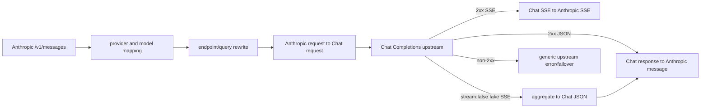

# Anthropic Messages API 与 OpenAI Chat Completions 桥接实现规范

> 本文描述仓库在提交 `3217f72596f2d1c0f879f0a05f83803825d9809f`
> 上的实际生产实现。它不是 Anthropic 或 OpenAI 官方协议的完整定义，而是一份可用于
> 独立重写 CC Switch 现有桥接行为的兼容性规范。

## 1. 结论与边界

仓库已经实现完整的 Anthropic Messages -> OpenAI Chat Completions 请求转换，以及
Chat Completions -> Anthropic Messages 成功响应转换：

1. Claude/Claude Desktop 客户端向本地代理发送 `/v1/messages` 请求；
2. provider 配置为 `openai_chat` 时，代理把 endpoint 和 JSON body 转为 Chat
   Completions；
3. 上游非流式 Chat response 被转成 Anthropic message；
4. 上游 Chat SSE 被状态化转成 Anthropic SSE；
5. `stream:false` 却收到 SSE 的非标准上游会先被聚合成 Chat JSON，再转 Anthropic JSON。

这条链路支持：

- system、text、image、tool_use、tool_result 和部分 thinking 历史；
- Anthropic tool schema 和 tool_choice；
- OpenAI reasoning effort 适配；
- DeepSeek/MiMo 的 `reasoning_content` 历史重放；
- tool result 图片迁移；
- token/cache usage 守恒转换；
- 并行流式 tool call；
- GitHub Copilot 的无 `/v1` Chat endpoint；
- OpenAI 兼容网关的重复 finish reason、usage-only 尾块和缺 `[DONE]` 流。

HTTP 非 2xx 不进入 Chat -> Anthropic body 转换器：forwarder 在转换前把它包装为通用
`UpstreamError` 并参与 failover/错误响应流程。本规范中的“响应转换”主要指 2xx 成功响应。

## 2. 模块分工

| 文件 | 职责 |
| --- | --- |
| `src-tauri/src/proxy/providers/claude.rs` | 识别 provider wire format，选择 openai_chat，决定 reasoning history 策略，调用请求转换 |
| `src-tauri/src/proxy/providers/transform.rs` | Anthropic request <-> Chat response 的非流式核心转换 |
| `src-tauri/src/proxy/providers/streaming.rs` | Chat Completions SSE -> Anthropic SSE 状态机 |
| `src-tauri/src/proxy/forwarder.rs` | 模型映射、endpoint/query 改写、header 处理、请求转发、非 2xx 拦截 |
| `src-tauri/src/proxy/handlers.rs` | 根据 JSON/SSE 和客户端 stream 语义选择响应转换器，伪流式聚合，响应头重建 |
| `src-tauri/src/proxy/tool_media.rs` | tool result 中的图片抽取、文本占位和合成 user message |
| `src-tauri/src/proxy/json_canonical.rs` | tool input/result 的稳定 JSON 序列化 |

## 3. 启用条件

### 3.1 Provider API format

Claude provider 的 API format 按以下顺序解析：

1. managed `codex_oauth` 或 `xai_oauth` 强制为 `openai_responses`，不走本文链路；
2. `provider.meta.api_format`；
3. legacy `provider.settings_config.api_format`；
4. legacy `provider.settings_config.openrouter_compat_mode`；
5. 默认 `anthropic`。

`meta.api_format` 和 `settings_config.api_format` 只有以下精确值会被识别：

```text
openai_chat
openai_responses
gemini_native
```

其他值回退为 `anthropic`。`openrouter_compat_mode` 支持：

- JSON `true`；
- 非零 JSON number；
- trim 后为 `"true"` 或 `"1"` 的字符串。

该 legacy 开关为 true 时等价于 `openai_chat`。

### 3.2 强制转换 Provider

以下 provider 总是进入某种格式转换：

- GitHub Copilot；
- Codex OAuth；
- xAI OAuth。

其中 Codex/xAI OAuth 固定走 Responses，不属于本文链路。GitHub Copilot 会动态读取 model
vendor：

- model vendor 是 OpenAI -> `openai_responses`；
- vendor 非 OpenAI、查不到、查询失败或没有 AppHandle -> `openai_chat`。

普通 provider 只有最终 format 为 `openai_chat` 时才走本文链路。

### 3.3 客户端入口

主要入口：

```text
/v1/messages
```

Claude Desktop 入口会先去掉外层代理前缀，再复用相同 handler。endpoint 改写器也识别：

```text
/claude/v1/messages
```

非上述 Messages path 不会被改写。

## 4. Endpoint、query 和 header

### 4.1 Endpoint 改写

普通 openai_chat provider：

```text
/v1/messages -> /v1/chat/completions
```

GitHub Copilot：

```text
/v1/messages -> /chat/completions
```

这是路径差异，不是 body 格式差异。

原 query 中所有名字以精确小写 `beta=` 开头的参数会删除，其他参数按原顺序保留：

```text
/v1/messages?beta=true&x-id=1
  -> /v1/chat/completions?x-id=1
```

当前过滤是区分大小写的，`Beta=` 不会被删除。

URL builder 将 base URL 与改写后 endpoint 拼接，并重复把 `/v1/v1` 压缩成 `/v1`。因此：

```text
https://host.example/v1 + /v1/chat/completions
  -> https://host.example/v1/chat/completions
```

### 4.2 请求 header

转换链路沿用 forwarder 的通用 header 规则：

- 重写 `Host` 为上游 host；
- 去掉 `content-length`、`transfer-encoding`、转发/CDN/tracing header；
- 客户端 `authorization`、`x-api-key`、`x-goog-api-key` 被 provider auth header 替换；
- `anthropic-beta` 不发送给 openai_chat 上游；
- `anthropic-version` 不发送给 openai_chat 上游；
- `accept-encoding` 强制为 `identity`，缺失时补入；
- GitHub Copilot 的客户端指纹 header 由 provider auth/fingerprint header 替换；
- 其他 header 默认透传。

强制 identity 是为了让后续 JSON/SSE 转换器直接读取未压缩 body。

### 4.3 响应 header

Anthropic SSE：

```text
Content-Type: text/event-stream
Cache-Control: no-cache
```

非流式 Anthropic JSON：

- 保留可安全透传的上游 header；
- 删除旧实体相关和 hop-by-hop header；
- 删除上游 Content-Type；
- 设置唯一 `Content-Type: application/json`；
- 保留上游成功 status。

## 5. 总体转换流程



请求 body 的模型映射在结构转换前完成；核心转换器本身不改 model ID。

## 6. Anthropic 请求转 Chat 请求

抽象接口：

```text
anthropic_to_chat(
    anthropic_body,
    preserve_reasoning_content
) -> chat_body | TransformError
```

### 6.1 顶层字段

| Anthropic 输入 | Chat 输出 | 规则 |
| --- | --- | --- |
| `model` | `model` | 仅字符串时复制；此前通常已完成模型映射 |
| `system` | `messages` 中 system | 见第 6.2 节 |
| `messages` | `messages` | 见第 6.3 节 |
| `max_tokens` | `max_tokens` 或 `max_completion_tokens` | o-series 使用后者 |
| `temperature` | `temperature` | 原值复制 |
| `top_p` | `top_p` | 原值复制 |
| `stop_sequences` | `stop` | 原值复制 |
| `stream` | `stream` | 原值复制 |
| `thinking`/`output_config.effort` | `reasoning_effort` | 仅支持 reasoning 的 model，见第 8 节 |
| `tools` | `tools` | 见第 7 节 |
| `tool_choice` | `tool_choice` | 见第 7.3 节 |

没有显式转换的 Anthropic 顶层字段不会进入 Chat body，例如：

```text
metadata
service_tier
container
mcp_servers
cache_control
```

`cache_control` 不会泄漏到 Chat system、message part 或 tool。

### 6.2 System prompt

`system` 支持：

- 字符串：生成一条 Chat system message；
- 数组：每个含字符串 `.text` 的 block 生成一条 system message；
- 其他：忽略。

每个 system 文本都先处理 Claude Code billing attribution。如果文本开头精确是：

```text
x-anthropic-billing-header:
```

则：

1. 删除第一行；
2. 同时删除紧随其后的最多一个 CRLF/LF/CR 空行；
3. 保留后面的稳定 prompt；
4. 如果整段只有 attribution 且没有换行，结果为空；
5. 不删除文本中间或后部出现的同名字符串。

转换完所有消息后规范化 system：

- 没有 system：不处理；
- 只有一条 system：移动到 `messages[0]`；
- 多条 system：提取其字符串 content；若 content 是数组，则提取每个 part `.text`
  并用 `\n` 拼接；再把各 system 内容用 `\n` 拼接成唯一首条 system；
- 非 system message 的相对顺序不变；
- 空 system 内容不进入合并结果。

### 6.3 普通 message

每个 Anthropic `messages[]`：

- role 取 `.role` 字符串；
- role 缺失时为 `user`；
- role 不做枚举归一化，其他字符串也原样进入 Chat；
- content 缺失 -> `{"role":role,"content":null}`；
- content 是字符串 -> 原样 Chat message；
- content 是数组 -> 按 content block 状态化转换；
- content 为其他 JSON -> 原样放入 Chat `content`。

### 6.4 Text 和 image block

`{"type":"text","text":"..."}`：

```json
{"type":"text","text":"..."}
```

不会复制 block 上的 `cache_control` 或其他 Anthropic 私有字段。

`{"type":"image",...}` 转为 Chat：

```json
{
  "type": "image_url",
  "image_url": {
    "url": "..."
  }
}
```

支持至少：

- Anthropic base64 source：
  `source.type=="base64"` + `source.media_type` + `source.data`，
  生成 `data:<media_type>;base64,<data>`；
- Anthropic URL source：
  `source.type=="url"` + `source.url`；
- tool media helper 能识别的其他 image URL/MCP image 形态。

`cache_control`、`prompt_cache_breakpoint` 等不复制。

最终 message content：

- 没有 text/image 且没有 tool call -> 不生成普通 message；
- 只有一个 text part -> 简化为字符串；
- 只有一个 image part -> 仍是 part 数组；
- 多 part -> part 数组；
- 有 tool_calls 但没有 text/image -> `content:null`。

### 6.5 `tool_use`

每个 Anthropic block：

```json
{
  "type": "tool_use",
  "id": "call_1",
  "name": "f",
  "input": {"x": 1}
}
```

变为同一 Chat assistant message 的一个 `tool_calls[]`：

```json
{
  "id": "call_1",
  "type": "function",
  "function": {
    "name": "f",
    "arguments": "{\"x\":1}"
  }
}
```

规则：

- id/name 缺失时为空串；
- input 缺失时为 `{}`；
- input 用 canonical JSON 字符串序列化；
- 同一 Anthropic message 内多个 tool_use 合并进一条 Chat message；
- text/image part 和 tool_calls 可以共存。

canonical JSON 要递归按字典序排序 object key、数组保序且不输出多余空白。

### 6.6 `tool_result`

每个 `tool_result` 立即产生一条独立 Chat tool message：

```json
{
  "role": "tool",
  "tool_call_id": "<tool_use_id or empty>",
  "content": "<string>"
}
```

content：

- Anthropic content 是字符串 -> 原样保留，即使字符串自身看起来像 JSON；
- 其他 JSON -> canonical JSON；
- 缺失 -> 空串。

注意这里与 Responses -> Chat bridge 不同：普通字符串不会尝试解析并 canonicalize。

一个 Anthropic message 中同时含 `tool_result` 和普通 text/tool_use 时，输出顺序是：

1. 每条 Chat tool message；
2. 如有抽取媒体，合成 media user message；
3. 该 Anthropic message 剩余 text/image/tool_use 形成的普通 Chat message。

### 6.7 Tool result 图片迁移

Chat tool message 只能安全携带文本。发现 tool_result content 中有媒体时：

1. 从原 content 递归抽取媒体；
2. 原位置替换为文本：
   `[cc-switch: tool result media moved to the following user message]`；
3. tool message 保留替换后的字符串或 canonical JSON；
4. 在当前 Anthropic message 的全部并行 tool results 后插入一条合成 user message：

```json
{
  "role": "user",
  "content": [
    {
      "type": "text",
      "text": "[cc-switch: media output of tool call <tool_use_id>]"
    },
    {
      "type": "image_url",
      "image_url": {"url":"..."}
    }
  ]
}
```

多个 tool_result 的媒体合并进同一 user message；每组媒体前都有 call 标记。tool messages
必须保持相邻，不能把 media user message 插入并行 tool results 中间。

媒体扫描、data URL 阈值、递归深度和残留 base64 clamp 与
`codex_response_to_chat_completions.md` 第 5.7 节相同，由共享 `tool_media.rs` 实现。
本文路径在普通 message content 中只接受 image；tool result 媒体 helper 则可按共享
`AllSupported` 范围提取当前支持的原生 Chat 媒体。

### 6.8 Thinking history

普通 openai_chat provider 默认不向 Chat request 添加非标准 `reasoning_content`。

只有 provider/model 标识含以下关键词时才启用历史保留，比较前转小写：

```text
deepseek
mimo
xiaomimimo
```

检查来源：

- 请求 body 的 model；
- `env.ANTHROPIC_BASE_URL`；
- `base_url`；
- `baseURL`；
- `apiEndpoint`。

Moonshot/Kimi 当前明确不在此名单。

启用保留且 Anthropic assistant message 含 tool_use 时：

- 收集 `thinking` block 的非空 `.thinking`；
- 多段用 `\n` 拼接；
- `redacted_thinking` 添加占位 `[redacted thinking]`；
- 没有可用 thinking 时添加占位 `tool call`；
- 写入该 Chat assistant message 的顶层 `reasoning_content`。

限制：

- 只对 role 为 `assistant` 且含 tool_calls 的输出 message 写入；
- thinking-only message 不会生成 Chat message；
- 非保留模式下 thinking/redacted_thinking 均丢弃；
- 这条路径不会把 thinking 当普通可见文本。

## 7. Tool 声明与 tool_choice

### 7.1 Tool 声明

Anthropic：

```json
{
  "name": "get_weather",
  "description": "Get weather",
  "input_schema": {}
}
```

Chat：

```json
{
  "type": "function",
  "function": {
    "name": "get_weather",
    "description": "Get weather",
    "parameters": {}
  }
}
```

规则：

- `type=="BatchTool"` 的 tool 被过滤；
- 其他 tool 全部映射；
- name 缺失 -> 空串；
- description 直接使用原字段引用，缺失最终为 JSON null；
- input_schema 缺失 -> `{}`；
- 不复制 Anthropic tool `cache_control`；
- 当前实现不映射 `strict`。

如果过滤后工具列表为空，不输出 Chat `tools`。

### 7.2 Schema 清理

只对 schema root 做默认 object 补全：

- root 是对象且完全缺少 `type` -> 添加 `type:"object"`；
- 此时如果也缺 `properties` -> 添加 `properties:{}`；
- root 已有 `type`，即使值为 null，也不会强制改成 object；
- 非对象 schema 不会自动包成 object。

递归清理：

- 当前节点 `format=="uri"` 时删除 `format`；
- 递归遍历 `properties` 的每个值；
- 递归遍历 `items`；
- 不主动遍历 `oneOf`、`anyOf`、`allOf` 等其他关键字。

### 7.3 Tool choice

| Anthropic 输入 | Chat 输出 |
| --- | --- |
| `"auto"` | `"auto"` |
| `"any"` | `"required"` |
| `"none"` | `"none"` |
| `{"type":"auto"}` | `"auto"` |
| `{"type":"any"}` | `"required"` |
| `{"type":"none"}` | `"none"` |
| `{"type":"tool","name":"f"}` | `{"type":"function","function":{"name":"f"}}` |
| 其他 | 原样保留 |

当前实现不会在全部 tools 被过滤后自动删除 tool_choice。

## 8. Anthropic thinking 转 OpenAI reasoning effort

只有 model 属于以下 family 时才添加 `reasoning_effort`：

- o-series：名字以 `o` 开头，第二个字符是数字；
- `gpt-5` 及以上当前匹配形式：小写 `gpt-` 后首字符是数字且 `>= '5'`；
- `grok-4.5`；
- `grok-4.5-*`；
- `grok-build-*`。

解析优先级：

### 8.1 `output_config.effort`

| Anthropic effort | Chat reasoning_effort |
| --- | --- |
| `low` | `low` |
| `medium` | `medium` |
| `high` | `high` |
| `max` | `xhigh` |
| 其他 | 不写 |

只要该字段存在，就不再回退读取 `thinking`；未知值因此会抑制 fallback。

### 8.2 `thinking`

当没有 `output_config.effort` 时：

| Anthropic thinking | Chat reasoning_effort |
| --- | --- |
| `{"type":"adaptive"}` | `xhigh` |
| enabled，`budget_tokens < 4000` | `low` |
| enabled，`4000 <= budget_tokens < 16000` | `medium` |
| enabled，`budget_tokens >= 16000` | `high` |
| enabled，缺 budget | `high` |
| disabled/未知/缺失 | 不写 |

原 `thinking` 和 `output_config` 本身不会透传到 Chat body。

## 9. Prompt cache 与流式 usage 请求

openai_chat 路径只在 `provider.meta.prompt_cache_key` 显式配置时写入：

```json
{"prompt_cache_key":"<configured value>"}
```

客户端 session ID、Anthropic metadata 和请求中的 cache_control 都不会自动生成 Chat
prompt cache key。

当转换后的 `stream == true` 时必须保证：

```json
{
  "stream_options": {
    "include_usage": true
  }
}
```

如果已有 object `stream_options`，保留其余键并覆盖 `include_usage=true`；否则创建该对象。
非流式请求不添加 `stream_options`。

## 10. 非流式 Chat 响应转 Anthropic message

抽象接口：

```text
chat_response_to_anthropic(chat_body) -> anthropic_message | TransformError
```

### 10.1 输入校验

只使用第一条 choice：

- 缺 `choices` 数组 -> `No choices in response`；
- 空数组 -> `Empty choices array`；
- 第一项缺 `message` -> `No message in choice`。

### 10.2 输出 envelope

```json
{
  "id": "<chat id or empty>",
  "type": "message",
  "role": "assistant",
  "content": [],
  "model": "<chat model or empty>",
  "stop_reason": null,
  "stop_sequence": null,
  "usage": {
    "input_tokens": 0,
    "output_tokens": 0
  }
}
```

Chat ID 原样保留，不添加 `msg_` 前缀。这用于 usage 去重。

### 10.3 Content block 顺序

按以下顺序构造：

1. `message.reasoning_content` -> thinking block；
2. message 可见 content/refusal -> text blocks；
3. tool_calls 或 legacy function_call -> tool_use blocks。

`reasoning_content` 只有非空字符串才输出：

```json
{"type":"thinking","thinking":"..."}
```

当前非流转换器不识别 `message.reasoning`、`reasoning_details` 或 `<think>` 标签。

Chat content：

- 非空字符串 -> 单个 Anthropic text block；
- 数组的 `type=="text"` 或 `type=="output_text"` -> text block；
- 数组的 `type=="refusal"` -> 把 `.refusal` 当 text；
- message 顶层非空 `refusal` -> 再追加一个 text block；
- 未知 part、图片、音频等忽略；
- 空内容允许最终 `content:[]`。

### 10.4 Tool calls

现代 `message.tool_calls[]`：

```json
{
  "type": "tool_use",
  "id": "<tool call id or empty>",
  "name": "<function name or empty>",
  "input": {}
}
```

arguments 规则：

- 仅接受字符串；
- 缺失时按 `"{}"`；
- 字符串能解析为任意 JSON Value时直接作为 input；
- 解析失败 -> `{}`。

如果 `tool_calls` 数组非空，设置“已有现代工具调用”，不再处理 legacy function_call。

legacy `message.function_call`：

- id/name 缺失 -> 空串；
- arguments 是 JSON 字符串 -> 解析，失败为 `{}`；
- arguments 是 object/array -> 原样；
- 其他/缺失 -> `{}`；
- 只有 name 非空或 arguments 字段存在时才生成 tool_use。

当前非流转换不会过滤空名字的现代 tool call。

### 10.5 Stop reason

| Chat finish_reason | Anthropic stop_reason |
| --- | --- |
| `stop` | `end_turn` |
| `length` | `max_tokens` |
| `tool_calls` | `tool_use` |
| `function_call` | `tool_use` |
| `content_filter` | `end_turn` |
| 未知非空值 | `end_turn`，并写 warning log |
| 缺失且有 tool_use | `tool_use` |
| 缺失且无 tool_use | null |

### 10.6 Usage

输入：

```text
prompt_tokens
completion_tokens
cache_read_input_tokens?
cache_creation_input_tokens?
prompt_tokens_details.cached_tokens?
prompt_tokens_details.cache_write_tokens?
input_tokens_details.cache_write_tokens?
```

cache read 优先级：

1. 顶层 `cache_read_input_tokens`；
2. `prompt_tokens_details.cached_tokens`；
3. 0。

cache creation 优先级：

1. 顶层 `cache_creation_input_tokens`；
2. `prompt_tokens_details.cache_write_tokens`；
3. `input_tokens_details.cache_write_tokens`；
4. 0。

OpenAI `prompt_tokens` 被视为包含 fresh + cache read + cache creation。Anthropic：

```text
input_tokens =
  saturating_sub(prompt_tokens, cache_read, cache_creation)
output_tokens = completion_tokens
```

因此尽量保持：

```text
input_tokens + cache_read_input_tokens + cache_creation_input_tokens
  == prompt_tokens
```

缓存数之和超过 prompt 时，input 钳到 0，不允许下溢。只有 cache 值大于 0 时才输出对应
Anthropic cache 字段。缺 usage 时仍输出 input/output 两个零值。

## 11. Chat SSE 转 Anthropic SSE

### 11.1 输入数据模型

流式转换器接受 OpenAI SSE data JSON，使用的字段：

```text
id: string, default ""
model: string, default ""
choices[]:
  delta.content?: string
  delta.reasoning?: string
  delta.reasoning_content?: string  # serde alias
  delta.tool_calls[]?:
    index: usize                    # 当前实现要求存在
    id?: string
    type?: string
    function.name?: string
    function.arguments?: string
  finish_reason?: string
usage?:
  prompt_tokens: u32
  completion_tokens: u32
  prompt_tokens_details.cached_tokens: u32
  prompt_tokens_details.cache_write_tokens: u32
  cache_read_input_tokens?: u32
  cache_creation_input_tokens?: u32
```

边界：

- 只使用 `choices[0]`；
- `reasoning` 和 `reasoning_content` 都映射 thinking；
- 不识别流式 `reasoning_details` 或 reasoning object；
- tool call 缺 `index` 会让该整个 JSON data 无法反序列化并被忽略；
- 非法 JSON、schema 不匹配的 data 被静默忽略；
- 一个 SSE block 内的每条 `data:` 行独立解析，不做多行 data 拼接；
- 支持 bytes 任意分片及跨分片 UTF-8；
- 当前转换器不专门解析上游 JSON error event；底层 stream error 有明确转换。

### 11.2 状态

至少维护：

```text
message_id?                    # 第一个非空 id
model?                         # 第一个非空 model
next_content_index
message_start_sent
first_finish_seen
pending_message_delta
message_stop_sent
latest_usage
current_non_tool_block_type    # thinking | text | none
current_non_tool_block_index
tool_state_by_chat_index
open_tool_block_indices
stream_ended_with_error
```

每个 tool state：

```text
anthropic_content_index
id
name
started
pending_arguments
consecutive_whitespace_count
aborted
```

### 11.3 Message start

第一次遇到含 choice 的合法 Chat chunk 时发送：

```text
event: message_start
```

```json
{
  "type": "message_start",
  "message": {
    "id": "<first non-empty chat id or empty>",
    "type": "message",
    "role": "assistant",
    "model": "<first non-empty model or empty>",
    "usage": {
      "input_tokens": 0,
      "output_tokens": 0
    }
  }
}
```

如果首个 choice chunk 自带 usage，则 message_start usage 中：

- input 按 fresh token 公式计算；
- cache read/create 大于 0 时添加；
- 不在 start 中写 completion_tokens，`output_tokens` 保持 0。

usage-only chunk 不会单独触发 message_start，但会更新 latest usage。

### 11.4 Thinking 和 text block

reasoning delta：

```text
content_block_start(type=thinking, thinking="")
content_block_delta(type=thinking_delta, thinking=<delta>)
```

text delta：

```text
content_block_start(type=text, text="")
content_block_delta(type=text_delta, text=<delta>)
```

content 空串不产生 text 事件。

thinking/text 共用一个“当前非工具 block”。类型切换时：

1. 对旧 index 发 `content_block_stop`；
2. 分配新的递增 content index；
3. 发新类型 start；
4. 发 delta。

因此 thinking -> text -> thinking 会生成三个独立 content block，不会合并回第一个。

### 11.5 流式 tool call

看到非空 `delta.tool_calls` 前先关闭当前 thinking/text block。每个 Chat `tool_call.index`
映射到独立 ToolBlockState，首次见到该 index 时立即分配 Anthropic content index。

id/name：

- 任何后续非缺失值都会写入 state，包括空字符串；
- 只有 id 和 name 都非空时才发 start；
- start 前收到的 arguments 累积到 `pending_args`；
- start 后立即先发积累参数，再发当前参数。

start：

```json
{
  "type": "content_block_start",
  "index": 1,
  "content_block": {
    "type": "tool_use",
    "id": "call_1",
    "name": "f"
  }
}
```

arguments delta：

```json
{
  "type": "content_block_delta",
  "index": 1,
  "delta": {
    "type": "input_json_delta",
    "partial_json": "{\"x\":"
  }
}
```

转换器不解析或 canonicalize partial JSON，只按字符串原样转发。

收到首次 finish reason 时，尚未 start 但已有任意 payload 的 tool state会被“晚启动”：

- id 为空 -> `tool_call_<chat index>`；
- name 为空 -> `unknown_tool`；
- 按已分配的 Anthropic content index 排序后 start；
- 再发送累积 arguments。

随后所有 open tool block 按 Anthropic index 升序发 `content_block_stop`。

### 11.6 无限空白保护

每个 tool arguments 流跟踪连续 Unicode whitespace 字符数量：

- 遇到非 whitespace 清零；
- 连续数量达到 500 时，把该 tool state 标记 aborted；
- 触发阈值的 delta 及其后续 delta 不再转发；
- 已经 start 的 block 仍会在 finish reason 时正常 stop。

这是 GitHub Copilot function arguments 无限换行问题的防护。

### 11.7 Finish、usage 和终止事件

第一次非空 finish reason：

1. 映射 stop reason；
2. 关闭当前 thinking/text；
3. 晚启动未完整 identity 的 tool；
4. 关闭所有 open tool blocks；
5. 创建但暂不发送 `message_delta`；
6. 标记已处理 finish。

后续 finish reason 不改变首个 stop reason，只允许用更晚的 usage 更新 pending
message_delta。usage-only chunk 同样会更新 pending usage。

pending message_delta：

```json
{
  "type": "message_delta",
  "delta": {
    "stop_reason": "end_turn",
    "stop_sequence": null
  },
  "usage": {
    "input_tokens": 0,
    "output_tokens": 0
  }
}
```

usage 映射与非流式基本相同，但当前流式模型只读取
`prompt_tokens_details`，不读取 `input_tokens_details.cache_write_tokens`。直接顶层 cache
字段仍优先。所有 token 数内部按 u32 解析。

`[DONE]`：

1. 如果有 pending message_delta，先发送；
2. 发送 `message_stop`：

```json
{"type":"message_stop"}
```

自然 EOF 且没有 `[DONE]`：

- 若有 pending message_delta：发送它，再发送 message_stop；
- 若从未看到 finish reason，pending 为空，不发送成功终止事件；
- 即使此前已发 message_start/content delta，无 finish reason 也不能补造成功 terminal。

底层 stream error：

```text
event: error
```

```json
{
  "type": "error",
  "error": {
    "type": "stream_error",
    "message": "Stream error: <error>"
  }
}
```

发生 stream error 后不能再发 message_delta/message_stop。

### 11.8 Stop reason 映射

与非流式一致：

| Chat finish_reason | Anthropic stop_reason |
| --- | --- |
| `tool_calls` / `function_call` | `tool_use` |
| `stop` | `end_turn` |
| `length` | `max_tokens` |
| `content_filter` | `end_turn` |
| 其他 | `end_turn` |

## 12. `stream:false` 收到 Chat SSE 的聚合

响应处理选择流式路径的条件是：

```text
client requested stream
OR upstream Content-Type indicates SSE
OR special Codex Responses condition
```

因此 openai_chat 上游只要明确返回 SSE，就会使用第 11 节并向客户端返回 Anthropic SSE，
即使请求 body 的 `stream` 是 false。

另一个兼容分支处理“body 是 SSE，但 Content-Type 不是 SSE”的情况：

1. 非流式 handler 读取 body；
2. JSON parse 失败；
3. body 嗅探像 SSE；
4. 使用 Chat SSE 聚合器生成单个 `chat.completion`；
5. 再调用第 10 节转换为 Anthropic JSON。

聚合器的重要契约：

- 支持 BOM、CRLF、尾 block 无空行；
- 只聚合 choice index 0；
- id/created/model 取第一个非空且非零占位值；
- content/refusal 追加；
- reasoning_content/reasoning/reasoning_details 通过共享提取器追加；
- tool_calls 用稀疏有序 map 按 index 聚合；
- id/name 非空时更新，arguments 分片拼接；
- legacy function_call 转为 tool_calls；
- finish_reason 首个非 null 值获胜；
- usage 取最后一个非 null 值；
- 完整 message snapshot 可覆盖此前 delta；
- event:error 或带有效 error message 的 data 使聚合失败；
- 从未见到 choice -> 失败；
- 同时缺 finish reason 和 `[DONE]` -> 判为截断并失败；
- 有 `[DONE]` 时可接受缺 finish reason；
- 缺 id 时合成 UUID。

聚合细节与 `codex_response_to_chat_completions.md` 第 11 节使用同一实现。

## 13. HTTP 错误和转换错误

### 13.1 上游非 2xx

forwarder 在响应转换前：

1. 读取有大小上限的错误 body；
2. 按 `content-encoding` 尝试解压；
3. 能 UTF-8 解码时保存文本；
4. 返回 `ProxyError::UpstreamError {status, body}`；
5. 按 provider/failover 策略决定是否重试其他 provider。

它不会调用 `openai_to_anthropic`，因此没有本文专属的 OpenAI error JSON -> Anthropic
error JSON 映射。

### 13.2 2xx 但 body 不合法

非流式成功响应：

- JSON parse 失败且不像 SSE -> 带 content type/body classification 的 parse error；
- 像 SSE但聚合失败 -> 聚合诊断 error；
- Chat JSON 缺 choices/message -> TransformError；
- 上游已经消耗 tokens、但结构转换失败时，handler 会尽可能先记录 raw usage 再返回错误。

### 13.3 SSE 错误

明确支持底层 stream transport error，输出 Anthropic `event:error`。当前 Chat SSE typed parser
不会把普通 `data: {"error":...}` 或 `event:error` JSON 转成 Anthropic error；不符合
`OpenAIStreamChunk` 的 data 会被忽略。这是重写兼容性测试应记录的现有边界。

## 14. 与 Responses -> Chat 桥接的关键差异

| 行为 | Anthropic -> Chat | Responses -> Chat |
| --- | --- | --- |
| 普通 endpoint | `/v1/chat/completions` | `/chat/completions` |
| Copilot endpoint | `/chat/completions` | `/chat/completions` |
| tool context 反向恢复 | 无 | 有 namespace/custom/tool_search context |
| string tool output | 原样 | 可解析 JSON 时 canonicalize |
| reasoning history | 仅 DeepSeek/MiMo 白名单 | 广泛、状态化归属 |
| 无 reasoning 的 tool call | 仅白名单 provider补占位 | 所有 assistant tool-call history 补占位 |
| schema root type 为 null | 保留 null | 强制 object |
| 无 tools 时 tool_choice | 可能保留 | 删除 |
| Chat SSE error JSON | typed parse 不处理 | 显式转 response.failed |
| 缺 tool index | 整个 data chunk 忽略 | 有 fallback key 策略 |
| 无名流式 tool | finish 时合成 unknown_tool | 丢弃，必要时 failed |
| 非流无名 tool | 保留空 name | 丢弃，必要时 TransformError |
| ID | Chat ID 原样作为 Anthropic ID | 统一 `resp_` |

## 15. 推荐的重写边界

建议至少拆分以下纯函数和状态组件：

```text
resolve_claude_wire_format(provider, model?) -> WireFormat
rewrite_messages_endpoint(endpoint, wire_format, is_copilot) -> endpoint
rewrite_headers(inbound_headers, provider_auth, wire_format) -> headers

anthropic_request_to_chat(body, options) -> ChatRequest
convert_anthropic_message(message, options) -> ChatMessage[]
convert_anthropic_tools(tools) -> ChatTool[]
resolve_reasoning_effort(body, model) -> effort?

chat_response_to_anthropic(body) -> AnthropicMessage
ChatSseToAnthropicState::consume(chunk) -> AnthropicEvent[]
ChatSseToAnthropicState::finish() -> AnthropicEvent[]
aggregate_chat_sse_to_json(body) -> ChatCompletion
```

请求主流程：

```text
format = resolve_claude_wire_format(provider, mapped_request.model)
if format != openai_chat:
    dispatch elsewhere

preserve_reasoning =
    model_or_provider_matches(deepseek | mimo | xiaomimimo)
chat_body =
    anthropic_request_to_chat(mapped_request, preserve_reasoning)
if provider.meta.prompt_cache_key exists:
    chat_body.prompt_cache_key = configured_key
if chat_body.stream == true:
    chat_body.stream_options.include_usage = true
POST rewritten_chat_endpoint
```

响应主流程：

```text
if status is non-2xx:
    return generic upstream error/failover

if client_stream || upstream_is_sse:
    return chat_sse_to_anthropic_sse(upstream_stream)

bytes = read_and_decode(upstream)
if bytes parse as JSON:
    chat = parsed JSON
else if bytes look like SSE:
    chat = aggregate_chat_sse_to_json(bytes)
else:
    return parse error
return chat_response_to_anthropic(chat)
```

## 16. 必须保持的实现不变量

1. 模型映射先于 body 结构转换，转换器不擅自改 model。
2. Messages endpoint 的 `beta=` query 不能发送到 Chat endpoint。
3. Anthropic auth/version/beta header 不能按原协议发送到 openai_chat 上游。
4. system 最终位于 Chat messages 首部，多 system 合并后不改变其他消息顺序。
5. 只删除 system 开头的 billing attribution，不能删除用户正文中的同名文本。
6. Anthropic `cache_control` 不得泄漏进 Chat body。
7. tool input 必须 canonicalize，确保 prompt cache 稳定。
8. 并行 tool_result 必须保持相邻，抽取媒体必须放在它们之后。
9. DeepSeek/MiMo assistant tool-call history 必须有非空 reasoning_content。
10. Kimi/Moonshot 当前不能启用 reasoning history 占位策略。
11. reasoning effort 只对明确支持的 model family 输出。
12. `output_config.effort` 存在时优先于 thinking，即使其值未知。
13. 流式 message_delta 只能发送一次，首个 finish reason 决定 stop_reason。
14. message_delta 要延迟到 `[DONE]` 或 EOF，以吸收 usage-only 尾块。
15. 没有 finish reason 的截断流不能伪造 message_stop。
16. stream error 后不能继续发成功 terminal 事件。
17. OpenAI prompt_tokens 转 Anthropic input 时必须扣除 cache read/create，并使用饱和减法。
18. Chat response ID 必须原样保留，供 usage 去重。
19. `stream:false` + 未标记 SSE 必须聚合回 Anthropic JSON，不能把 Chat SSE body 当 JSON
    直接报普通 parse error。
20. 非 2xx 必须在转换前进入通用 upstream error/failover，不能假定其 body 有 choices。

## 17. 最小验收测试矩阵

| 类别 | 用例 | 预期 |
| --- | --- | --- |
| format | meta、legacy api_format、compat mode | 正确选择 openai_chat |
| Copilot | OpenAI vendor/其他/查询失败 | Responses/Chat/Chat |
| endpoint | 普通与 Copilot | `/v1/chat/completions` / `/chat/completions` |
| query | beta + 普通参数 | 删除 beta，保留其他顺序 |
| header | Anthropic beta/version/auth | beta/version 删除，auth 替换 |
| system | 字符串、数组、多段、中途 system | 唯一首条 system |
| billing | 单独 attribution、attribution+正文、正文中同名 | 删除/保留正文/不误删 |
| text | 单 block、多 block | 字符串简化/part 数组 |
| image | base64 和 URL source | image_url，无 Anthropic 私有字段 |
| tool_use | 单个、并行、与 text 共存 | 一条 assistant + tool_calls |
| tool input | key 顺序不同 | canonical arguments 一致 |
| tool_result | string、array/object、缺 content | 原串/canonical/空串 |
| tool media | 单个、并行、与普通 text 同 message | tool 相邻，media user 后置 |
| reasoning history | DeepSeek/MiMo thinking + tool | reasoning_content |
| redacted history | redacted_thinking + tool | `[redacted thinking]` |
| missing history | 白名单 provider裸 tool | `tool call` |
| generic/Kimi | thinking + tool | 不输出 reasoning_content |
| schema | 缺 root type、空 schema、format:uri、nested items | 精确清理 |
| BatchTool | 混合/全部 BatchTool | 过滤；空时无 tools |
| tool_choice | any/auto/none/指定 tool | required/auto/none/function |
| effort | 显式四档、adaptive、budget 边界、未知显式值 | 精确映射 |
| prompt cache | meta 有/无 key | 仅显式 meta 注入 |
| stream request | true/false | true 注入 include_usage |
| non-stream text | reasoning_content + text + tools | thinking/text/tool_use 顺序 |
| refusal | part 和 message-level | Anthropic text |
| legacy call | string/object args | tool_use |
| stop reason | stop/length/tool_calls/function_call/filter/未知/缺失 | 精确映射 |
| usage | nested/direct cache、cache 超 prompt | fresh token 守恒且不下溢 |
| SSE text | reasoning/text 切换 | block start/delta/stop 正确 |
| SSE tools | 参数先于 id/name、并行 index | 延迟 start，不丢参数 |
| SSE incomplete identity | finish 时缺 id/name | fallback id/unknown_tool |
| SSE whitespace | 连续 500 空白 | 中止该 tool delta |
| duplicate finish | 多 finish + usage-only 尾块 | 一个 message_delta，用最新 usage |
| no DONE | 有 finish / 无 finish | 成功 terminal / 不伪造 terminal |
| stream error | transport error | error event，无 message_stop |
| fake SSE | stream:false + 错 Content-Type | 聚合成 Anthropic JSON |
| malformed JSON | 非 SSE body | 明确 parse error |
| HTTP error | 非 2xx Chat error | 通用 UpstreamError/failover，不进 choices 转换 |
