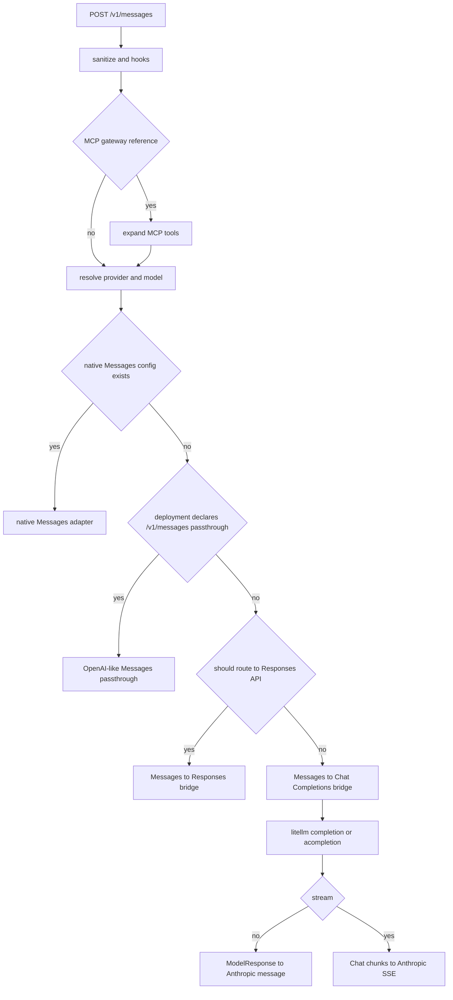

# Anthropic Messages API 到 Chat Completions 桥接规格

本文档描述 LiteLLM 如何把 Anthropic Messages API 请求转换为 Chat Completions 请求，以及如何把 Chat Completions 响应重新组装成 Anthropic Messages API 响应

本文档基于提交 `9cebc4738974fd9338e7b960a51025356790a5fa`。它同时记录当前实现、兼容性约束和已知偏差，目标是让另一个 agent 不依赖原实现结构也能重写这条桥接链路

## 1. 结论

仓库中已经有完整实现，核心目录是

```text
litellm/llms/anthropic/experimental_pass_through/adapters/
```

| 文件 | 职责 |
| --- | --- |
| `handler.py` | 组织请求转换、context management polyfill、调用 `litellm.completion()` 或 `litellm.acompletion()`、选择流式或非流式响应转换 |
| `transformation.py` | Messages request、Chat Completions request、Chat response、Anthropic response 的字段级转换 |
| `streaming_iterator.py` | 把 Chat Completions chunks 转成 Anthropic SSE 事件 |

外层路由和预处理位于

| 文件 | 职责 |
| --- | --- |
| `../messages/handler.py` | `/v1/messages` 主入口、provider config 选择、MCP、web search、native、Responses 和 Chat 三条路径分派 |
| `litellm/proxy/anthropic_endpoints/endpoints.py` | Proxy HTTP `POST /v1/messages` 入口和 Anthropic 风格错误输出 |
| `../context_management/` | `context_management` edits 和 compaction polyfill |

该模块不会自己直接拼接字面上的 `/chat/completions` URL。它调用 LiteLLM 的统一 `completion` 或 `acompletion` 入口，后续 provider adapter 再决定真实上游 URL。对该桥接层而言，上游协议已经是 Chat Completions

## 2. HTTP 入口和三类分派

Proxy HTTP 入口是

```text
POST /v1/messages
```

请求进入 `litellm.anthropic_messages`，完成预处理后进入同步分派函数 `anthropic_messages_handler`

分派优先级如下

1. 如果请求包含 LiteLLM MCP gateway tool reference，先展开 MCP 工具
2. 如果 provider 有原生 `BaseAnthropicMessagesConfig`，使用原生 Messages adapter
3. 如果 deployment 的 `model_info.supported_endpoints` 包含 `/v1/messages`，使用 OpenAI-like Messages passthrough config
4. 如果没有原生 config，但满足 Responses API 条件，走 Messages 到 Responses API 桥
5. 其他没有原生 config 的 provider，走本文档描述的 Messages 到 Chat Completions 桥



### 2.1 Responses API 优先条件

OpenAI provider 默认走 Responses API，而不是本文档的 Chat Completions 桥

```text
custom_llm_provider == "openai"
and litellm.use_chat_completions_url_for_anthropic_messages is false
```

设置以下全局开关可以关闭该特殊 Responses 优先级，当前特殊 provider 集合只包含 OpenAI

```python
litellm.use_chat_completions_url_for_anthropic_messages = True
```

如果原请求模型在去掉 provider prefix 前被识别为 Responses-only，但去掉 prefix 后被错误识别为 Chat 模型，外层也会保留 Responses API 路由，避免把 Responses-only deployment 错发到 Chat endpoint

### 2.2 OpenAI thinking 的二次 Responses 路由

即使全局开关强制 OpenAI 进入 Chat bridge，只要请求满足以下条件，adapter 仍会把模型名改为 `openai/responses/<model>`，让后续 `litellm.completion` 再转到 Responses API

```text
provider == openai
thinking.type == enabled
model registry 没有明确 supports_reasoning == false
```

这是为了获得 OpenAI Responses API 的 reasoning 文本，再转换为 Anthropic `thinking` content block

因此“Messages 请求转 Chat Completions”不是所有 provider 和参数组合的统一行为。重写时必须保留 native、Responses 和 Chat 三条清晰边界

## 3. 进入桥接前的请求预处理

主 Messages handler 在 provider 分派前执行以下处理

1. 删除空字符串、全空白 text block 和空 thinking block
2. 规范化历史中的 `tool_use.id`、`server_tool_use.id` 和 `tool_result.tool_use_id`
3. 展平无法加密的 web search result history
4. 根据 Anthropic cache-control hook 注入 cache breakpoints
5. 执行 custom logger `async_pre_request_hook`
6. 尝试 web-search-only short circuit
7. 尝试 Messages interceptors，例如 advisor orchestration

tool ID 规范化要求满足

```text
^[a-zA-Z0-9_-]+$
```

Gemini thought signature 后缀先删除，其他非法字符替换为 `_`。结果为空时使用 `tool_use_id`

这些预处理属于端到端接口契约。重写 adapter 时可以把它们留在外层，但不能让不同分派路径绕过

## 4. Handler 调用契约

Chat bridge 的统一入口是

```python
LiteLLMMessagesToCompletionTransformationHandler.anthropic_messages_handler(
    max_tokens,
    messages,
    model,
    metadata=None,
    stop_sequences=None,
    stream=False,
    system=None,
    temperature=None,
    thinking=None,
    tool_choice=None,
    tools=None,
    top_k=None,
    top_p=None,
    output_format=None,
    _is_async=False,
    **kwargs,
)
```

同步路径调用 `litellm.completion`，异步路径调用 `litellm.acompletion`

处理顺序如下

1. 读取并执行 `context_management`
2. 得到可能被 edits 修改的 messages 和 system
3. 调用 `_prepare_completion_kwargs`
4. 调用 Chat Completions 统一入口
5. 非流式 `ModelResponse` 转为 `AnthropicMessagesResponse`
6. 流式 response 包装为 `AnthropicStreamWrapper`
7. SSE wrapper 输出 bytes

流式 Chat 请求强制加入

```json
{
  "stream": true,
  "stream_options": {
    "include_usage": true
  }
}
```

这是为了让 Anthropic 最终 `message_delta.usage` 包含完整 token 和 cache usage

## 5. 顶层请求字段转换

### 5.1 字段映射

| Anthropic Messages 输入 | Chat Completions 输出 | 规则 |
| --- | --- | --- |
| `model` | `model` | 原值，特殊 OpenAI thinking 情况可能改为 `openai/responses/<model>` |
| `messages` | `messages` | 使用第 6 节算法 |
| `system` | `messages` | 转成置顶 system message，使用第 6.7 节算法 |
| `max_tokens` | `max_tokens` | 原值 |
| `metadata.user_id` | `user` | 完整字符串 |
| `metadata.user_id` | `prompt_cache_key` | provider 支持时取前 64 字符 |
| `stop_sequences` | `stop` | 非空列表原样 |
| `temperature` | `temperature` | 原值 |
| `top_k` | `top_k` | 原值，后续 provider 层决定是否支持 |
| `top_p` | `top_p` | 原值 |
| `thinking` | `thinking` 或 `reasoning_effort` | 使用第 8 节算法 |
| `tool_choice` | `tool_choice` | 使用第 7.4 节算法 |
| `tools` | `tools` 和可选 `web_search_options` | 使用第 7 节算法 |
| `output_format` | `response_format` | 使用第 9 节算法 |
| `output_config.format` | `response_format` | `output_format` 不存在时使用 |
| `output_config.effort` | `reasoning_effort` 或 `output_config` | 取决于目标模型和 provider |
| `stream` | `stream` 和 `stream_options` | 由 handler 添加 |

转换器明确消费以下 Anthropic-only 字段，不会再以原名复制

```text
messages
metadata
system
tool_choice
tools
thinking
output_format
output_config
stop_sequences
```

其他 Anthropic request 字段由 `_copy_untranslated_anthropic_params` 原样复制到 completion kwargs。之后 `extra_kwargs` 中不与已转换字段冲突的非空键也会补入

`output_config` 和内部标记 `anthropic_messages` 被禁止在 extra kwargs 合并时重新加入，避免 Chat provider 收到 Anthropic-only 对象

调用方显式提供的 `prompt_cache_key` 最后覆盖从 `metadata.user_id` 派生的值

### 5.2 required 参数

adapter 要求 `model` 和 `messages` 都为 truthy

缺失或空值分别抛出

```text
ValueError: Bad Request: model is required for Anthropic Messages Request
ValueError: Bad Request: messages is required for Anthropic Messages Request
```

`max_tokens` 是 handler 的 required Python 参数，但 adapter 内部没有单独验证其正数范围

### 5.3 metadata

Proxy 外层先用 `AnthropicMetadata` 校验 `metadata`，Anthropic shape 当前只承载 `user_id`

转换规则如下

```json
{
  "metadata": {
    "user_id": "session-123"
  }
}
```

转换为

```json
{
  "user": "session-123",
  "prompt_cache_key": "session-123"
}
```

只有目标 provider 的 `get_supported_openai_params` 包含 `prompt_cache_key` 时才派生该字段。`litellm_proxy` 因为后端能力未知，不做派生

`user` 保留完整 user ID，只有 `prompt_cache_key` 截断到 64 字符

Anthropic `metadata` 和 Proxy 内部 `litellm_metadata` 是不同概念。后者包含认证、计费、trace 等字段，并通过 extra kwargs 继续传给 LiteLLM completion

## 6. Anthropic messages 到 Chat messages

### 6.1 顺序规则

输入 messages 按顺序扫描。中途出现的 `role="system"` message 保持原位置

每个 Anthropic user message 最多拆成以下 Chat messages

1. 零个或多个 `role="tool"` messages
2. 一个字符串 user message
3. 一个多模态 user message

当前实现会把同一 Anthropic user message 内的所有 tool results 移到文本和图片前面，因此 content block 的精确交错顺序不会保留

每个 Anthropic assistant message转换为一个 Chat assistant message，其中可以同时包含 content、thinking blocks 和 tool calls

### 6.2 user 字符串

```json
{
  "role": "user",
  "content": "hello"
}
```

保持相同结构

空字符串不会创建 Chat user message

### 6.3 user text block

```json
{
  "type": "text",
  "text": "hello"
}
```

转换为

```json
{
  "type": "text",
  "text": "hello"
}
```

同一 user message 的 text、image 和 document blocks 收集为一个 Chat 多模态 user message

如果 block 有 `prompt_cache_breakpoint`，该字段通过共享 helper 保留

`cache_control` 只在目标模型名包含 `anthropic` 或 `claude`，或者模型是 Bedrock ARN 时保留。其他目标删除该字段

### 6.4 image 和 document

Anthropic base64 source

```json
{
  "type": "base64",
  "media_type": "image/png",
  "data": "<base64>"
}
```

转换为 Chat image URL

```json
{
  "type": "image_url",
  "image_url": {
    "url": "data:image/png;base64,<base64>"
  }
}
```

Anthropic URL source

```json
{
  "type": "url",
  "url": "https://example.com/image.png"
}
```

转换为同 URL 的 Chat `image_url`

Anthropic `document` 当前也按 Chat `image_url` content part 处理，包括 PDF data URL

source 类型无效、base64 data 为空或 URL source 缺少有效 URL 时删除该 block

### 6.5 tool_result

Anthropic

```json
{
  "type": "tool_result",
  "tool_use_id": "toolu_1",
  "content": "sunny"
}
```

转换为

```json
{
  "role": "tool",
  "tool_call_id": "toolu_1",
  "content": "sunny"
}
```

tool result content 支持以下形态

| Anthropic content | Chat tool content |
| --- | --- |
| 字符串 | 原字符串 |
| 单个 text block | 降为字符串 |
| 多个 text blocks | Chat `text` parts 列表，保持顺序 |
| image block | Chat `image_url` part |
| document block | Chat `image_url` part |
| `tool_reference` | `{"type":"tool_reference","tool_name":"..."}` |
| 无法识别的 block | 删除 |
| 非字符串且非列表 | 空字符串 |
| 列表内没有可转换 block | 空字符串 |

并行 tool results 生成多个相邻 Chat tool messages

`is_error` 当前不会映射到 Chat tool message 的显式字段

### 6.6 assistant 文本、thinking 和 tool_use

Anthropic assistant 字符串 content 直接成为 Chat assistant content

assistant content 数组中的 text blocks 有两种输出

1. 任一 text block 保留了 `cache_control` 时，Chat content 使用 text parts 数组
2. 没有 cache control 时，所有 text 按顺序直接拼接成字符串

assistant `thinking` block 转为

```json
{
  "type": "thinking",
  "thinking": "...",
  "signature": "...",
  "cache_control": {}
}
```

assistant `redacted_thinking` block 转为

```json
{
  "type": "redacted_thinking",
  "data": "...",
  "cache_control": {}
}
```

这些 blocks 写入 Chat assistant message 的 `thinking_blocks`

所有普通 thinking 文本还会通过 `reasoning_content_from_thinking_blocks` 合并到 Chat message 的 `reasoning_content`

Anthropic `tool_use` 转为 Chat `tool_calls`

```json
{
  "id": "<Anthropic tool_use.id>",
  "type": "function",
  "function": {
    "name": "<possibly truncated name>",
    "arguments": "<JSON serialization of tool_use.input>"
  }
}
```

如果 Anthropic `tool_use.provider_specific_fields.signature` 存在，会写到 Chat function 的 `provider_specific_fields.thought_signature`

assistant message 可以同时携带 text、thinking 和多个 tool calls

### 6.7 system

顶层 `system` 字符串转换为置于所有 messages 之前的 Chat system message

顶层 `system` content block 数组只保留 `type="text"` 的 blocks，并转换为 Chat text parts。cache control 和 prompt cache breakpoint 按前述规则处理

messages 数组内中途出现的 `role="system"` 不会上移，字符串或 text blocks 保持原序

空 system 字符串、空 block 数组、非 text blocks 不生成 message

顶层 system 始终排在中途 system 以及其他 messages 之前

## 7. 工具定义转换

### 7.1 普通 Anthropic function tool

Anthropic

```json
{
  "name": "get_weather",
  "description": "Get weather",
  "input_schema": {
    "type": "object",
    "properties": {
      "city": {
        "type": "string"
      }
    }
  },
  "strict": true
}
```

转换为

```json
{
  "type": "function",
  "function": {
    "name": "get_weather",
    "description": "Get weather",
    "parameters": {
      "type": "object",
      "properties": {
        "city": {
          "type": "string"
        }
      }
    },
    "strict": true
  }
}
```

`strict` 放在 function 对象上，不放入 JSON schema

工具缺少 name 或 name 为空时生成

```text
litellm_unnamed_tool_<zero-based-index>
```

除以下已映射字段外，其他工具字段合并进 `function.parameters`

```text
name
type
input_schema
description
cache_control
strict
```

### 7.2 长工具名

OpenAI function name 上限为 64 字符

长度不超过 64 时原样保留。更长时转换为

```text
<前 55 字符>_<原名 SHA-256 的前 8 个十六进制字符>
```

请求转换同时生成 `truncated_name -> original_name` mapping

非流式和流式响应中的 tool name 都必须通过该 mapping 恢复

### 7.3 原样保留的工具

以下工具不重写

1. 已经是 OpenAI `{"type":"function","function":{...}}` 形态的工具
2. 只含一个未知 provider-native key，且 value 是对象的工具
3. `type` 以 Anthropic hosted tool 前缀开头的工具

已知 hosted tool 前缀包括

```text
web_search
bash
text_editor
code_execution
web_fetch
memory
tool_search_tool
```

但 web search 在总转换前会被单独识别，见下一节

### 7.4 web search

如果工具 `type` 以 `web_search` 开头，或 `name=="web_search"`，它不会进入 Chat `tools`

只要存在至少一个 web search tool，Chat request 加入

```json
{
  "web_search_options": {}
}
```

原 Anthropic web search 的 `max_uses`、`user_location` 等字段不会复制到 `web_search_options`

混合工具列表中，web search 被移除，其他工具继续转换

### 7.5 tool_choice

| Anthropic `tool_choice` | Chat `tool_choice` |
| --- | --- |
| `{"type":"any"}` | `"required"` |
| `{"type":"auto"}` | `"auto"` |
| `{"type":"none"}` | `"none"` |
| `{"type":"tool","name":"x"}` | `{"type":"function","function":{"name":"x"}}` |
| 未知 type | 抛出 `ValueError` |

指定工具名时使用与 tools 定义相同的 64 字符截断算法

Anthropic `disable_parallel_tool_use` 当前不会转换

## 8. thinking 和 reasoning 转换

### 8.1 非 Claude 目标

`thinking.type` 转换如下

| Anthropic thinking | Chat `reasoning_effort` |
| --- | --- |
| `{"type":"disabled"}` | `"none"` |
| `{"type":"enabled","budget_tokens":n}` | 按 budget bucket |
| `{"type":"adaptive"}` | 默认 `"medium"`，如果 `output_config.effort` 存在则用该值 |
| 未知或无效 | 不发送 |

默认 budget thresholds 可通过环境变量覆盖

| budget_tokens | effort |
| --- | --- |
| `>= 4096` | `high` |
| `>= 2048` 且 `< 4096` | `medium` |
| `>= 1024` 且 `< 2048` | `low` |
| `< 1024` | `minimal` |

如果 thinking 有 `summary`，结果包装为

```json
{
  "effort": "<tier>",
  "summary": "<requested summary>"
}
```

如果启用了 `litellm.reasoning_auto_summary` 或环境变量 `LITELLM_REASONING_AUTO_SUMMARY=true`，且调用方未提供 summary，则自动使用 `"detailed"`

`thinking.type=="disabled"` 始终保留 plain string `"none"`，不会包装 summary

### 8.2 Claude 目标

模型名包含 `anthropic` 或 `claude`，或者是 Bedrock ARN 时，原始 `thinking` 对象作为 Chat extension param 保留

Bedrock target 如果 `output_config` 除 `format` 外还有字段，会把剩余部分作为 `output_config` 保留

非 Bedrock Claude target 只有在 provider 明确声明支持 `reasoning_effort` 时才额外发送 adaptive effort tier

budgeted Claude thinking 保留原 `budget_tokens`，不会额外生成 effort tier

### 8.3 effort 能力降级

handler 在可能加 `responses/` 前缀前根据 model registry 规范化 tier

```text
max -> max -> xhigh -> high
xhigh -> xhigh -> high
minimal -> minimal -> low
```

选择目标声明支持的第一个 tier。能力信息缺失时使用链尾

其他 effort 值不做降级

## 9. Structured Outputs

支持两种 Anthropic 输入位置

```text
output_format
output_config.format
```

两者同时存在时 `output_format` 优先

只接受

```json
{
  "type": "json_schema",
  "schema": {}
}
```

转换为

```json
{
  "response_format": {
    "type": "json_schema",
    "json_schema": {
      "name": "structured_output",
      "schema": {},
      "strict": true
    }
  }
}
```

转换前 deep copy schema，不修改调用方对象

为满足 OpenAI strict schema，递归执行以下规范化

1. 每个带 properties 的 object 加入 `additionalProperties:false`
2. 每个 object 的 `required` 重写为全部 property keys
3. 递归处理 object properties
4. 递归处理 array `items`
5. 递归处理 `anyOf`、`oneOf`、`allOf`
6. 递归处理 `$defs` 和 `definitions`

非 `json_schema`、缺少 schema 或非对象输入不生成 `response_format`

## 10. context management

Chat bridge 在调用 completion 前支持 Anthropic `context_management` polyfill

高层流程如下

1. 检查历史中客户端已经发送的 `compaction` block
2. 如果没有计划运行 `compact_20260112` polyfill，先应用客户端 compaction history slicing
3. 根据 edits 运行 dispatcher
4. 使用结果中的 messages 和 system 替换原请求
5. 把 `compaction_block`、`applied_edits` 和 `iterations_usage` 带到响应转换

`additional_drop_params` 包含 `context_management` 时显式禁用 polyfill

普通 `drop_params` 不禁用 polyfill，因为这里把 context management 视为 LiteLLM 支持的功能，而不是未知 provider 参数

同步 handler 通过 `run_async_function` 执行 async polyfill。为避免跨 event loop 使用 proxy router 的 httpx clients，同步路径不会自动取得全局 proxy router

如果没有 context management 且历史中没有 compaction block，同步路径跳过 async bridge

compact-only polyfill 发生非 AnthropicContextManagementError 异常时可降级为 history slicing。包含其他 edit type 时异常提升为 `AnthropicContextManagementError`

## 11. 非流式 Chat response 到 Anthropic response

### 11.1 顶层对象

`translate_openai_response_to_anthropic` 输出

```json
{
  "id": "<chat response id>",
  "type": "message",
  "role": "assistant",
  "model": "<chat response model or unknown-model>",
  "content": [],
  "stop_reason": "end_turn|max_tokens|tool_use",
  "stop_sequence": null,
  "usage": {}
}
```

如果 context polyfill 产生可见 edits，额外加入

```json
{
  "context_management": {
    "applied_edits": []
  }
}
```

如果 polyfill 产生 compaction block，该 block 插入 content 数组最前面

### 11.2 finish reason

| Chat `finish_reason` | Anthropic `stop_reason` |
| --- | --- |
| `stop` | `end_turn` |
| `length` | `max_tokens` |
| `tool_calls` | `tool_use` |
| 其他 | `end_turn` |

`stop_sequence` 始终为 `null`，当前实现不恢复真实匹配的 stop sequence

总 stop reason 只读取 `choices[0].finish_reason`

### 11.3 content block 顺序

对每个 choice 按以下顺序追加

1. thinking 或 redacted thinking blocks
2. reasoning_content fallback
3. text block
4. 所有 tool use blocks

多个 choices 的 blocks 继续追加到同一个 Anthropic message content 数组

### 11.4 thinking

如果 Chat message 有 `thinking_blocks`

| Chat block | Anthropic block |
| --- | --- |
| `thinking` | `{"type":"thinking","thinking":"...","signature":"..."}` |
| `redacted_thinking` | `{"type":"redacted_thinking","data":"..."}` |

空 thinking block 删除

只有在没有 `thinking_blocks` 时，才把 `message.reasoning_content` 转成

```json
{
  "type": "thinking",
  "thinking": "<reasoning content>",
  "signature": null
}
```

### 11.5 text

`message.content is not None` 时生成一个 Anthropic text block

```json
{
  "type": "text",
  "text": "<message.content>"
}
```

adapter 期望最终 Chat ModelResponse 的 content 已经是字符串。它不会在这里把 Chat multimodal assistant parts 展平

空字符串不是 `None`，因此会产生空 text block

### 11.6 tool calls

每个 Chat tool call 转换为

```json
{
  "type": "tool_use",
  "id": "<normalized tool call id>",
  "name": "<restored original name>",
  "input": "<parsed JSON arguments>"
}
```

工具名先通过长名称 mapping 恢复

arguments 通过共享 `parse_tool_call_arguments` 解析。解析行为由该 helper 负责，adapter 不手写宽松 JSON parser

tool call ID 先删除 Gemini thought-signature suffix，再把非法字符替换为 `_`

如果 tool call 或 function 的 `provider_specific_fields.thought_signature` 存在，Anthropic tool use block 加入

```json
{
  "provider_specific_fields": {
    "signature": "<signature>"
  }
}
```

### 11.7 usage

基础映射如下

| Chat usage | Anthropic usage |
| --- | --- |
| `prompt_tokens - cache_read - cache_creation` | `input_tokens`，最小为 0 |
| `completion_tokens` | `output_tokens` |
| cache read 值 | `cache_read_input_tokens`，只在大于 0 时输出 |
| cache creation 值 | `cache_creation_input_tokens`，只在大于 0 时输出 |
| web search request count | `server_tool_use.web_search_requests`，只在大于 0 时输出 |

cache read 优先级

1. `usage.cache_read_input_tokens`
2. `usage._cache_read_input_tokens`
3. `usage.prompt_tokens_details.cached_tokens`

cache creation 优先级

1. `usage.cache_creation_input_tokens`
2. `usage._cache_creation_input_tokens`
3. `usage.prompt_tokens_details.cache_creation_tokens`
4. `usage.prompt_tokens_details.cache_write_tokens`

只接受正整数，或数值为正整数的 float。布尔值、负数、零和小数当作 0

web search usage 优先使用共享 `get_web_search_requests_from_usage`，其次读取 `prompt_tokens_details.web_search_requests`

如果 polyfill 有 `iterations_usage`，最终 usage 加入原 polyfill iterations，再追加本次 message iteration

## 12. 流式转换总览

`AnthropicStreamWrapper` 同时实现同步和异步 iterator。外层分别使用

```python
anthropic_sse_wrapper()
async_anthropic_sse_wrapper()
```

每个 dict event 编码成

```text
event: <event.type>
data: <JSON event>

```

标准文本流事件顺序是

```text
message_start
content_block_start
content_block_delta  repeated
content_block_stop
message_delta
message_stop
```

不同 block type 之间必须先 stop 前一个 block，再 start 新 block

### 12.1 message_start

流的第一个事件固定为

```json
{
  "type": "message_start",
  "message": {
    "id": "msg_<uuid4>",
    "type": "message",
    "role": "assistant",
    "content": [],
    "model": "<provider-local model name>",
    "stop_reason": null,
    "stop_sequence": null,
    "usage": {
      "input_tokens": 0,
      "output_tokens": 0,
      "cache_creation_input_tokens": 0,
      "cache_read_input_tokens": 0
    }
  }
}
```

流式 message ID 不复用 Chat stream ID

provider prefix 会从 message_start 的 model 中删除

### 12.2 combined chunk splitter

部分 provider 会在同一个 Chat chunk 中同时返回 content 和 finish reason。Anthropic state machine 假设两者分开，因此 wrapper 先拆成

1. content-only chunk，删除 finish reason 和 usage
2. finish-only chunk，清空 content、tool calls、reasoning 和 thinking blocks，保留 finish reason 和 usage

单 choice chunk 如果同时带多种 payload，再按 Anthropic block 顺序拆成

```text
reasoning or thinking
text
tool calls
```

以下情况不按 payload kind 拆分

1. choices 数量不是 1
2. tool call 只有 argument continuation，没有 function name
3. 只有一种 payload kind

没有 signature 的 thinking blocks 会规范化为 `reasoning_content`，避免 block start body 和 delta 重复累计 thinking 文本

### 12.3 block start

首个非空 Chat delta 决定 content block type

| Chat delta | Anthropic block start |
| --- | --- |
| `content` | `{"type":"text","text":""}` |
| 新 tool call name 或 ID | `{"type":"tool_use","id":"...","name":"...","input":{}}` |
| `thinking_blocks` | thinking block |
| `reasoning_content` | `{"type":"thinking","thinking":"","signature":""}` |

leading role-only、空 content、空 reasoning 和空 thinking chunks 不会打开 content block

同一 tool call 的 argument continuation 不会新建 block。新的 function name 代表新的并行 tool call，会关闭前一个 tool block 并打开下一个

### 12.4 block deltas

| Chat delta | Anthropic delta |
| --- | --- |
| `delta.content` | `{"type":"text_delta","text":"..."}` |
| tool `function.arguments` | `{"type":"input_json_delta","partial_json":"..."}` |
| thinking text | `{"type":"thinking_delta","thinking":"..."}` |
| thinking signature | `{"type":"signature_delta","signature":"..."}` |

一个 chunk 内多个 choices 的相同字段会拼接

tool arguments 按该 chunk 内所有 tool calls 顺序拼接到一个 `partial_json`

如果同一 thinking chunk 同时有 signature 和 thinking text，当前转换优先输出 `signature_delta`

空 delta 不发送。这样可以避免在 thinking block 内误发空 `text_delta`

### 12.5 block 切换

发现 payload type 与当前 block type 不同时排队

```text
content_block_stop for previous index
content_block_start for new index
triggering content_block_delta if non-empty
```

新 block index 自增

触发切换的 chunk 必须在 start 后重新发送 delta，否则新 block 的第一个 token 或首段 tool arguments 会丢失

### 12.6 finish reason 和 usage 合并

finish chunk 转为

```json
{
  "type": "message_delta",
  "delta": {
    "stop_reason": "end_turn|max_tokens|tool_use"
  },
  "usage": {}
}
```

Chat Completions 的 `include_usage` 通常产生一个后续 choices 为空的 usage-only chunk

wrapper 会暂存带 stop reason 的 `message_delta`。如果后续收到 usage-only chunk，把 usage 合并后再发送，保证

```text
content_block_stop
message_delta with final usage
message_stop
```

如果 stream 结束仍未收到独立 usage chunk，暂存的 message delta 使用已有 usage 或零值后发送

一旦 final usage message delta 已发送，后续 provider chunks 删除，避免 Anthropic SSE 在终止事件后继续出现 content

### 12.7 compaction streaming

polyfill 产生 compaction block 时，在普通 content 前发送独立 block 生命周期

```text
content_block_start
  content_block = {"type":"compaction","content":""}
content_block_delta
  delta = {"type":"compaction_delta","content":"<summary>"}
content_block_stop
```

compaction 使用当前 index，结束后 index 自增

`context_management.applied_edits` 附在最终 `message_delta`

如果有 polyfill `iterations_usage`，最终 usage 加入 iterations。本次 message 只有在 input 或 output tokens 大于 0 时才追加 message iteration

### 12.8 流结束

正常流最终只发送一次 `message_stop`

如果 provider 发送 choices 为空但没有 usage，chunk 跳过

同步 iterator 的任意非 StopIteration 异常会记录日志并转换成 StopIteration。异步 iterator 没有同等的通用吞错分支

## 13. 错误转换

Proxy `/v1/messages` 对 `AnthropicContextManagementError` 使用 Anthropic error body，并保留对应 HTTP status

其他 adapter 或 provider 异常最终进入 LiteLLM exception mapping，再由 Proxy 包装为 `ProxyException`

重写应保留以下显式错误边界

| 条件 | 当前行为 |
| --- | --- |
| model 缺失或空 | `ValueError` |
| messages 缺失或空 | `ValueError` |
| 未知 tool_choice type | `ValueError` |
| request translator 返回 `None` | `ValueError` |
| streaming translator 返回 `None` | `ValueError` |
| non-stream translator 返回 `None` | `ValueError` |
| context management schema 或 edit 错误 | `AnthropicContextManagementError` |
| provider completion 异常 | 传播到 LiteLLM exception mapping |

## 14. 重写必须保持的兼容性不变量

以下是规范性要求，不要求保留当前类名或文件结构

1. provider 有原生 Messages config 时不得绕到 Chat bridge
2. deployment 显式声明 `/v1/messages` passthrough 时不得转换请求 shape
3. OpenAI 默认 Responses 路由和强制 Chat 开关必须有清晰、可测试的优先级
4. system、mid-turn system、user、assistant 和 tool result 的相对 turn 顺序必须可预测
5. tool use ID 和 tool result ID 必须使用完全相同的规范化算法
6. assistant message 必须能同时携带 text、thinking 和 parallel tool calls
7. tool result 的 text、image、document 和 tool reference 内容不得丢失
8. 长工具名必须确定性截断，并在非流式和流式响应中恢复
9. cache control 只能发送给确定支持 Anthropic cache semantics 的目标
10. `metadata.user_id` 映射到 `user`，派生 cache key 时必须遵守目标能力和长度上限
11. thinking 必须根据目标模型和 provider capability选择 `thinking`、`output_config` 或 `reasoning_effort`
12. structured output schema 必须 deep copy 并递归满足 OpenAI strict schema
13. Chat finish reason 必须稳定映射到 Anthropic stop reason
14. cache read 和 cache creation tokens 必须从 input token count 中扣除，且不能产生负数
15. 流式每个 content block 必须严格遵守 start、delta、stop 生命周期
16. payload type 切换时不能丢失触发切换的第一个 delta
17. final usage 必须位于最后 content block stop 之后、message stop 之前
18. choices 为空的 usage chunk 必须合并，而不是结束或破坏 stream
19. context management 的 edits、compaction block 和 iteration usage 必须同时支持 sync 和 async
20. SSE 必须同时提供正确的 `event:` 和 `data:` 行

## 15. 当前实现中不应盲目复制的偏差

### 15.1 user message 内 block 重排

一个 Anthropic user message 同时含 tool result 和 text 或 image 时，adapter 会先输出全部 Chat tool messages，再输出 user content

这可能改变原 content block 的精确顺序。重写应显式定义允许的 Anthropic block ordering，并尽量保持原始语义顺序

### 15.2 document 降级为 image_url

普通 user document 和 tool result document 都使用 Chat `image_url` shape

目标 Chat provider 如果有原生 file 或 document part，新的实现应由 capability mapper 选择更准确的 shape，而不是统一伪装成 image

### 15.3 web search 配置丢失

Anthropic web search 只触发空对象 `web_search_options={}`，原 `max_uses`、`user_location`、`allowed_callers` 等字段不保留

重写应定义可映射字段和无法映射字段的错误或 warning 行为

### 15.4 tool result `is_error`

`is_error` 在 Anthropic 到 Chat 转换中丢失

如果 provider 支持 tool error status，应保留。如果不支持，至少应通过结构化 metadata 或清晰降级规则表达

### 15.5 stop sequence

响应 `stop_sequence` 固定为 `null`，即使 Chat provider 因具体 stop string 结束

重写应在上游能够提供匹配 stop sequence 时恢复它

### 15.6 多 choices 合并

所有 Chat choices 被合并进一个 Anthropic content 数组，但顶层 stop reason只看第一个 choice

Anthropic Messages 没有 `n` choices 对等结构。重写应在请求侧禁止 `n>1`，或定义确定性选择策略，不应静默拼接独立候选答案

### 15.7 空 text block

非流式 Chat `message.content==""` 会生成空 Anthropic text block。外层预处理下一轮历史时又会删除该 block

重写应在响应生成阶段直接避免无意义的空 text block

### 15.8 stream ID 不一致

非流式 response 使用 Chat response ID，流式 `message_start.message.id` 使用新的随机 `msg_<uuid>`

重写应为同一调用定义统一、稳定且 Anthropic-compatible 的 ID 策略

### 15.9 thinking signature 和 delta 优先级

一个 streaming chunk 同时包含 thinking text 和 signature 时，delta translator 优先 signature，可能依赖 block start 中已经带有完整 thinking snapshot

重写应把 snapshot 与 incremental delta 区分清楚，确保每段 thinking 文本恰好发送一次，signature 也恰好发送一次

### 15.10 同步 stream 吞错

同步 `AnthropicStreamWrapper.__next__` 捕获所有异常、记录日志并结束迭代，客户端可能把失败误认为正常 EOF

重写应把 provider 和转换错误映射成 Anthropic SSE `error` event 或向外抛出，不应 success-shaped stop

### 15.11 container 参数传播

外层 `anthropic_messages_handler` 接收 named `container`，但进入无原生 config 的 `_shared_kwargs` 时没有显式加入，因此 Chat bridge 不一定收到该字段

重写应从一个完整、typed 的规范化 request 对象分派，避免 named 参数和 `kwargs` 分裂造成字段丢失

### 15.12 raw extra 参数

除 translatable list 外的 Anthropic 字段会原样复制到 Chat completion kwargs。新增 Anthropic-only 字段如果忘记加入排除集合，可能泄漏到严格 Chat provider 并造成 400

重写应使用 allowlist schema，而不是默认复制所有未知字段

## 16. 推荐的重写边界

建议把 I/O 和纯转换拆开

```text
normalize_messages_request(raw_request) -> NormalizedMessagesRequest | MessagesError
select_messages_transport(request, deployment_capabilities) -> Native | Responses | Chat
anthropic_messages_to_chat_messages(messages, target_capabilities) -> tuple[ChatMessage, ...] | ConversionError
anthropic_tools_to_chat_tools(tools, target_capabilities) -> ToolConversion | ConversionError
anthropic_options_to_chat_options(request, target_capabilities) -> ChatOptions | ConversionError
chat_response_to_anthropic(response, conversion_context) -> AnthropicMessage | ConversionError
chat_chunk_to_anthropic_events(state, chunk) -> StreamTransition | ConversionError
apply_context_edits(request, context_services) -> EditedRequest | ContextError
```

`ToolConversion` 至少保存

```text
translated tools
web search options
truncated name to original name mapping
tool ID normalization policy
warnings for lossy fields
```

`ConversionContext` 至少保存原模型、provider-local 模型、工具名 mapping、请求 stop sequences、context management result 和 ID strategy

`StreamTransition` 应返回新 state 和零个或多个事件。这样 combined chunk、block transition 和 usage-only chunk 都能在纯函数中确定性测试

## 17. 最小验收测试矩阵

| 类别 | 用例 |
| --- | --- |
| 路由 | native Messages config 优先 |
| 路由 | deployment `/v1/messages` passthrough 优先 |
| 路由 | 无 native config 的普通 provider 走 Chat |
| 路由 | OpenAI 默认走 Responses |
| 路由 | 全局开关强制 OpenAI Chat |
| 路由 | OpenAI enabled thinking 二次转 Responses |
| 预处理 | 空 text 和 thinking blocks 删除 |
| 预处理 | tool use 和 result ID 同步规范化 |
| messages | user 字符串、text blocks、image、document |
| messages | assistant text、thinking、redacted thinking、parallel tools |
| messages | mid-turn system 保持位置 |
| tool result | string、多个 text、image、document、tool reference |
| tool result | malformed content 产生空结果而不丢 tool turn |
| tools | 普通 schema、strict、cache control、额外字段 |
| tools | 空 name 生成确定性后备名 |
| tools | 64 字符边界、长名称 hash、collision avoidance、响应恢复 |
| tools | OpenAI function 和 provider-native tool 原样 |
| tools | hosted tools 和 web search 分离 |
| tool choice | any、auto、none、named tool、未知 type |
| metadata | user、64 字符 cache key、显式 cache key 覆盖 |
| thinking | disabled、budget buckets、adaptive effort、summary |
| thinking | Claude、Bedrock ARN、非 Claude provider capability 分支 |
| structured output | nested object、array、union、defs、原对象不修改 |
| 非流式 | text、thinking、redacted thinking、text plus tools |
| 非流式 | finish reason 和 stop reason 全矩阵 |
| 非流式 | tool ID 规范化和 thought signature |
| usage | 无 cache、cache read、cache create、private aliases |
| usage | integral float 接受，bool、fractional、negative 拒绝 |
| usage | web search server tool count |
| streaming | 文本完整事件顺序 |
| streaming | thinking、signature、text、tool 多 block 切换 |
| streaming | combined content plus finish chunk |
| streaming | payload-kind combined chunk |
| streaming | bundled tool arguments 首 delta 不丢失 |
| streaming | parallel tools 每个独立 block |
| streaming | choices 为空的 final usage chunk |
| streaming | leading empty chunks 不打开虚假 block |
| streaming | message delta 在 message stop 前且包含 usage |
| context | compaction block、applied edits、iterations usage |
| 同步性 | sync 和 async 请求、响应、SSE 顺序等价 |
| 错误 | provider stream 异常不能伪装正常结束 |

现有主要回归测试位于

```text
tests/test_litellm/llms/anthropic/experimental_pass_through/adapters/
tests/test_litellm/llms/anthropic/experimental_pass_through/messages/
tests/test_litellm/llms/anthropic/experimental_pass_through/context_management/
tests/e2e/llm_translation/test_messages_e2e.py
```

## 18. 关键源码索引

| 行为 | 源码 |
| --- | --- |
| 主分派 | `../messages/handler.py::anthropic_messages_handler` |
| Responses 与 Chat 路由选择 | `../messages/handler.py::_should_route_to_responses_api` |
| Chat bridge handler | `handler.py::LiteLLMMessagesToCompletionTransformationHandler` |
| completion kwargs 组装 | `handler.py::_prepare_completion_kwargs` |
| 总请求转换 | `transformation.py::translate_anthropic_to_openai` |
| messages 转换 | `transformation.py::translate_anthropic_messages_to_openai` |
| tools 转换 | `transformation.py::translate_anthropic_tools_to_openai` |
| thinking 转换 | `transformation.py::_translate_thinking_to_openai` |
| structured output | `transformation.py::translate_anthropic_output_format_to_openai` |
| 非流式总响应转换 | `transformation.py::translate_openai_response_to_anthropic` |
| response content blocks | `transformation.py::_translate_openai_content_to_anthropic` |
| usage 转换 | `transformation.py::_translate_openai_usage_to_anthropic_usage_delta` |
| 单 chunk delta 转换 | `transformation.py::translate_streaming_openai_response_to_anthropic` |
| streaming state machine | `streaming_iterator.py::AnthropicStreamWrapper` |
| combined chunk 拆分 | `streaming_iterator.py::_CombinedChunkSplitter` |
| context management | `../context_management/` |
| Proxy HTTP 入口 | `litellm/proxy/anthropic_endpoints/endpoints.py::anthropic_response` |
