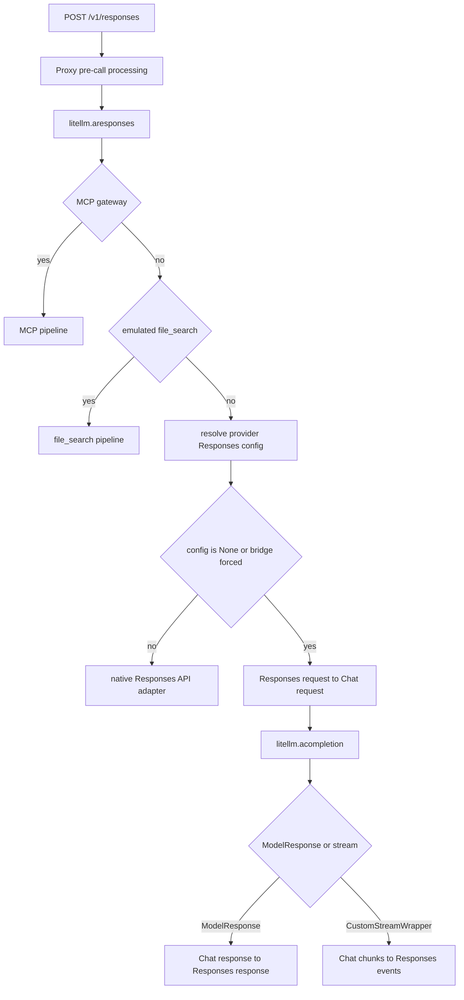

# Responses API 到 Chat Completions 桥接规格

本文档描述 LiteLLM 如何把 OpenAI Responses API 请求转换为 Chat Completions 请求，以及如何把 Chat Completions 响应重新组装成 Responses API 响应

本文档基于提交 `ae7e50f096a8722bad14d63b6a0d4634d59bf475`。它同时记录当前实现、兼容性约束和已知偏差，目标是让另一个 agent 不依赖原实现结构也能重写此模块

## 1. 结论

仓库中已经有完整实现，核心目录是 `litellm/responses/litellm_completion_transformation/`

| 文件 | 职责 |
| --- | --- |
| `handler.py` | 组织 Responses 请求转换、调用 `litellm.completion()` 或 `litellm.acompletion()`、选择非流式或流式响应转换 |
| `transformation.py` | 请求字段、输入消息、工具、非流式响应、usage 的双向转换 |
| `streaming_iterator.py` | 把 Chat Completions chunk 转换为 Responses API 事件流 |
| `session_handler.py` | 使用 `previous_response_id` 从 spend logs 和冷存储恢复 Chat Completions 消息历史 |
| `custom_tools.py` | 在 Responses `custom` 工具和 Chat Completions `function` 工具之间转换 |

这个模块不会自己直接发送 HTTP 请求到字面上的 `/chat/completions` URL。它调用 LiteLLM 的统一 `completion` 或 `acompletion` 入口，后续 provider adapter 再决定真实上游 URL。对调用方而言，上游协议已经是 Chat Completions

## 2. HTTP 入口和启用条件

Proxy 接受以下等价入口，它们最终进入 `litellm.aresponses`

```text
POST /v1/responses
POST /responses
POST /openai/v1/responses
```

路由入口位于 `litellm/proxy/response_api_endpoints/endpoints.py`，核心分派位于 `litellm/responses/main.py`

桥接在以下任一条件成立时启用

1. `ProviderConfigManager.get_provider_responses_api_config()` 返回 `None`，说明 provider 没有原生 Responses API adapter
2. 调用参数 `use_chat_completions_api` 为 truthy
3. 模型名使用 `openai/chat_completions/<model>`，该前缀会被规范化为 `openai/<model>`，同时强制启用桥接

如果 provider 有原生 Responses API config，且调用方没有强制桥接，则直接使用 provider 的 Responses API handler

MCP gateway 和 emulated file search 的分派发生在普通桥接判断之前，因此这两个功能可能先接管请求。file search 内部再次调用 Responses API 时会继续传递 `use_chat_completions_api=True`



## 3. Handler 调用契约

入口方法是

```python
LiteLLMCompletionTransformationHandler.response_api_handler(
    model,
    input,
    responses_api_request,
    custom_llm_provider=None,
    _is_async=False,
    stream=None,
    extra_headers=None,
    **kwargs,
)
```

处理顺序如下

1. 调用 `transform_responses_api_request_to_chat_completion_request`
2. 以 `kwargs` 为基础，再覆盖转换后的 Chat Completions 字段
3. 强制加入 `_skip_responses_api_bridge=True`
4. 同步路径调用 `litellm.completion`，异步路径调用 `litellm.acompletion`
5. `ModelResponse` 进入非流式转换
6. `CustomStreamWrapper` 包装为 `LiteLLMCompletionStreamingIterator`
7. 其他返回类型抛出 `ValueError`

`_skip_responses_api_bridge=True` 是递归保护。某些模型在 Chat Completions 入口会因为 model cost map 的 `mode="responses"` 再被转到 Responses API，如果没有该标记会形成 Responses 到 Chat 再回 Responses 的无限递归

异步路径在调用 `acompletion` 前处理 `previous_response_id`，同步路径当前没有对应的会话恢复步骤

## 4. 顶层请求字段转换

### 4.1 字段映射

`transform_responses_api_request_to_chat_completion_request` 生成以下 Chat Completions 参数

| Responses API 输入 | Chat Completions 输出 | 规则 |
| --- | --- | --- |
| `model` | `model` | 原值 |
| `input` | `messages` | 使用第 5 节算法 |
| `instructions` | `messages[0]` | 非空时插入 `{"role":"system","content":instructions}` |
| `max_output_tokens` | `max_tokens` | 原值 |
| `parallel_tool_calls` | `parallel_tool_calls` | 原值 |
| `temperature` | `temperature` | 原值 |
| `top_p` | `top_p` | 原值 |
| `user` | `user` | 原值 |
| `stream` | `stream` | handler 的显式 `stream` 参数 |
| `tools` | `tools` | 使用第 6 节算法 |
| `tools` 中的 web search | `web_search_options` | 从工具定义派生，不保留在 `tools` 中 |
| `tool_choice` | `tool_choice` | 使用第 6.5 节算法 |
| `text.format` | `response_format` | 使用第 4.2 节算法 |
| `reasoning` | `reasoning_effort` | 使用第 4.3 节算法 |
| `context_management` | `context_management` | 原值 |
| `custom_llm_provider` | `custom_llm_provider` | handler 参数 |
| `extra_headers` | `extra_headers` | handler 参数 |
| `metadata` | `metadata` | 当前代码读取 `kwargs["metadata"]`，不是 `responses_api_request["metadata"]` |
| `service_tier` | `service_tier` | 当前代码读取 `kwargs["service_tier"]` |

所有值为 `None` 的键在返回前删除

如果转换后 `tools` 为空，则同时删除 `tools` 和 `tool_choice`，避免 Chat Completions provider 拒绝没有工具定义的 `tool_choice`

流式请求额外加入

```json
{
  "stream_options": {
    "include_usage": true
  }
}
```

这是为了保证最终 `response.completed` 能携带 usage。相同值还会写入传入的 LiteLLM logging object

`extra_body`、`timeout`、`allowed_openai_params` 以及其他 LiteLLM 参数不是由转换函数创建，而是 handler 合并 `kwargs` 时继续传入 `completion` 或 `acompletion`

### 4.2 `text.format` 到 `response_format`

| Responses `text.format.type` | Chat `response_format` |
| --- | --- |
| `json_schema` | `{"type":"json_schema","json_schema":{"name":name 或 "response_schema","schema":schema 或 {},"strict":strict 或 false}}` |
| `json_object` | `{"type":"json_object"}` |
| `text` | 不发送 `response_format` |
| 缺失或未知 | 不发送 `response_format` |

### 4.3 `reasoning` 到 `reasoning_effort`

| `reasoning` 值 | `reasoning_effort` |
| --- | --- |
| 字符串 | 原字符串 |
| 包含 `summary` 的对象 | 保留完整对象，包括 `effort` 和 `summary` |
| 仅包含 `effort` 的对象 | 只传 `effort` 字符串 |
| 其他非空对象 | 原对象 |
| 空值 | 不发送 |

### 4.4 当前不会由核心转换器映射的 Responses 字段

以下字段可能在更外层被消费，但核心 Responses 到 Chat 转换器不会把它们转换为 Chat Completions 参数

| 字段 | 当前结果 |
| --- | --- |
| `include` | 不进入 Chat 请求 |
| `store` | 不进入 Chat 请求 |
| `background` | 普通桥接转换不处理 |
| `truncation` | 不进入 Chat 请求 |
| `prompt` | 在进入桥接前由 prompt management 处理 |
| `previous_response_id` | 仅用于异步历史恢复，不直接发给 Chat provider |
| `safety_identifier` | 核心转换器不处理 |

## 5. `input` 到 `messages` 的转换

### 5.1 字符串输入

```json
"hello"
```

转换为

```json
[
  {
    "role": "user",
    "content": "hello"
  }
]
```

如果有 `instructions`，system message 位于该 user message 前面

### 5.2 通用输入项

对于不是工具调用、工具结果或 reasoning 的对象

```json
{
  "type": "message",
  "role": "user",
  "content": "hello"
}
```

转换为

```json
{
  "role": "user",
  "content": "hello"
}
```

`role` 缺失时默认为 `user`。`content` 为 `null` 时整项删除

### 5.3 content part 转换

| Responses content part | Chat content part |
| --- | --- |
| 字符串 | 原字符串 |
| `{"type":"input_text","text":"x"}` | `{"type":"text","text":"x"}` |
| `{"type":"output_text","text":"x"}` | `{"type":"text","text":"x"}` |
| `{"type":"tool_result","text":"x"}` | `{"type":"text","text":"x"}` |
| `{"type":"input_audio",...}` | type 保持 `input_audio`，只保留转换器生成的 `type` 和 `text` |
| 未知 type 且有 `text` | type 降级为 `text` |
| 任意文本 part 且 `text` 为 `null` | 删除该 part |
| `cache_control` | 在文本、文件和图片 part 上保留 |

`input_file` 转换为

```json
{
  "type": "file",
  "file": {
    "file_id": "effective-id-or-url",
    "file_data": "optional-base64"
  }
}
```

`file_id` 优先于 `file_url`，没有 `file_id` 时把 `file_url` 放入 Chat 的 `file.file_id`。`file_data` 独立保留

`input_image` 转换为

```json
{
  "type": "image_url",
  "image_url": {
    "url": "original-image_url-or-empty-string",
    "detail": "original-detail-or-auto"
  }
}
```

content part 的 `type="encrypted_content"` 会变成 Chat 文本 part，其中 `text` 等于原 `encrypted_content` 字符串

如果 content 本身既不是字符串也不是列表，转换器抛出 `ValueError`

### 5.4 `function_call` 和 `custom_tool_call`

Responses 输入

```json
{
  "type": "function_call",
  "call_id": "call_1",
  "id": "fc_1",
  "name": "get_weather",
  "arguments": "{\"city\":\"Paris\"}",
  "status": "completed"
}
```

转换为

```json
{
  "role": "assistant",
  "content": null,
  "tool_calls": [
    {
      "id": "call_1",
      "type": "function",
      "index": 0,
      "function": {
        "name": "get_weather",
        "arguments": "{\"city\":\"Paris\"}"
      }
    }
  ]
}
```

ID 优先级为 `call_id`、`id`、空字符串

如果 `arguments` 等于 LiteLLM 的 redaction sentinel，会替换为有效 JSON 占位符 `"{}"`

`custom_tool_call` 的原始负载位于 `input`。转换时包装为

```json
{
  "content": "<raw input>"
}
```

并序列化到 Chat function arguments

带 `namespace` 的普通 function call 使用 `<namespace>__<name>` 作为 Chat function name。custom tool 不加 namespace 前缀

连续的多个 function call 会合并到同一个 assistant message 的 `tool_calls` 数组。这样可以满足要求多个 tool use block 和后续 tool result 相邻的 provider

如果一个普通 assistant content message 紧跟在只有 `tool_calls` 且 `content` 为空的 assistant message 后面，content 会折叠进前一个 assistant message

### 5.5 工具执行结果

以下 Responses item type 都按工具结果处理

```text
function_call_output
custom_tool_call_output
web_search_call
computer_call_output
tool_result
```

基础输出是

```json
{
  "role": "tool",
  "tool_call_id": "call_1",
  "content": "tool output"
}
```

`call_id` 缺失或为空时删除整项，因为无法构造有效 Chat tool message

`output` 规范化规则如下

| `output` 类型 | Chat `content` |
| --- | --- |
| `null` | 空字符串 |
| 字符串 | 原字符串 |
| 只包含文本 part 的列表 | 按顺序拼接全部文本 |
| 包含图片 part 的列表 | 保留为 `text` 和 `image_url` content part 列表 |
| 其他列表、对象或数值 | JSON 序列化，失败时使用 `str(value)` |

图片 part 接受 `input_image` 或 `image_url`，URL 可以是字符串，也可以是 `{"url":"..."}` 对象

模块使用进程内 `TOOL_CALLS_CACHE` 保存先前生成的 tool call 定义。如果处理 tool output 时命中缓存，会在 tool message 前补一个 assistant `tool_calls` message

已有 function call input 和缓存恢复出的 assistant wrapper 使用 call ID 去重，避免同一工具调用出现两次

### 5.6 reasoning 输入项

provider-bound 转换调用时使用 `replay_reasoning=True`

reasoning 文本提取优先级如下

1. 非空字符串 `content`
2. `content` 列表中非 `encrypted_content`、非 `redacted_thinking` block 的 `text`，多个值以换行连接
3. `summary` 列表中各 block 的 `text`，多个值以换行连接

提取到的文本不会成为可见 assistant content，而是生成

```json
{
  "role": "assistant",
  "content": null,
  "reasoning_content": "..."
}
```

如果 `encrypted_content` 是本模块先前写出的 JSON thinking block 数组，则恢复带有效 `signature` 的 `thinking` block 和带有效 `data` 的 `redacted_thinking` block，并写入 assistant message 的 `thinking_blocks`

reasoning-only assistant message 如果紧跟普通 assistant answer 或 tool call assistant message，会合并到后者。多个 reasoning 文本以换行连接，恢复的 thinking blocks 放在目标 message 已有 blocks 前面

如果 reasoning 后面是 user message或位于输入末尾，则保留独立 reasoning-only assistant message

没有文本且没有可验证 thinking block 的 reasoning item 会删除

供 guardrail、token counting 等只读调用方使用的 `replay_reasoning=False` 模式会把 reasoning 文本留在普通 `content` 中，保证可扫描性

## 6. 工具定义转换

### 6.1 function 工具

Responses 工具

```json
{
  "type": "function",
  "name": "get_weather",
  "description": "Get weather",
  "parameters": {
    "type": "object",
    "properties": {}
  },
  "strict": true
}
```

转换为

```json
{
  "type": "function",
  "function": {
    "name": "get_weather",
    "description": "Get weather",
    "parameters": {
      "type": "object",
      "properties": {}
    },
    "strict": true
  }
}
```

`parameters` 缺失、为空或缺少 `type` 时补 `"type":"object"`

以下扩展字段在外层保留

```text
cache_control
defer_loading
allowed_callers
input_examples
```

### 6.2 web search 工具

`web_search` 和 `web_search_preview` 不进入 Chat `tools`，而是转换为

```json
{
  "web_search_options": {
    "search_context_size": "low|medium|high",
    "user_location": {}
  }
}
```

如果目标 provider 的 `get_supported_openai_params` 明确不包含 `web_search_options`，则删除派生参数。provider 未映射、返回 `None` 时保留

### 6.3 custom 工具

Responses `type="custom"` 工具降级为单参数 Chat function

```json
{
  "type": "function",
  "function": {
    "name": "<custom name>",
    "description": "<description plus optional grammar>",
    "parameters": {
      "type": "object",
      "properties": {
        "content": {
          "type": "string",
          "description": "The <name> content following the specified format"
        }
      },
      "required": ["content"]
    }
  }
}
```

如果 custom tool 有 `format.definition`，description 末尾追加 fenced grammar，语言标识使用 `format.syntax`

`allowed_callers` 必须是严格的字符串列表或 `null`，否则抛出 `ValueError`

响应转换时，原始 request 中同名 custom tool 的 function call 会恢复为 `custom_tool_call`，并从 `{"content":"..."}` arguments 中取出原始字符串

为防止异常大 JSON 解析，arguments 超过 1,000,000 字符时不解包，原样返回

### 6.4 namespace 工具

嵌套 namespace

```json
{
  "type": "namespace",
  "name": "weather",
  "description": "Weather tools",
  "tools": [
    {
      "type": "function",
      "name": "lookup",
      "parameters": {}
    }
  ]
}
```

展平为名为 `weather__lookup` 的 Chat function。namespace description 和子工具 description 以两个换行连接

只有嵌套 `type="function"` 子工具会转换，其他子工具删除

没有 `tools` 数组的扁平 namespace 按单个 function 处理，名称不加 `namespace__` 前缀

如果顶层 function 名与某个展平后的 namespace function 名冲突，转换器抛出 `ValueError`

响应恢复时支持两种名称

1. 完整的 `namespace__tool`
2. 在所有 namespace 中唯一，且不与顶层 function 同名的短名称 `tool`

恢复后的 Responses function call 使用短 `name`，并额外写入 `namespace`

### 6.5 其他工具

| Responses tool type | 当前行为 |
| --- | --- |
| `mcp` | 原样放入 Chat `tools` |
| `computer_use` | 记录 warning 后删除 |
| `image_generation` | 记录 warning 后删除 |
| `shell` | 记录 warning 后删除 |
| 其他未知类型 | 原样放入 Chat `tools` |

### 6.6 `tool_choice`

| Responses 值 | Chat 值 |
| --- | --- |
| `"auto"`、`"none"`、`"required"` | 原字符串 |
| `{"type":"auto"}` | `"auto"` |
| `{"type":"none"}` | `"none"` |
| `{"type":"required"}`、`{"type":"tool"}`、`{"type":"any"}` | `"required"` |
| `{"type":"function","name":"x"}` | `{"type":"function","function":{"name":"x"}}` |
| `{"type":"function"}` | `"required"` |
| `{"type":"custom","name":"x"}` | `{"type":"function","function":{"name":"x"}}` |
| `{"type":"custom","custom":{"name":"x"}}` | 同上 |
| 无法识别 | 原样返回 |

标准 Chat 形式 `{"type":"function","function":{"name":"x"}}` 原样返回

## 7. `previous_response_id` 和会话恢复

Responses request 预处理会先尝试解码 LiteLLM 管理的 response ID，取出原始上游 `response_id`

异步桥接检测到 `previous_response_id` 后执行以下算法

1. 用 `previous_response_id` 对应的原始 response ID 查询 `LiteLLM_SpendLogs.request_id`
2. 取得匹配记录的 `session_id`
3. 查询同一 session 的所有 spend logs，并按 `endTime ASC` 排序
4. 从每条记录的 `proxy_server_request.input` 或 `messages` 重建 Chat 输入消息
5. 从每条记录的 `response.choices[*].message` 追加 assistant 历史
6. 把历史和本次新 messages 拼接
7. 修复缺少对应 assistant tool call 的 tool result
8. 把 spend log session ID 写入 `litellm_trace_id`

如果 request payload 因长度被截断，并且配置了 cold storage logger，则通过 spend log metadata 中的 `cold_storage_object_key` 读取完整请求

刚完成的请求可能尚未写入 spend log，因此查询最多按配置重试 `RESPONSES_SESSION_LOOKUP_MAX_ATTEMPTS` 次，每次间隔 `RESPONSES_SESSION_LOOKUP_RETRY_INTERVAL`

如果禁用了 spend logs，只查询一次

tool result 修复优先级如下

1. 从前一个 assistant message 恢复空的 `tool_call_id`
2. 检查该 assistant 是否已有同 ID tool call
3. 从 `TOOL_CALLS_CACHE` 恢复完整定义
4. 缓存未命中时，从当前 tools 列表构造 name 加空 arguments 的最小 tool call
5. 仍无法修复且还有其他非 tool message 时删除无效 tool message

如果最终 messages 为空，优先恢复本次原始 messages，再恢复 session messages。两者都为空时抛出 LiteLLM `BadRequestError`

## 8. 非流式 Chat 响应到 Responses 响应

### 8.1 顶层对象

`transform_chat_completion_response_to_responses_api_response` 接受 `ModelResponse` 或可构造成 `ModelResponse` 的字典

| Chat 字段 | Responses 字段 | 缺省值或规则 |
| --- | --- | --- |
| `id` | `id` | 原值 |
| `created` | `created_at` | 原值 |
| `model` | `model` | 原值 |
| 固定值 | `object` | `"response"` |
| `error` | `error` | `null` |
| `incomplete_details` | `incomplete_details` | `null` |
| `instructions` | `instructions` | `null` |
| `metadata` | `metadata` | `{}` |
| `parallel_tool_calls` | `parallel_tool_calls` | `false` |
| `temperature` | `temperature` | `0` |
| `tool_choice` | `tool_choice` | `"auto"` |
| `tools` | `tools` | `[]` |
| `top_p` | `top_p` | `null` |
| `max_output_tokens` | `max_output_tokens` | `null` |
| `previous_response_id` | `previous_response_id` | `null` |
| 固定值 | `reasoning` | `null` |
| 固定值 | `text` | `{}` |
| `truncation` | `truncation` | `null` |
| `user` | `user` | `null` |
| `usage` | `usage` | 使用第 8.7 节算法 |

顶层 `status` 只看第一个 choice 的 `finish_reason`

| Chat `finish_reason` | Responses `status` |
| --- | --- |
| `stop`、`tool_calls`、`function_call`、`null` | `completed` |
| `length`、`content_filter`、`refusal` | `incomplete` |
| 未知值 | `completed` |

### 8.2 output 顺序

output 按以下顺序构建

1. 最多一个 reasoning item
2. 每个 choice 的 message item 或 image generation items
3. 所有 choice 的 function 或 custom tool call items
4. provider 预构建的 server-side tool result 替换对应 function call

因此一个带 reasoning、文本和 tool call 的 choice 可以同时产生三个 output item

### 8.3 文本 message

每个没有 `message.images` 的 choice 生成

```json
{
  "type": "message",
  "id": "msg_<uuid4>",
  "status": "<mapped from finish_reason>",
  "role": "<chat message role>",
  "content": [
    {
      "type": "output_text",
      "text": "<message.content>",
      "annotations": []
    }
  ]
}
```

每次转换生成新的随机 message ID，不复用 Chat completion ID

### 8.4 annotations

只转换 Chat annotation `type="url_citation"`

```json
{
  "type": "url_citation",
  "start_index": 0,
  "end_index": 10,
  "url": "https://example.com",
  "title": "Example"
}
```

其他 annotation type 当前删除

### 8.5 reasoning 输出

转换器只检查第一个包含 reasoning 的 choice，生成最多一个 reasoning item

```json
{
  "type": "reasoning",
  "id": "rs_<uuid4>",
  "status": "<mapped from finish_reason>",
  "role": "assistant",
  "content": [
    {
      "type": "output_text",
      "text": "<message.reasoning_content>",
      "annotations": []
    }
  ],
  "encrypted_content": "<optional-json>"
}
```

如果 message 有带 `signature` 或 `data` 的 `thinking_blocks`，这些 blocks 会被紧凑 JSON 序列化到 `encrypted_content`

即使没有明文 `reasoning_content`，只要存在可保留的 thinking block 也会生成 reasoning item，此时 `content` 为空数组

### 8.6 工具调用输出

所有 choice 的 `message.tool_calls` 都会收集。普通 function call 生成

```json
{
  "type": "function_call",
  "id": "<chat tool call id>",
  "call_id": "<chat tool call id>",
  "name": "<function name>",
  "arguments": "<raw arguments string>",
  "status": "<function status or completed>"
}
```

tool call 同时写入 `TOOL_CALLS_CACHE`，供后续 `function_call_output` 恢复 assistant tool call

如果原始 Responses request 定义了同名 custom tool，则输出改为

```json
{
  "type": "custom_tool_call",
  "id": "<chat tool call id>",
  "call_id": "<chat tool call id>",
  "name": "<function name>",
  "input": "<unwrapped content>",
  "status": "<function status or completed>"
}
```

namespace function name 按第 6.4 节恢复

tool call 或 function 上的 `provider_specific_fields` 会原样附加到 Responses function call

provider adapter 可以把 server-side code execution result 放在 `message.provider_specific_fields["code_interpreter_results"]`。这些对象被转换为 `code_interpreter_call`，并按 ID 替换同 call ID 的普通 `function_call`

### 8.7 图片输出

如果 choice message 有 `images`，该 choice 不生成文本 message，而是为每个有效图片生成

```json
{
  "type": "image_generation_call",
  "id": "ig_<uuid4>",
  "status": "completed|incomplete|failed",
  "result": "<base64-without-data-url-prefix>"
}
```

`data:image/...;base64,` 前缀会删除。没有前缀的字符串按纯 base64 原样使用

| finish reason | image status |
| --- | --- |
| `stop` | `completed` |
| `length` | `incomplete` |
| `content_filter`、`error` | `failed` |
| 其他 | `completed` |

### 8.8 usage

基础映射如下

| Chat usage | Responses usage |
| --- | --- |
| `prompt_tokens` | `input_tokens` |
| `completion_tokens` | `output_tokens` |
| `total_tokens` | `total_tokens` |
| `usage.cost` | 动态 `cost` 字段 |

没有 usage 时三个 token count 都为 `0`

`prompt_tokens_details` 映射为 `input_tokens_details`

| Chat detail | Responses detail |
| --- | --- |
| `cached_tokens` | `cached_tokens`，缺失时在 detail 对象内补 `0` |
| `text_tokens` | `text_tokens` |
| `audio_tokens` | `audio_tokens` |
| `cache_write_tokens` | `cache_write_tokens` |
| `cache_creation_tokens` | 当 `cache_write_tokens` 缺失时作为其后备 |

`completion_tokens_details` 映射为 `output_tokens_details`

| Chat detail | Responses detail |
| --- | --- |
| `reasoning_tokens` | `reasoning_tokens`，缺失时补 `0` |
| `audio_tokens` | `audio_tokens` |
| `text_tokens` | `text_tokens` |
| `image_tokens` | `image_tokens` |

只有原 Chat detail 对象存在时才创建对应 Responses detail 对象

### 8.9 hidden 和 provider 字段

Chat response 的 `_hidden_params` 整体复制到 Responses response

如果 `_hidden_params["provider_specific_fields"]` 存在，还会把它暴露为顶层动态 `provider_specific_fields`

## 9. 流式转换

### 9.1 输入和状态

`LiteLLMCompletionStreamingIterator` 同时支持同步和异步迭代。它维护以下关键状态

| 状态 | 用途 |
| --- | --- |
| `_cached_response_id` | 保证所有 response-level 事件使用同一 ID |
| `_cached_item_id` | 文本 message item ID |
| `_cached_reasoning_item_id` | reasoning item ID |
| `collected_chat_completion_chunks` | 在流结束时用 `stream_chunk_builder` 重建完整 ModelResponse |
| `_pending_response_events` | reasoning、message、annotation 等待发送事件 |
| `_pending_tool_events` | function call 等待发送事件 |
| `_tool_args_by_call_id` | 累积每个工具调用的 arguments |
| `_tool_call_id_by_index` | 恢复后续没有 ID 的 tool delta |
| `_tool_output_index_by_call_id` | 固定每个工具 output index |
| `_sequence_number` | 部分事件的序号 |
| `completed_response` | 保存最终 `response.completed`，供外层 fallback 和 ownership hook 使用 |

迭代器会在发出 `response.created` 前先读取第一个非空上游 chunk，并缓存它。这样优先使用 Chat stream 的真实 ID，而不是先生成随机 ID

如果流在首个 chunk 前结束，则生成 `resp_<uuid4>` 作为后备 ID

### 9.2 普通文本事件序列

预期普通文本序列如下

```text
response.created
response.in_progress
response.output_item.added
response.content_part.added
response.output_text.delta  repeated
response.output_text.done
response.content_part.done
response.output_item.done
response.completed
```

message output index 和 content index 都是 `0`

初始 message item 为

```json
{
  "id": "msg_<uuid4>",
  "type": "message",
  "role": "assistant",
  "status": "in_progress",
  "content": []
}
```

初始 content part 为

```json
{
  "type": "output_text",
  "text": "",
  "annotations": []
}
```

每个 Chat chunk 只读取第一个 choice 的 `delta.content`

流结束时完整 chunks 交给 `stream_chunk_builder`，随后调用同一个非流式响应转换器构造 `response.completed.response`

最终 snapshot 中 message 和 reasoning item ID 会替换为流中已经发出的 ID，保证中间事件与完成快照一致

### 9.3 reasoning 事件

首个有效 delta 是 `reasoning_content` 时，先发送

```text
response.output_item.added
```

item 使用 `type="reasoning"`、`status="in_progress"`、`output_index=0`

每个 reasoning delta 转换为

```text
response.reasoning_summary_text.delta
```

当 chunk 首次出现普通 content、function call、tool call 或非空 finish reason 时，reasoning 阶段结束，并排队

```text
response.reasoning_summary_text.done
response.reasoning_summary_part.done
response.output_item.done
```

reasoning 文本由所有已见 `reasoning_content` 直接拼接

### 9.4 function tool call 事件

发现一个新的 call ID 时发送

```text
response.output_item.added
```

item 是 `function_call` 或 `custom_tool_call`，初始 status 为 `in_progress`

工具 output index 从 `1` 开始，因为当前实现保留 `0` 给 message 或 reasoning item

Chat provider 可能一次给出很长的 arguments delta。桥接器固定按最多 10 个字符切片，每片发送

```text
response.function_call_arguments.delta
```

流结束后，每个工具调用按顺序发送

```text
response.function_call_arguments.done
response.output_item.done
```

如果完整 tool call 只出现在 `stream_chunk_builder` 的最终 ModelResponse 中，而流式 delta 中没有出现，迭代器会补发 added、全部 argument deltas、arguments done 和 item done

后续 tool delta 没有 call ID 时，用 Chat tool call `index` 找回 ID。若同一个 index 曾对应多个不同 call ID，该 index 标为歧义，后续无 ID delta 会跳过，避免把 arguments 拼到错误调用

parallel tool calls 按 call ID 分别累积，并获得不同 output index

### 9.5 annotation 事件

首次看到 `delta.annotations` 时，把所有可转换的 URL citations 排队为

```text
response.output_text.annotation.added
```

当前实现只处理第一次出现 annotations 的 chunk

### 9.6 provider-specific 数据

每个 chunk 顶层和 `choice[0].delta` 的 `provider_specific_fields` 都会累积

同名字段采用最后值覆盖。列表也不追加，因为 provider 通常发送到当前时刻为止的完整累计列表

流结束后这些字段写入完整 ModelResponse 的 `_hidden_params["provider_specific_fields"]`

### 9.7 response ID 编码

流式 `response.created`、`response.in_progress` 和 `response.completed` 会经过 `ResponsesAPIRequestUtils._update_responses_api_response_id_with_model_id`

编码格式为

```text
resp_<base64("litellm:custom_llm_provider:<provider>;model_id:<model-id>;response_id:<original-id>")>
```

这个 ID 用于下一次请求的 deployment affinity 和 session lookup。已经是 LiteLLM 编码格式的 ID 不会重复编码

非流式核心转换器本身只复制 Chat response ID。调用链如果需要统一管理 ID，必须在外层明确执行相同编码步骤

## 10. 错误和降级规则

重写时应保留以下显式错误

| 条件 | 当前行为 |
| --- | --- |
| handler 收到既不是 `ModelResponse` 也不是 `CustomStreamWrapper` 的返回值 | `ValueError` |
| input content 既不是字符串也不是列表 | `ValueError` |
| namespace 展平名称与顶层 function 冲突 | `ValueError` |
| `allowed_callers` 不是字符串列表或 `null` | `ValueError` |
| `previous_response_id` 恢复后仍无法构造任何 message | LiteLLM `BadRequestError` |
| 上游 completion 异常 | 原样传播 |
| streaming iterator 内部异常 | 标记 finished 后原样传播 |

以下情况静默删除或降级

| 条件 | 当前行为 |
| --- | --- |
| input item `content=null` | 删除 item |
| content part `text=null` | 删除 part |
| tool output 缺少 call ID | 删除 item |
| opaque 或无法解析的 reasoning encrypted content | 不重放 |
| `computer_use`、`image_generation`、`shell` 工具 | warning 后删除 |
| 未知 content part type | 降级为 text |
| 未知 finish reason | 顶层状态按 completed |
| 无 usage | token counts 全部为 0 |

## 11. 重写必须保持的兼容性不变量

下面这些应视为目标实现的规范性要求，而不是对当前类结构的要求

1. 桥接必须在没有原生 Responses adapter 时自动启用，并允许调用方显式强制启用
2. 必须设置递归保护，Chat 调用不能再次桥回 Responses
3. request input item 顺序必须保持，尤其是 assistant tool call 和紧随其后的 tool result
4. 并行 function calls 必须合并到同一个 assistant message
5. Chat tool result 必须有对应 assistant tool call，不得发送孤立 tool result
6. custom tool、namespace tool 的名称和 payload 必须能往返恢复
7. reasoning 明文和签名 thinking blocks 必须与可见 content 分离并支持多轮重放
8. 每个 Responses output item 必须有符合类型前缀且在该响应内稳定的 ID
9. 流式同一 response 的所有 response-level 事件必须共享一个 response ID
10. `response.completed` 的 item ID 必须复用中间事件已公布的 item ID
11. 工具 arguments deltas 必须按 call ID 隔离，不能在并行调用之间串线
12. 流式结束前必须提供 usage，因此 Chat stream 必须请求 `include_usage`
13. finish reason 到 Responses status 的映射必须同时用于顶层 response 和各 output item
14. URL citation、cache token、reasoning token、image token 和 provider-specific 字段不能在桥接中丢失
15. `previous_response_id` 必须恢复完整有序历史，并保持 deployment 和 trace affinity
16. 同步和异步接口应产生等价的请求、响应和 session 行为

## 12. 当前实现中不应盲目复制的偏差

这些是从代码路径直接观察到的行为。重写前应先决定是否修复，并用兼容测试锁定决定

### 12.1 named 参数传播不一致

请求转换器从 `kwargs` 读取 `metadata` 和 `service_tier`，但它们在 `responses()` 中是 named 参数，并且已经存在于 `responses_api_request` 或局部变量。桥接分派没有显式把这两个 named 参数再次放入 `kwargs`

新的实现应从规范化后的 Responses request 读取它们，不应依赖它们是否恰好还存在于 `kwargs`

### 12.2 同步 `previous_response_id`

只有异步 handler 调用 session handler。同步桥接会忽略历史恢复

新的实现应让同步路径执行等价恢复，或明确拒绝同步 session continuation

### 12.3 非流式 ID 管理

非流式转换器直接把 `chatcmpl-*` ID 放到 Responses 顶层 `id`，而流式路径显式编码为 LiteLLM `resp_*` ID

新的实现应统一两条路径，并保证 ID 可用于 `previous_response_id`

### 12.4 流式首 chunk 和 item 生命周期

异步迭代器会在排队初始 item 事件后继续转换同一个 chunk。同步迭代器在排队初始 item 事件后立即返回，当前 chunk 的 delta 只进入最终 chunk builder，可能没有对应的中间 delta 事件

reasoning-first 流在 reasoning 结束并进入普通文本时不会重新发送 message `output_item.added` 和 `content_part.added`，但后续仍可能发送 message text delta 和 done 事件

tool-only 流结束后仍经过默认 message text done、content part done 和 item done 状态，可能产生空 message 生命周期

新的实现应为 reasoning、message 和每个 tool call 分别维护独立 item state，不应使用单个 `sent_output_item_added_event` 控制所有 item

### 12.5 sequence number 不一致

只有部分事件带 `sequence_number`。部分 done event 没有动态序号，message `output_item.done` 甚至固定使用 `1`

如果目标客户端依赖 OpenAI 事件顺序，重写应为每个发出的事件分配严格单调递增的 sequence number

### 12.6 advertised 参数与实际参数不一致

`get_supported_openai_params` 声明支持 `metadata` 和 `previous_response_id`，但同步路径或 named 参数传播不能完整兑现。反过来，转换器实际处理 `context_management`，但该字段不在 advertised list 中

重写应从单一 schema 生成支持列表和转换逻辑，避免两份能力定义漂移

## 13. 推荐的重写边界

为了减少当前实现中的共享可变状态，建议把重写拆成以下纯转换边界

```text
normalize_responses_request(request, provider_capabilities) -> NormalizedBridgeRequest | BridgeError
responses_input_to_chat_messages(input_items, replay_context) -> tuple[ChatMessage, ...] | BridgeError
responses_tools_to_chat_tools(tools, provider_capabilities) -> ToolConversion
chat_response_to_responses(chat_response, original_request, id_context) -> ResponsesResponse
chat_chunk_to_events(stream_state, chat_chunk) -> StreamTransition
restore_session(previous_response_id, history_store) -> SessionHistory | SessionError
```

`ToolConversion` 至少需要同时返回 Chat tools、web search options、custom tool name set 和 namespace name map

`StreamTransition` 应返回新 state 和零个或多个事件。这样同一 chunk 可以先创建 item，再发 delta，不会因为 iterator 一次只能 return 一个对象而丢失当前 chunk

I/O、数据库查询、provider capability lookup、ID encoding 和纯字段转换应使用依赖注入分离，便于对每个边界做确定性测试

## 14. 最小验收测试矩阵

另一个实现至少应覆盖以下测试

| 类别 | 用例 |
| --- | --- |
| 路由 | provider 无 Responses config 自动桥接 |
| 路由 | `use_chat_completions_api=True` 强制桥接 |
| 路由 | `openai/chat_completions/<model>` 规范化并桥接 |
| 路由 | provider 有原生 config 且未强制时不桥接 |
| 递归 | forwarded completion 带 `_skip_responses_api_bridge=True` |
| 输入 | 字符串、message、文本数组、图片、文件、空 content |
| 输入 | file ID、file URL、file data 和优先级 |
| 工具 | function schema 缺少 type 时补 object |
| 工具 | custom grammar 工具往返 |
| 工具 | namespace 展平、短名称恢复、冲突拒绝 |
| 工具 | web search 派生与 provider capability 删除 |
| 工具 | unsupported Responses-only tools 删除 |
| 工具 | 多个并行 function call 合并 |
| 工具 | function call output 与 assistant call 相邻 |
| reasoning | 明文、summary-only、签名 thinking block、多轮合并 |
| 非流式 | 文本、reasoning、tool call、custom tool call、image output |
| 非流式 | 所有 finish reason 状态映射 |
| usage | 无 details、cached、cache write、reasoning、audio、text、image tokens |
| annotations | URL citation 索引和字段保持 |
| 流式 | 普通文本完整事件序列 |
| 流式 | reasoning 后继续输出文本 |
| 流式 | tool-only 流不生成虚假 message item |
| 流式 | 并行 tool calls 和无 ID 后续 delta |
| 流式 | final-only tool call 补发 |
| 流式 | response 和 item ID 全程稳定 |
| 流式 | sequence number 严格递增 |
| 会话 | previous response 恢复输入、输出和 tool calls |
| 会话 | spend log 延迟重试和 cold storage 回源 |
| 同步性 | sync 和 async 结果等价 |

现有主要回归测试位于

```text
tests/test_litellm/responses/litellm_completion_transformation/
tests/test_litellm/responses/test_responses_api_bridge_flag.py
tests/test_litellm/test_responses_api_bridge_non_stream.py
tests/e2e/llm_translation/test_responses_bridge_streaming_e2e.py
```

## 15. 关键源码索引

| 行为 | 源码 |
| --- | --- |
| 桥接启用判断 | `litellm/responses/main.py::_bridges_to_chat_completions` |
| 强制桥接模型前缀 | `litellm/responses/main.py::_normalize_openai_chat_completions_responses_model` |
| 请求总转换 | `transformation.py::transform_responses_api_request_to_chat_completion_request` |
| input 到 messages | `transformation.py::transform_responses_api_input_to_messages` |
| 单个 input item | `transformation.py::_transform_responses_api_input_item_to_chat_completion_message` |
| Responses tools 到 Chat tools | `transformation.py::transform_responses_api_tools_to_chat_completion_tools` |
| 非流式响应总转换 | `transformation.py::transform_chat_completion_response_to_responses_api_response` |
| Chat tools 到 Responses output | `transformation.py::transform_chat_completion_tools_to_responses_tools` |
| usage 转换 | `transformation.py::_transform_chat_completion_usage_to_responses_usage` |
| 流式 chunk 转换 | `streaming_iterator.py::_transform_chat_completion_chunk_to_response_api_chunk` |
| 流式完成快照 | `streaming_iterator.py::_emit_response_completed_event` |
| session 恢复 | `session_handler.py::get_chat_completion_message_history_for_previous_response_id` |
| response ID 编码 | `litellm/responses/utils.py::_update_responses_api_response_id_with_model_id` |
