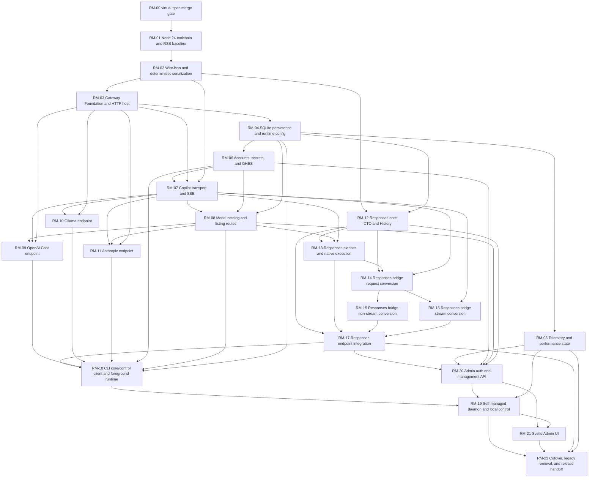

# ghc-gateway 重构 Master Spec

> 状态：实现与交付的可执行 contract
> 目标项目：`ghc-gateway`
> npm package：`@ljie-pi/ghc-gateway@0.1.0`
> executable：`ghcg`
> 实现分支：`refactor`
> 本规范分支：`refactor-master-spec`

## 1. 使用方式与合并纪律

本文只固定跨模块约束、交付顺序、文件所有权、接口、状态归属与验收门槛。协议字段、event
ordering 和 wire bytes 不在这里重写；实现 agent 必须按第 3 节的 context pointer 读取对应生产规范。

`RM-00` 是当前 master-spec PR 代表的 virtual pre-implementation gate，不创建 GitHub issue。该 PR
合并到 `refactor` 后，维护者才可：

1. 按第 12 节模板创建 `RM-01` 至 `RM-22` 的 GitHub issues；
2. 按第 11 节表建立 native dependency edges；
3. 从最新 `refactor` 创建实现分支；
4. 为每个 issue 提交一个以 `refactor` 为 base 的 coherent PR。

`RM-01` issue 记录 `RM-00` merge commit 作为 `Spec baseline`，但不创建不存在的 native issue
dependency。后续 native dependency graph 只包含 `RM-01` 至 `RM-22`。

依赖 issue 未合并时，不创建 stacked implementation PR。实现期间 `main` 不动；所有 coding-agent PR
都以 `refactor` 为 base。最终 promotion、npm publish 与 repository rename 是第 15 节的维护者操作，
不是 implementation slice。

每个 slice 以可观察行为和测试完成，不以代码行数、文件数或“主体已写完”作为完成标准。非默认的新
TypeScript app 可以只注册已经完成的 routes；任何默认 entrypoint 都不得包含 `TODO`、stub handler，
也不得 fallback 到 legacy JavaScript handler。

## 2. Scope 与 non-goals

### 2.1 In scope

- Node.js 24、ESM、strict TypeScript、Hono、`@hono/node-server`、Undici。
- 单一 npm package、单一 gateway process；Svelte 5 + Vite 构建为同进程提供的静态 Admin SPA。
- `better-sqlite3`、WAL、`synchronous=FULL`、显式 migrations。
- 以下完整 public routes：

| Method | Route | Owner |
| --- | --- | --- |
| `POST` | `/v1/chat/completions` | `OpenAiChatEndpoint` |
| `POST` | `/v1/responses` | `ResponsesEndpoint` |
| `POST` | `/v1/messages` | `AnthropicMessagesEndpoint` |
| `GET` | `/v1/models` | `ModelCatalogRoutes` |
| `POST` | `/api/chat` | `OllamaChatEndpoint` |
| `GET` | `/api/tags` | `ModelCatalogRoutes` |
| `GET` | `/api/version` | `OllamaVersionRoute` |
| `GET` | `/healthz` | `GatewayFoundation` |
| `GET` | `/readyz` | `GatewayFoundation` |
| `GET` | `/admin/*` | `AdminStaticRoute` |
| varies | `/admin/api/v1/*` | `AdminApi` |

- `ghcg serve/start/stop/restart/status`；`auth`、`accounts`、`models`、`config`、`admin open`
  command groups。
- GitHub.com 与 GHES accounts、file-backed secrets、model catalog、native Responses 与 Chat bridge。
- Responses History、Usage Buckets、Operational Events、JSONL log rotation、resource/performance gates。
- Windows x64、Linux x64/arm64、macOS x64/arm64 上的 Node.js 24 delivery。
- clean-break rename、legacy removal、pack/install smoke、README 与 release handoff。

### 2.2 Non-goals

- 不提供 `ghcg chat`、protocol plugins、provider profiles、runtime behavior profiles 或 arbitrary
  third-party providers。
- 不注册 `/models`、`/responses`、`/openai/v1/responses`、`/claude/v1/messages`、
  `/v1/responses/compact`、尾斜杠或旧名称 aliases。
- 不导入 `ghcp-ollama`/`ghcp-gateway` 的 data、config、credentials 或 process state。
- 不保留 `ghcp-ollama`、`ghcp-gateway`、`ghcpo`、`ghcpo-server` runtime aliases。
- 不引入 OS supervisor、watchdog、automatic restart、multi-process gateway、Redis、ORM、WebSocket
  或 SvelteKit server。
- 不把协议转换成可逆的 canonical message model，不建立通用 `BaseAdapter`、`StreamTransformer`
  或统一 public error envelope。
- 不按 model name、vendor、hostname 或历史成功结果猜测 capability。
- 不因 performance degradation 使 `/healthz` 或 `/readyz` 失败，不自动调参。

## 3. Sources of truth 与 context pointers

### 3.1 Priority by scope

来源不是一条模糊的全局覆盖链；先按责任范围选唯一来源，再解决冲突：

| Scope | Normative source | 何时必须读取 |
| --- | --- | --- |
| 已确认的名称、技术栈、全局 limits、security、DAG、cutover gates | 本文 | 每个 slice 开始与交接时 |
| Shared HTTP admission、limits、timeouts、pre-commit errors、headers | [Gateway HTTP contracts](../gateway_http_contracts.md) | 修改任何 route、middleware、body/stream pump 或 error presenter 前 |
| OpenAI Chat native success behavior | [OpenAI Chat](../openai_chat_completions.md) | 修改 `/v1/chat/completions` request、model resolution、JSON/SSE success 前 |
| Module/interfaces/state ownership | [Architecture](../architecture.md) | 修改 composition、module seam、state、persistence、CLI/Admin 前 |
| OpenAI Responses plan/native behavior | [Responses routing](../openai_responses_routing.md) | 修改 Responses planning、native URL/body/stream/history ownership 前 |
| Responses Chat bridge | [Responses bridge](../codex_response_to_chat_completions.md) | 修改 request/history/tool/reasoning/nonstream/stream conversion 前 |
| Anthropic Messages bridge | [Anthropic bridge](../claude_messages_to_chat_completions.md) | 修改 `/v1/messages` object/event/wire behavior 前 |
| Ollama Chat bridge | [Ollama bridge](../ollama_chat_to_chat_completions.md) | 修改 `/api/chat` object/NDJSON behavior 前 |
| CAPI catalog与三种 model serializers | [Model listing](../github_copilot_model_listing_apis.md) | 修改 credentials/CAPI cache、`/v1/models`、`/api/tags` 前 |
| Canonical vocabulary | [CONTEXT](../../CONTEXT.md) | 命名 module、state、history、checkpoint、telemetry 前 |
| Durable decisions | [ADR-0001](../adr/0001-protocol-endpoint-modules.md), [ADR-0002](../adr/0002-file-backed-secret-store.md), [ADR-0003](../adr/0003-clean-break-rename.md), [ADR-0004](../adr/0004-self-managed-daemon.md) | 修改相应决策前 |
| Delivery workflow | [AGENTS](../../AGENTS.md) | 创建 issue、branch、PR 或修改规范前 |

`docs/gateway_http_contracts.md` 与本文同属 `RM-00` merge prerequisite。实现 agent 不得自行填补其
空白。它与协议规范冲突时：shared pre-first-byte
HTTP behavior 由该文件负责，协议 object/event/terminal/wire behavior 由对应协议规范负责。无法按
scope 消解的冲突必须阻塞 issue，由 spec-only PR 修正文档，不能由 implementation PR 选择。
该文件中的 resource/time numeric values 必须在 `RM-00` 合并前标明为第 7.2、8.1 节的 configurable
defaults，listener 必须表达为 fixed host `127.0.0.1` + configurable default port `31400`；不能把
已确认的 startup/runtime config 写成 immutable constants。

Legacy source、legacy tests、`docs/cc-switch/` 与 `docs/litellm/` 都不是可选 production profile。
只有上述生产规范明确指向的 pinned upstream commit 才可用于核对；固定 commit 与说明文字冲突时，
遵守生产规范写明的优先级。

### 3.2 `RM-00` 必须关闭的 normative gaps

Master-spec PR 必须在创建实现 issues 前同步：

- `docs/architecture.md` 中的项目名、file-backed `CredentialStore`、并行 build/cutover 命名；
- `CONTEXT.md` 的 canonical terms；
- `docs/adr/*.md` 的 clean-break、secret file、self-managed daemon 决策；
- `docs/openai_chat_completions.md` 的 OpenAI Chat success behavior；
- `docs/gateway_http_contracts.md` 的 probes、header validation、overload bodies、timeout/abort 与 exact
  route behavior；
- 本文的 slice IDs、paths、test names 与 dependency edges。

这些是 spec PR 的决定，不是后续 agent 的设计任务。实现中发现新 gap 时，当前 slice 标记
`blocked`，先合并 spec-only correction，再恢复实现。

`/api/version` 的 closure 必须固定为无需 Bound Account、无需 inference admission 的
`200 application/json; charset=utf-8`，body 为 compact UTF-8
`{"version":"0.1.0"}`，其中 version 来自 RM-01 target build version source，并在 RM-22 与
`package.json` 强制一致；它不读取 Ollama model catalog。
OpenAI Chat success 的唯一 model-resolution、request reserialization、nonstream validation 与
successful SSE terminal rules 必须在 `docs/openai_chat_completions.md` 落地，不能只存在于 issue 描述。

### 3.3 Fixture closure

每个 golden case 使用稳定英文 `caseId`，并在相邻 `manifest.json` 记录：

```json
{
  "caseId": "ollama.stream.sparse-tool-indexes",
  "owner": "RM-10",
  "source": "docs/ollama_chat_to_chat_completions.md#73-tool-calls",
  "input": "stream/sparse-tool-indexes.input.jsonl",
  "expected": "stream/sparse-tool-indexes.expected.ndjson",
  "encoder": "go-reference"
}
```

Fixture families 与唯一 owner：

| Family | Owner | Required categories |
| --- | --- | --- |
| `wire-json` | `RM-02` | number lexemes、member order、duplicate members、Unicode、canonical sort、limits |
| `gateway-http-host` | `RM-03` | body read、admission、generic limits/timeouts、commit boundary、raw headers、abort、route registration |
| `accounts` | `RM-06` | host normalization、stable identity、login/remove/relogin、ACL failures |
| `copilot-transport` | `RM-07` | token refresh、endpoint discovery、redirect、SSE byte splits、cancel |
| `model-catalog` | `RM-08` | strict CAPI DTO、cache generations、three serializers、model-list presenter |
| `openai-chat` | `RM-09` | buffered、SSE、usage/presenter、model resolution、abort |
| `ollama` | `RM-10` | request、nonstream、stream reducer/presenter、Go byte goldens |
| `anthropic` | `RM-11` | request、nonstream、stream lifecycle/presenter、Python SSE text goldens |
| `responses-core-history` | `RM-12` | request DTO/decoder、enrichment、unique/ambiguous call lookup、TTL/eviction/checkpoint |
| `responses-native` | `RM-13` | routing matrix、native request/JSON/SSE、stable item IDs |
| `responses-bridge-request` | `RM-14` | input/tools/media/reasoning/history/canonical JSON |
| `responses-bridge-nonstream` | `RM-15` | envelope/items/tools/images/usage/managed IDs |
| `responses-bridge-stream` | `RM-16` | item lifecycle、sequence、late tools、terminal/checkpoints |
| `responses-endpoint` | `RM-17` | native/bridge integration、presenter、commit、post-commit failure、aliases |

Golden 更新只能由显式 `npm run fixtures:generate -- --case <caseId> --accept` 产生并在 PR 中人工审阅。
CI 运行 `npm run fixtures:verify`，不得隐式更新 snapshots，不访问网络，不把随机 UUID/clock 写入 expected。

## 4. System invariants

1. **Parallel app, atomic cutover**：legacy JavaScript 保持默认可运行；新 TypeScript app 使用
   `*:refactor` scripts 和 `dist-refactor/`，在 `RM-22` 前不改变 `npm start`、published bins 或
   default package entrypoint。`RM-22` 一次切换并删除 legacy。
2. **No legacy fallback**：新 app 的 route 要么由对应 TypeScript `Protocol Endpoint Module`
   完整处理，要么未注册而返回 404；不 import、spawn 或 proxy legacy handler。
3. **One package/process**：生产只有一个 npm package、一个 Node.js gateway process、一个 SQLite
   connection；Admin assets 在同一 Hono app 中提供。
4. **Protocol locality**：OpenAI Chat、Ollama、Anthropic、Responses native、Responses bridge
   各自拥有 decoder、state machine、terminal 与 wire encoder；shared raw SSE/WireJson 不知道下游协议。
5. **Real seams only**：只有 production adapter 与 scripted/memory test adapter 都存在时才建立
   swappable seam。Hono、`better-sqlite3` 与单一 serializer 直接位于 implementation 内，不增加
   `HttpFrameworkPort`、`DatabasePort` 或 pass-through repository。
6. **Immutable request state**：每个 request 恰好绑定一次 `Bound Account`、resolved model、
   runtime config snapshot 与 cancellation signal；默认账号、model 或配置变化不影响在途请求。
7. **Exact wire is behavior**：missing/null/false/0/empty、member order、number lexeme、SSE/NDJSON
   framing、terminal ownership 与 bytes 都由 fixtures 验证。
8. **Loopback only**：listener host 只接受 literal `127.0.0.1`，default port 为 `31400`；startup config
   可以改变 port，但不能改变 host。`::1`、hostname 与任何其他 address 都在 socket 创建前明确失败。
   Inference routes 无 gateway API key。
9. **Secrets stay separate**：OAuth/Copilot/admin/control secrets 只在 protected atomic file 与内存；
   不进 SQLite、logs、metrics、Operational Events 或 public errors。
10. **Bounded state**：body、events、accumulators、active/queued requests、history、telemetry、logs、
    subscribers 与 caches 都有明确上限和 cleanup。
11. **Offline verification**：所有 fixtures、scripted upstream、OAuth/CAPI fakes、Playwright flows 和
    benchmarks 在 outbound network blocked 时运行。
12. **Observable degradation only**：5-minute rolling windows 连续三个超阈值进入 `degraded`；连续三个
    恢复窗口清除。状态出现在 Admin 并各写一个 sanitized `Operational Event`，不影响 health/readiness，
    不自动改变 concurrency、SQLite mode 或 protocol behavior。
13. **Validation split**：每个 inference `Protocol Endpoint Module` 从 `WireJson` 使用显式 decoder；
    Admin/config DTO 使用 TypeBox 且 coercion disabled。两者不能用 `JSON.parse()` + broad casts、
    schema defaults 或 coercion 互相替代。

## 5. Canonical target tree 与 parallel-build rule

新 `.ts` files 可与 legacy `.js` files 同处 `src/`；TypeScript config 只 include `.ts`。直到
`RM-22`，legacy `src/server.js`、`src/serverctl.js`、`src/ghcpo.js` 与 `src/utils/**/*.js` 保持默认路径。

```text
src/
  main.ts
  version.ts
  cli/
    main.ts
    commands/
  daemon/
    controller.ts
    identity_file.ts
    local_control.ts
  gateway/
    create_gateway.ts
    hono_app.ts
    request_scope.ts
    admission.ts
    body_reader.ts
    stream_response.ts
    failures.ts
  serialization/
    wire_json.ts
    canonical_json.ts
  config/
    startup_config.ts
    runtime_config.ts
    schema.ts
  persistence/
    database.ts
    migrations.ts
    migrations/
      001_runtime_config.ts
      010_accounts.ts
      020_telemetry.ts
      030_responses_history.ts
  accounts/
    account_directory.ts
    credential_store.ts
    device_flow.ts
    github_environment.ts
  copilot/
    backend.ts
    transport.ts
    token_refresh.ts
    endpoint_discovery.ts
    chat_sse.ts
    model_catalog.ts
  protocols/
    chat_completions/
      types.ts
      decoder.ts
    openai_chat/
      endpoint.ts
      wire.ts
    model_catalog/
      routes.ts
      wire.ts
    ollama_chat/
      endpoint.ts
      bridge.ts
      stream.ts
      wire.ts
      version.ts
    anthropic_messages/
      endpoint.ts
      bridge.ts
      stream.ts
      wire.ts
    responses/
      endpoint.ts
      planner.ts
      native.ts
      history.ts
      bridge_request.ts
      bridge_nonstream.ts
      bridge_stream.ts
      tool_context.ts
      wire.ts
  telemetry/
    logger.ts
    usage.ts
    operational_events.ts
    performance.ts
    admin.ts
  admin/
    auth.ts
    api.ts
    events.ts
    routes.ts
    static.ts
web/
  src/
    views/
      Overview.svelte
      Accounts.svelte
      Models.svelte
      Configuration.svelte
      ResponsesHistory.svelte
      Events.svelte
  vite.config.ts
tests/refactor/
  fixtures/
  unit/
  contract/
  integration/
  sdk/
  e2e/
  performance/
tests/live/
  sdk/
scripts/refactor/
dist-refactor/                 # generated, never committed
dist/                          # final package output, never committed
```

目录表达 locality，不要求一 type 一文件。只有状态机或 encoder 足够复杂时再拆文件。跨 slice 修改
他人 owned path 前，先在 issue 中记录原因并由 owner/coordinator 确认；共享 composition files
`src/main.ts` and `package.json` 的修改由依赖顺序串行完成。`createGateway` accepts route registrations，
so later protocol slices do not edit `src/gateway/create_gateway.ts`。
RM-20 is the explicit exception for the additive optional `AdminModule` mount；it does not change protocol
`RouteRegistration` or existing protocol callers。

## 6. Key interfaces 与 state ownership

以下是调用者必须知道的最小 interface；具体 DTO 仍由生产规范定义。

```ts
export interface Gateway {
  fetch(request: Request): Promise<Response>;
  close(): Promise<void>;
}

export function createGateway(
  config: Readonly<GatewayConfig>,
  routes: readonly RouteRegistration[],
  dependencies: Readonly<GatewayDependencies>,
): Promise<Gateway>;

export interface DecodedHttpRequest {
  readonly url: URL;
  readonly headers: Headers;
  readonly body?: WireJsonObject;
}

export type ProtocolEndpoint = (
  request: Readonly<DecodedHttpRequest>,
  scope: Readonly<RequestScope>,
) => Promise<Response>;

export type FailurePresenter = (
  failure: Readonly<GatewayFailure>,
  requestId: string,
) => Response;

export interface RouteRegistration {
  readonly method: "GET" | "POST" | "PUT" | "DELETE";
  readonly path: string;
  readonly admission: "none" | "inference";
  readonly body: "none" | "wire-json-object";
  readonly presentFailure: FailurePresenter;
  readonly endpoint: ProtocolEndpoint;
}

export interface RequestScope {
  readonly requestId: string;
  readonly signal: AbortSignal;
  readonly config: Readonly<RuntimeConfigSnapshot>;
}
```

`RouteRegistration` remains exclusively for public protocol routes and is not widened for Admin JSON. Management routes
use an additive optional Gateway mount:

```ts
export interface AdminRequestContext {
  readonly requestId: string;
  readonly signal: AbortSignal;
  readonly listenerOrigin: LoopbackOrigin;
  readonly activity: GatewayActivity;
}

export type LoopbackOrigin = `http://127.0.0.1:${number}`;

export interface AdminModule {
  handle(request: Request, context: Readonly<AdminRequestContext>): Promise<Response>;
  mintBootstrap(): AdminBootstrapResult;
  close(): void;
}

export type AdminBootstrapResult =
  | { readonly kind: "issued"; readonly token: string; readonly expiresAt: string }
  | { readonly kind: "capacity" }
  | { readonly kind: "closed" };

export interface AdminStaticModule {
  handle(request: Request, signal: AbortSignal): Promise<Response>;
}
```

`GatewayDependencies` adds optional `admin?: AdminModule` and `adminStatic?: AdminStaticModule`. Existing RM-01 through
RM-18 callers that omit them preserve identical behavior. Gateway owns Admin request-ID creation, caller/shutdown abort,
active listener Origin and activity snapshot；`AdminModule` captures the current body limit from `RuntimeConfigStore`
and owns Admin parsing、validation、security、envelope and SSE lifecycle。Gateway supplies
`AdminRequestContext.activity` per request, avoiding an Admin/Gateway composition
cycle。Exact Admin API paths are matched before RM-21 static handling；unmatched `/admin/api/v1/*` never becomes
SPA HTML。

This correction does not reopen observable behavior from RM-01 through RM-18：protocol `RouteRegistration`、Gateway
public routes、admission、WireJson、timeouts and protocol presenters remain unchanged。Only RM-19、RM-20、RM-21 and
their transitive RM-22 composition consume these optional interfaces。

Gateway Foundation owns body read/WireJson parse/admission；each Protocol Endpoint Module owns one
`FailurePresenter` adapter and endpoint。For `anthropic-version`, an exact single value is accepted；the comma-merged
value produced by duplicate Fetch headers cannot equal `2023-06-01` and is rejected。RM-03 tests the registration seam
with a fake presenter；exact protocol presenter fixtures belong to the endpoint slice。

`Gateway.fetch` 隐藏 Hono routing、admission、account binding、upstream、protocol state、persistence 与
wire serialization。`close()` 幂等：停止 admission、abort in-flight、在有界 grace period 内 flush
noncritical telemetry，再关闭 pool、SQLite 与 log writer。

```ts
export interface AccountDirectory {
  bindDefault(signal: AbortSignal): Promise<BoundAccount>;
  list(): readonly AccountSummary[];
  use(accountId: AccountId, expectedRevision: number): Promise<AccountRevision>;
  remove(accountId: AccountId, expectedRevision: number): Promise<AccountRevision>;
}

export interface CredentialStore {
  readGeneration(
    accountId: AccountId,
    generation: number,
  ): Promise<SecretCredential | null>;
  putGeneration(
    accountId: AccountId,
    generation: number,
    value: SecretCredential,
  ): Promise<void>;
  removeAccount(accountId: AccountId): Promise<void>;
  prune(references: ReadonlyMap<AccountId, number>): Promise<void>;
}

export interface AccountModelPreferences {
  get(accountId: AccountId): Promise<ModelPreference | null>;
  set(
    accountId: AccountId,
    candidate: Readonly<{
      modelId: string;
      catalogGeneration: number;
    }>,
    expectedRevision: number,
  ): Promise<ModelPreference>;
  markInvalidIfMissing(
    accountId: AccountId,
    visibleModelIds: ReadonlySet<string>,
    catalogGeneration: number,
  ): Promise<ModelPreference | null>;
  clear(accountId: AccountId): Promise<void>;
}

export interface CopilotBackend {
  bind(account: Readonly<BoundAccount>, signal: AbortSignal): Promise<BoundCopilot>;
}

export interface BoundCopilot {
  readonly accountId: AccountId;
  readonly target: Readonly<CopilotTarget>;
  completeChat(request: Readonly<ChatRequest>): Promise<ChatResponse>;
  openChatStream(request: Readonly<ChatRequest>): Promise<UpstreamByteStream>;
  completeResponses(
    request: Readonly<NativeResponsesUpstreamRequest>,
  ): Promise<UpstreamByteResponse>;
  openResponsesStream(
    request: Readonly<NativeResponsesUpstreamRequest>,
  ): Promise<UpstreamByteStream>;
}

export interface NativeResponsesUpstreamRequest {
  readonly body: Uint8Array;
  readonly hasVisionInput: boolean;
  readonly initiator: "user" | "agent";
}
```

`CredentialStore` 是真实 seam：production 使用 protected atomic file，tests 使用 memory adapter。
`CopilotBackend` 是真实 seam：production 使用 Undici，contract tests 使用 scripted adapter。
`AccountModelPreferences` is one deep SQLite module owned by RM-06，not a swappable persistence port；RM-08 invokes
its invalidation method after catalog refresh。RM-08 owns `PreferredModelManager`，which validates an exact model
against a captured catalog and passes `{modelId,catalogGeneration}` to this store；CLI/Admin use that manager and model
resolution only reads the preference。Protocol modules 不知道 secret 格式、SQLite 或 HTTP client。

```ts
export interface CopilotModelCatalog {
  get(accountId: AccountId, signal: AbortSignal): Promise<CatalogSnapshot>;
  invalidate(accountId: AccountId): void;
  clear(): void;
}

export interface ResponsesHistory {
  enrich(
    request: Readonly<ResponsesRequest>,
    signal: AbortSignal,
  ): Promise<ResponsesRequest>;
  record(
    record: Readonly<ResponsesHistoryRecord>,
    signal: AbortSignal,
  ): Promise<void>;
}

export interface ResponsesHistoryAdmin {
  inspect(): ResponsesHistorySummary;
  clear(expectedRevision: number): ResponsesHistorySummary;
}
```

Admin 不获得 inference-only mutation interface；inference path 不获得 Admin clear/list interface。
`ResponsesHistory` tests 对隔离的 SQLite database 运行 production implementation，不另写不同语义 fake。

```ts
export type WireJson =
  | null
  | boolean
  | string
  | { readonly kind: "number"; readonly lexeme: string }
  | { readonly kind: "array"; readonly items: readonly WireJson[] }
  | WireJsonObject;

export interface WireJsonObject {
  readonly kind: "object";
  readonly members: readonly Readonly<{
    key: string;
    value: WireJson;
  }>[];
}
```

`WireJson` 是 deep module，不是 canonical protocol model。Protocol decoder 从它直接生成自己的 DTO。

### 6.1 State ownership table

| State | Owner | Lifetime/store | Invariant |
| --- | --- | --- | --- |
| request ID、abort、config | `RequestScope` | one request / memory | 不加入 protocol-specific cursors |
| selected identity/credential/target | `BoundAccount` + `BoundCopilot` | one request / memory | bind once；默认变化不重绑 |
| per-account preferred model/revision | `AccountModelPreferences` | SQLite | missing fallback only；catalog refresh marks invalid |
| runtime config | `RuntimeConfigStore` | SQLite + immutable memory snapshot | revision compare-and-swap |
| admission permits/queue | `AdmissionController` | process / bounded memory | 4 active、16 queued default |
| stream/item/tool state | owning `Protocol Endpoint Module` | one `Stream Execution` | terminal 后释放，不跨协议共享 |
| model catalog/generation | `CopilotModelCatalog` | process / per-account memory | no TTL；invalidate prevents stale writeback |
| Responses History | `ResponsesHistory` | SQLite | only `ChatBridgePlan` |
| Usage Buckets | `UsageRecorder` | SQLite batched | content-free、bounded |
| Operational Events | `OperationalEventStore` | SQLite batched | sanitized、bounded |
| admin bootstrap/session/CSRF | `AdminModule` via internal `AdminAuth` implementation | process memory | restart invalidates all |
| daemon PID/start identity/nonce/control token | `DaemonIdentityFile` | protected atomic file | authenticated control before action |
| credentials/admin long-term secret | `FileCredentialStore` | protected atomic file | never SQLite/log |
| JSONL files/rotation | `JsonlLogger` | data directory | 10 MiB × 5、max age 7d |
| Admin usage/event queries | `AdminTelemetry` | telemetry module / SQLite read adapter | read-only; reuses RM-05 retention/sanitizer |
| Admin request/activity counters | `GatewayActivity` | process / read-only snapshot | no admission or stream mutation capability |

### 6.2 Model resolution

`ModelResolver` consumes one Bound Account、one captured Catalog Snapshot and a protocol-decoded model field。For
OpenAI Chat、Anthropic Messages and OpenAI Responses：

1. Missing model uses that account's preferred model only when preference state is `valid` and the exact ID exists in the
   captured catalog。
2. Explicit model must be a non-empty string and match a catalog ID exactly；type/empty failure is `invalid_request`，
   unknown ID is `model_not_found`。
3. Missing model with no valid visible preference is `invalid_request`；the gateway never silently chooses the first model。
4. An explicit unknown model never falls back to preference and never reaches upstream。
5. Resolution happens once。The returned `ResolvedModel { requestedModel, upstreamModel, source, routing }` is immutable
   for the request；Responses planning reads its private routing metadata。

`model_not_found` uses HTTP 404 `not_found_error` in OpenAI presenters and HTTP 404 `not_found_error` in Anthropic。
Ollama does not use this shared fallback：its production spec requires an explicit non-empty model and preserves it for
upstream handling。

## 7. Persistence, migrations 与 config contract

### 7.1 SQLite v1 logical schema

Implementations may add indexes required by the documented queries, but may not change ownership or retention:

```sql
schema_migrations(
  version INTEGER PRIMARY KEY,
  name TEXT NOT NULL UNIQUE,
  checksum TEXT NOT NULL,
  applied_at_ms INTEGER NOT NULL
)

runtime_config(
  singleton_id INTEGER PRIMARY KEY CHECK (singleton_id = 1),
  revision INTEGER NOT NULL,
  config_json TEXT NOT NULL,
  updated_at_ms INTEGER NOT NULL
)

accounts(
  account_id TEXT PRIMARY KEY,
  revision INTEGER NOT NULL,
  normalized_host TEXT NOT NULL,
  numeric_user_id TEXT NOT NULL,
  environment_kind TEXT NOT NULL CHECK (environment_kind IN ('github.com', 'ghes')),
  login TEXT,
  display_name TEXT,
  authenticated_at_ms INTEGER,
  credential_generation INTEGER,
  credential_state TEXT NOT NULL CHECK (credential_state IN ('active', 'removing', 'removed')),
  created_at_ms INTEGER NOT NULL,
  updated_at_ms INTEGER NOT NULL,
  UNIQUE(normalized_host, numeric_user_id)
)

gateway_preferences(
  singleton_id INTEGER PRIMARY KEY CHECK (singleton_id = 1),
  revision INTEGER NOT NULL,
  default_account_id TEXT REFERENCES accounts(account_id),
  updated_at_ms INTEGER NOT NULL
)

account_model_preferences(
  account_id TEXT PRIMARY KEY REFERENCES accounts(account_id),
  revision INTEGER NOT NULL,
  model_id TEXT NOT NULL,
  validity TEXT NOT NULL CHECK (validity IN ('valid', 'invalid')),
  catalog_generation INTEGER NOT NULL,
  updated_at_ms INTEGER NOT NULL
)

responses_history_state(
  singleton_id INTEGER PRIMARY KEY CHECK (singleton_id = 1),
  revision INTEGER NOT NULL,
  next_insertion_seq INTEGER NOT NULL,
  updated_at_ms INTEGER NOT NULL
)

responses(
  response_id TEXT PRIMARY KEY,
  insertion_seq INTEGER NOT NULL UNIQUE,
  created_at_ms INTEGER NOT NULL,
  expires_at_ms INTEGER NOT NULL
)

response_calls(
  response_id TEXT NOT NULL REFERENCES responses(response_id) ON DELETE CASCADE,
  ordinal INTEGER NOT NULL,
  call_id TEXT NOT NULL,
  kind TEXT NOT NULL,
  item_json TEXT NOT NULL,
  PRIMARY KEY(response_id, ordinal)
)

usage_buckets(
  utc_hour_ms INTEGER NOT NULL,
  account_id TEXT NOT NULL,
  protocol TEXT NOT NULL CHECK (protocol IN (
    'openai_chat', 'openai_responses_native', 'openai_responses_bridge', 'anthropic', 'ollama'
  )),
  resolved_model TEXT NOT NULL,
  outcome TEXT NOT NULL CHECK (outcome IN (
    'success', 'client_error', 'authentication_error', 'overloaded',
    'upstream_error', 'timeout', 'aborted', 'internal_error'
  )),
  request_count INTEGER NOT NULL,
  error_count INTEGER NOT NULL,
  input_tokens INTEGER NOT NULL,
  output_tokens INTEGER NOT NULL,
  cache_tokens INTEGER NOT NULL,
  latency_sum_ms REAL NOT NULL,
  latency_max_ms REAL NOT NULL,
  PRIMARY KEY(utc_hour_ms, account_id, protocol, resolved_model, outcome)
)

operational_events(
  event_id INTEGER PRIMARY KEY AUTOINCREMENT,
  occurred_at_ms INTEGER NOT NULL,
  kind TEXT NOT NULL,
  severity TEXT NOT NULL CHECK (severity IN ('info', 'warning', 'error')),
  metadata_json TEXT NOT NULL
)

telemetry_state(
  singleton_id INTEGER PRIMARY KEY CHECK (singleton_id = 1),
  dropped_usage_updates INTEGER NOT NULL,
  dropped_operational_events INTEGER NOT NULL,
  updated_at_ms INTEGER NOT NULL
)
```

Required indexes include `responses(expires_at_ms)`, `response_calls(call_id)`,
`usage_buckets(utc_hour_ms)` and `operational_events(occurred_at_ms, event_id)`.
`usage_buckets.account_id` intentionally has no cascading foreign key：usage remains queryable through credential/
account cleanup and the telemetry migration can land independently of the account migration。

Responses History revision changes once per transaction that changes visible history：new/updated Semantic Checkpoint、
non-stream record、TTL cleanup、512-row eviction or non-empty clear。A no-op lookup/record/clear does not increment。
`ResponsesHistoryAdmin.clear(expectedRevision)` compares and, when non-empty, clears rows and increments the singleton
revision in the same transaction。`next_insertion_seq` is monotonic and never reset by clear。

Retention cleanup is deterministic：

- History deletes `expires_at_ms <= now_ms` before lookup/record, then evicts the lowest `insertion_seq` until at most
  512 responses remain。
- Usage deletes rows whose `utc_hour_ms < floorToUtcHour(now_ms - retentionDays)`；if rows still exceed 100,000, delete
  by `utc_hour_ms, account_id, protocol, resolved_model, outcome` ascending until the cap is met。
- Operational Events delete `occurred_at_ms <= now_ms - retentionDays`，then lowest `event_id` until at most 512 remain。
- Cleanup runs at startup and in the owning read/write transaction；no correctness depends on a timer。

Migration versions are reserved to avoid conflicts between parallel slices:

| Version | Owner | Content |
| ---: | --- | --- |
| `001` | `RM-04` | migrations + `runtime_config` |
| `010` | `RM-06` | accounts + preferences |
| `020` | `RM-05` | usage + operational events |
| `030` | `RM-12` | Responses History |

Each migration file exports one immutable `{version,name,sql}` object and its filename begins with the same
three-digit version。`scripts/refactor/generate_migrations.ts` performs build-time filesystem discovery, rejects
filename/export mismatch or duplicate/reserved-owner violations, computes checksums and generates an ordered manifest
under the uncommitted build directory。Production imports that generated static manifest；it does not discover runtime
files and npm does not need to ship loose SQL assets。A later slice registers a migration only by adding its owned
versioned `.ts` file。

The runner applies every embedded-but-unapplied version in numeric order transactionally；reserved gaps are valid and
`max(version)` is not the migration state, so a later-merged lower reserved version is still applied。It records
checksums, refuses checksum drift or an applied version unknown to the binary, and never performs network I/O or large
JSON conversion inside a transaction. It opens one main-thread
`better-sqlite3` connection with WAL、`synchronous=FULL`、foreign keys、`busy_timeout=1000` ms、
`wal_autocheckpoint=1000` pages、`journal_size_limit=67108864` bytes、prepared statements and short transactions.
Only measured event-loop delay p95 over 10 ms may trigger a later worker evaluation; no slice may preemptively add a
worker.

### 7.2 Config

- Startup config precedence is `CLI > GHC_GATEWAY_* environment > default` and contains only listener port、
  data directory、log level。Canonical flags are `--port`、`--data-dir`、`--log-level` on `serve`/`start`；
  canonical environment keys are `GHC_GATEWAY_PORT`、`GHC_GATEWAY_DATA_DIR`、
  `GHC_GATEWAY_LOG_LEVEL`。Port default is 31400 and range is `1..65535`；data directory defaults to
  `~/.ghc-gateway` and resolves to an absolute path；log level is `trace|debug|info|warn|error` with default `info`。
  Startup config only takes effect at process start。
- Runtime config uses SQLite as sole truth after initialization. Environment variables seed a missing row once, then
  have no effect on later starts.
- Admin/CLI updates decode with TypeBox without coercion, validate a complete candidate, compare expected revision in
  one transaction, build an immutable `RuntimeConfigSnapshot`, atomically swap it, then invalidate affected caches。
- Validation、revision conflict、write or snapshot build failure leaves the old row/snapshot active。
- A request captures one snapshot at admission; a `Stream Execution` never observes a mid-stream update。
- Reducing active/queue limits never cancels active requests or existing waiters。New admission pauses until active count is
  below the new limit；existing waiters retain their captured queue deadline，while new waiters use the new snapshot。

Canonical runtime registry：

| Key | Default | Hard range | Unit/meaning |
| --- | ---: | ---: | --- |
| `limits.requestBodyBytes` | `33554432` | `1048576..67108864` | bytes |
| `limits.sseEventBytes` | `4194304` | `65536..16777216` | bytes |
| `limits.nonstreamBodyBytes` | `33554432` | `1048576..134217728` | bytes |
| `limits.accumulatorBytes` | `33554432` | `1048576..134217728` | bytes |
| `admission.activeMax` | `4` | `1..16` | active requests |
| `admission.queueMax` | `16` | `0..64` | waiting requests |
| `timeouts.queueMs` | `30000` | `1000..300000` | milliseconds |
| `timeouts.connectMs` | `30000` | `1000..120000` | milliseconds |
| `timeouts.firstByteMs` | `120000` | `5000..600000` | milliseconds |
| `timeouts.streamIdleMs` | `120000` | `5000..600000` | milliseconds |
| `timeouts.totalMs` | `1800000` | `60000..7200000` | milliseconds |
| `accounts.maxAuthenticated` | `8` | `1..32` | active accounts |
| `history.ttlDays` | `7` | `1..365` | days；global row cap fixed `512` |
| `usage.retentionDays` | `90` | `1..365` | days；row cap fixed `100000` |
| `events.retentionDays` | `7` | `1..30` | days；row cap fixed `512` |

`ghcg config get/set` and Admin configuration use these identifiers。Startup-only port/data-dir/log-level and fixed
row caps are readable status, not mutable runtime keys；attempting to set them or an unknown key fails without changing
the revision。A first-seed environment name is `GHC_GATEWAY_` plus dot/camel segments converted to upper snake case，
for example `limits.requestBodyBytes` → `GHC_GATEWAY_LIMITS_REQUEST_BODY_BYTES`。Environment text and CLI
`config set` values are explicitly parsed to the key's primitive type before the complete candidate is validated；
TypeBox itself always runs with coercion disabled。

Fixed process capacities are not runtime-mutable：

| Capacity | Hard cap | Overflow behavior |
| --- | ---: | --- |
| Pending telemetry mutations | `1024` | apply the type-specific coalesce/eviction policy below and increment bounded dropped counters |
| In-memory Admin Sessions | `8` | reject a new bootstrap exchange with Admin capacity error |
| Outstanding admin bootstrap tokens | `8` | reject minting a new token |
| Active device flows | `8` | reject the ninth flow；each expires within 15 minutes |
| Admin SSE subscribers | `8` | reject the ninth subscriber |
| Per-subscriber pending events | `128` events or `1 MiB` | disconnect that slow subscriber |
| Operational Event `metadata_json` | `16 KiB` | reject/truncate is forbidden；emit a smaller fixed `metadata_rejected` event when capacity permits |
| One JSONL record | `64 KiB` | replace oversized metadata with a fixed sanitized overflow record |
| Graceful shutdown | `10 seconds` | proceed to forced resource close after recording timeout when possible |
| Daemon readiness | `30 seconds` | fail `start`, terminate the verified child and clean its identity file |

Critical history/config/account/credential writes never enter the lossy telemetry queue。All overflow counters use fixed
labels and saturate at JavaScript `Number.MAX_SAFE_INTEGER` so the counters themselves remain bounded。

Telemetry saturation is deterministic：

- A Usage update first coalesces into an existing pending bucket key。If the queue is full and the key is new，evict the
  oldest pending Usage update；if no Usage update exists, drop the incoming Usage update。Increment
  `droppedUsageUpdates` by the lost update's request count。
- An Operational Event on a full queue evicts the oldest pending Operational Event；if none exists, drop the incoming
  event。Increment `droppedOperationalEvents` once。
- Neither type evicts the other。The next successful flush persists aggregate saturating counters in
  `telemetry_state`；Admin exposes both counters and no recursive Operational Event is created for each drop。

### 7.3 Account/secret cross-store commit

SQLite account state is the activation authority; the secret file is storage, not proof that an account is active。

1. Login validates the immutable numeric user ID, atomically adds a new secret generation while retaining the currently
   active generation, then commits the new active generation and metadata in SQLite。After commit it atomically prunes
   the previous generation。
2. If SQLite commit fails, the old generation remains usable and the new generation is inert；startup reconciliation
   removes generations not referenced by active SQLite rows。
3. Idempotent remove compares `accounts.revision`，then marks the account `removing` and increments revision while clearing
   default/model preference in one SQLite transaction。`bindDefault` excludes `removing` and `removed` rows。
4. It removes credentials and invalidates token/endpoint/catalog caches，then marks the row `removed` and increments
   revision in a second transaction。Failure leaves durable `removing` state；the command/API reports failure and a
   repeated remove resumes cleanup without requiring the stale original revision。
5. Startup reconciliation resumes every `removing` row and removes secret generations not referenced by an `active` row；
   it never reactivates a row to hide cleanup failure。
6. Identity row and Usage Buckets remain；relogin of the same host/user tuple installs a new generation, marks that row
   active with a new revision and rejoins usage。
   Responses History is global and is unaffected by account removal。
7. A `removed` identity row is retained while any retained Usage Bucket references its stable account ID。After usage
   retention removes the last bucket, cleanup may delete that tombstone；a later login deterministically recreates the same
   account ID。Thus identity rows are bounded by active accounts plus retained usage dimensions。

Removal CAS is state-specific：

- `active` accepts only its exact current revision，then persists `removing` at `revision + 1`。
- `removing` accepts only the current removing revision；it resumes external cleanup without incrementing again，then
  persists `removed` at `revision + 1` after cleanup succeeds。The old active revision is a 409 conflict。
- `removed` with the exact current revision is idempotent success and does not increment；any stale revision is 409。
- Cleanup failure returns operational failure while leaving the current `removing` revision observable from account GET/
  list。CLI retries first reads that revision；Admin clients refresh after failure。

### 7.4 Preference revisions

`gateway_preferences.revision` is the CAS value for changing the default account。Each
`account_model_preferences.revision` independently protects that account's preferred model；absence is represented to
clients as revision 0。`PreferredModelManager.setPreferred(accountId, modelId, expectedRevision, signal)` captures the account catalog，requires
an exact model ID，then calls the store with that ID and catalog generation；the store increments revision in one
transaction。Catalog refresh that removes the preferred model changes `valid -> invalid` and increments
the preference revision；it never chooses another model。A later explicit set restores `valid` with another increment。

## 8. Failure, commit, timeout 与 cancellation

### 8.1 Configurable defaults

| Limit | Default |
| --- | ---: |
| Request body | 32 MiB |
| One upstream SSE event | 4 MiB |
| Non-stream body | 32 MiB |
| Per-request protocol accumulator | 32 MiB |
| Active inference requests | 4 |
| Admission queue | 16 |
| Queue wait | 30 s |
| Connect timeout | 30 s |
| First-byte timeout | 120 s |
| Stream idle timeout | 120 s |
| Total request timeout | 30 min |

Queue full and queue timeout map to OpenAI `503`、Anthropic `529`、Ollama `503`，with exact body/headers from
`docs/gateway_http_contracts.md`。A queued abort removes that waiter immediately。

### 8.2 Commit boundary

`StreamResponseWriter` tracks `responseCommitted` at the first downstream byte：

| Path | Before first byte | After first byte |
| --- | --- | --- |
| OpenAI Chat | protocol HTTP error | close；no synthetic `[DONE]` |
| Ollama | Ollama HTTP error | exactly one safe NDJSON error for non-abort；no `done:true` |
| Anthropic | Anthropic HTTP error | close；no synthetic `event:error`/`message_stop` |
| Responses Chat bridge | Responses HTTP error | close；no synthetic `response.failed` |
| Responses native | Responses HTTP error | close；never switch to Chat events |

Client abort emits zero additional bytes in every phase, aborts the same upstream request, invokes iterator `return()`,
releases decoder/state/timers/permit, and suppresses error/success terminal。

Chat-bridge nonstream history commits after complete conversion and before sending the success body。Chat-bridge stream
commits each `Semantic Checkpoint` synchronously before its `response.output_item.done` bytes, and completes the final
transaction before `response.completed`。Commit failure suppresses that checkpoint/terminal；earlier bytes remain sent，
live fragments are not recovered。Native Responses never reads or writes local history。

Usage Buckets、Operational Events and JSONL logs are noncritical：short batches may be lost on hard crash；graceful
shutdown flushes within its bounded grace period。Config、account activation、secret replace and Semantic Checkpoint
are critical and synchronously report failure。

## 9. Security, daemon 与 Admin contract

### 9.1 Listener and files

- The only accepted bind host is literal `127.0.0.1`，with default port `31400`；`0.0.0.0`、`::`、`::1`、
  LAN addresses and hostname binds are rejected before listen。
- Default data directory is `~/.ghc-gateway`。It contains `state.db`、WAL/SHM、`credentials.json`、
  protected `daemon.json` and `logs/*.jsonl`。
- Unix data directory mode is `0700`；Windows directory ACL is current-user-only。Credential/daemon paths and
  same-directory temp paths must be regular files under the resolved data directory；symlink/reparse-point or ownership
  mismatch fails closed。
- Secret/daemon files use same-directory temporary file、flush、atomic replace；Unix final mode is `0600`。
  Windows ACL grants file access only to the current user, removes inherited broad ACEs, and is verified after replace。
  Permission/ACL failure is fatal；the app never continues with a weaker file。
- Request/response content、tool arguments、Authorization、OAuth/Copilot/admin/control tokens and complete upstream
  error bodies never enter logs、SQLite telemetry、Admin responses or exception messages。

### 9.2 Self-managed daemon

Both foreground `serve` and detached `start` hold an exclusive identity-file creation lock and publish protected
`daemon.json` while running；the file includes `managed:false` for foreground and `managed:true` for detached mode。
This makes all management CLI commands thin authenticated clients of the one running gateway；they never open SQLite or
the secret file in a second process。If no gateway is running, auth/accounts/models/config/admin commands return exit 5
and instruct the user to run `start` or `serve`。

`ghcg start` spawns one detached Node.js child running the same package's
`serve` implementation, waits at most 30 seconds for an authenticated ready handshake, then `unref()`s。An already
verified running gateway is idempotent success，whether foreground or managed。Failed readiness terminates the verified
child and removes its identity file。

`daemon.json` is versioned and contains `managed`、`pid`、`processStartIdentity`、`instanceNonce`、`controlToken`、
`port` and `createdAt`。Control routes share the main `127.0.0.1:<port>` listener；there is no second listener。
Canonical routes：

- `GET /__ghcg/control/v1/status`
- `POST /__ghcg/control/v1/stop`
- `POST /__ghcg/control/v1/admin-bootstrap`
- `POST /__ghcg/control/v1/command`

Each requires exact `X-GHCG-Control-Token` and `X-GHCG-Instance-Nonce` headers from the protected identity file。
Success identifies the same `{pid, processStartIdentity, instanceNonce}`；status returns
`{data:{state:"running",instance:{...}}}`，stop returns HTTP 202 with the same instance，and admin-bootstrap returns
`{data:{token,expiresAt}}`。Missing/wrong token is 401，nonce/identity mismatch is 409，not-ready is 503，all using
`{error:{code,message}}` with respectively `unauthorized`/`unauthorized`、
`instance_mismatch`/`instance mismatch` and `not_ready`/`not ready`。Malformed command is 400
`invalid_command`/`invalid command`；application command failures retain the canonical CLI error code category without
adding sensitive details。These routes reject browser credential modes and are excluded
from inference/Admin middleware and static fallback。
All control responses use `Content-Type: application/json; charset=utf-8` and `Cache-Control: no-store`。

Control command body is `{operation,arguments}`，validated without coercion。Operation is exactly one of：

```text
auth.login.start
auth.login.poll
auth.logout
auth.status
accounts.list
accounts.use
accounts.remove
models.list
models.current
models.set
config.get
config.set
```

Interactive `ghcg auth login` calls start，prints the user code/verification URL，then polls by opaque `flowId` until
terminal or interrupt；JSON mode returns after start as specified in section 9.4。Other arguments match public CLI
grammar。The route returns `{data:<command-result>}` and uses the same application modules/revision rules as Admin；it
never shells out to another `ghcg` process。

Process identity is platform-specific and serialized canonically：

- Linux：kernel boot ID + `/proc/<pid>/stat` start ticks；
- Windows：process creation FILETIME；
- macOS：`LC_ALL=C ps -o lstart= -p <pid>` canonicalized to UTC seconds，with nonce handshake as the second factor。

`stop/restart` require `managed:true`；they refuse to terminate a foreground `serve` process。`stop` never kills based
only on PID。After authenticated identity verification it requests graceful close and waits
10 seconds；only if the same OS process identity still exists may it force terminate。Without verification it returns
`conflict` or `unreachable` and never kills。`status` distinguishes `running`、`stopped`、`stale`、`conflict` and
`unreachable`；it removes an identity file only after proving the recorded process no longer exists。There is no watchdog
or automatic restart。`restart` is verified stop followed by start and receives a new nonce/start identity。

JSONL logs rotate at 10 MiB, retain at most 5 files and delete files older than 7 days；both count and age limits apply。

### 9.3 Admin authentication

- First initialization generates a long random admin secret in the protected secret file。
- `ghcg admin open` authenticates to local control and requests a 60-second single-use bootstrap token。
- The browser URL carries the token in a fragment；the SPA exchanges it once through
  `POST /admin/api/v1/auth/bootstrap`，so normal HTTP logs/referrers do not receive it。
- Exchange creates an in-memory Admin Session cookie：`HttpOnly`、`SameSite=Strict`、`Path=/admin`；
  idle timeout 30 minutes、absolute timeout 12 hours。Daemon restart invalidates every session/bootstrap token。
- Bootstrap exchange is the sole mutation exempt from an existing Admin Session and CSRF token；it still requires exact
  `Origin` plus a valid unexpired single-use bootstrap token。
- Every other Admin mutation validates session、`X-GHCG-CSRF` and exact `Origin` derived from the active loopback listener。
  Missing/null/alternate Origin fails closed。GET responses are `Cache-Control: no-store` where state is sensitive。
- Admin/config DTOs use TypeBox with coercion disabled。Inference WireJson decoders are not reused for Admin。
- `/admin/*` static fallback cannot catch `/v1/*`、`/api/*`、`/healthz`、`/readyz` or control routes。
- `/admin/api/v1/events/stream` is authenticated SSE with bounded subscribers/queues；a slow subscriber is disconnected rather
  than accumulating unbounded events。

Every Admin JSON success is `{data:<value>}`。Every Admin failure is
`{error:{code:string,message:string,requestId:string}}` with fixed low-information text。Validation is 400，
unauthenticated is 401，CSRF/Origin failure is 403，missing resource is 404，revision/state conflict is 409，
capacity is 503 and internal failure is 500。All Admin JSON/SSE responses are `Cache-Control: no-store`。
Canonical codes are respectively `validation_failed`、`unauthenticated`、`forbidden`、`not_found`、
`revision_conflict`、`capacity_exceeded` and `internal_error`；the matching messages are fixed lower-case versions
with spaces。HTTP 204 responses have no body。

Admin HTTP behavior is owned by `AdminModule`, not by protocol `RouteRegistration` or Gateway HTTP protocol parsing：

- exact Origin is a Gateway-constructed `LoopbackOrigin` for `http://127.0.0.1:<active-port>`；Admin never accepts an
  arbitrary caller-provided origin string；
- JSON mutations accept only `application/json` with optional UTF-8 charset and missing/single `identity` encoding；
- empty、malformed、non-object、unknown-field、unsupported-media and over-limit bodies return `400 validation_failed`；
- `AdminModule` captures `RuntimeConfigStore.readSnapshot().limits.requestBodyBytes` at request handling start and
  cancels at the first excess byte；later config CAS affects only later requests；
- no-body routes reject nonempty bodies and all routes reject unknown/duplicate query fields；
- every Admin JSON/SSE response uses `Cache-Control: no-store` and gateway-generated `x-request-id`；JSON uses
  `application/json; charset=utf-8`；
- caller abort or Gateway close cancels body/use-case/SSE work and emits no additional bytes；
- Admin never uses inference admission、WireJson or a protocol failure presenter。

`AdminTelemetry` is a read-only adapter owned in `src/telemetry/admin.ts`。It owns Usage/Event SQLite queries、opaque
cursors、filtered totals、event replay and sanitized DTO reads while reusing RM-05 schema/retention/sanitizer。RM-20 does
not change RM-05 telemetry writes、batching、cleanup or performance transitions。`GatewayActivity` exposes read-only
active request/stream/queue snapshots。

`AdminTelemetry` also exposes `subscribe(listener): unsubscribe` for sanitized Operational Event and performance
transitions。`AdminModule` owns browser subscriber caps、per-subscriber queues、replay/reset ordering、heartbeat and
slow-consumer disconnect。`AdminModule.close()` is idempotent；closed `handle` fails closed and closed
`mintBootstrap()` returns `kind:"closed"`。The ninth outstanding bootstrap returns `kind:"capacity"`。RM-19 maps both
capacity and closed to control `503 not_ready` without exposing internal counts。

RM-20 adds optional in-process observers to `TelemetryRecorder` and `PerformanceWindows` to implement that subscription；
with no observer registered, RM-05 write/evaluate results、batching、retention、cleanup and resource bounds are unchanged。
RM-20 also adds `GatewayActivity` instrumentation: existing admission counts are read-only, and one bounded active-stream
counter follows the existing response lifecycle cleanup。Without an Admin mount it creates no observer/timer/queue and
does not alter protocol bytes、admission、abort or terminal behavior。

Canonical Admin route matrix：

| Method/path | Input | Success |
| --- | --- | --- |
| `POST /admin/api/v1/auth/bootstrap` | `{token}` | 200 `{csrfToken,idleExpiresAt,absoluteExpiresAt}` + session cookie |
| `GET /admin/api/v1/auth/session` | none | 200 session expiry/CSRF metadata |
| `POST /admin/api/v1/auth/logout` | CSRF + Origin | 204 and invalidate current session |
| `GET /admin/api/v1/status` | none | version/uptime/health/degraded/admission/storage/daemon summary |
| `GET /admin/api/v1/usage` | filters + cursor | page of Usage Buckets and aggregate totals |
| `GET /admin/api/v1/accounts` | none | stable account summaries、default ID and revision |
| `POST /admin/api/v1/device-flows` | `{host}` | 201 `{flowId,userCode,verificationUri,expiresAt,pollIntervalSeconds}` |
| `GET /admin/api/v1/device-flows/:flowId` | none | `{state:"pending"|"complete"|"expired"|"failed",account?}` |
| `DELETE /admin/api/v1/accounts/:accountId` | `{expectedRevision}` | final removed account summary |
| `PUT /admin/api/v1/accounts/default` | `{accountId,expectedRevision}` | default account + new revision |
| `GET /admin/api/v1/models?accountId=` | account or current default | catalog + preferred model validity |
| `POST /admin/api/v1/models/refresh` | `{accountId}` | refreshed catalog + generation |
| `PUT /admin/api/v1/models/preferred` | `{accountId,modelId,expectedRevision}` | preference + new revision |
| `GET /admin/api/v1/config` | none | complete runtime config + revision + hard ranges |
| `PUT /admin/api/v1/config` | `{expectedRevision,config}` | complete updated config + new revision |
| `GET /admin/api/v1/history` | none | `{revision,count,oldestAt,newestAt,ttlDays,maxResponses}` |
| `DELETE /admin/api/v1/history` | `{expectedRevision}` | cleared summary + new revision |
| `GET /admin/api/v1/events` | filters + cursor | page of persisted Operational Events |
| `GET /admin/api/v1/events/stream` | none | live Operational Event/performance SSE |

Canonical response DTOs：

```ts
interface AdminStatus {
  version: string;
  uptimeMs: number;
  health: "ok";
  performance: "healthy" | "degraded";
  degradedSince?: string;
  performanceMetrics: Array<{
    metric: "buffered_p95_ms" | "stream_event_p95_ms" | "checkpoint_p95_ms" | "event_loop_p95_ms";
    state: "healthy" | "degraded" | "insufficient_data";
    actual: number | null;
    threshold: number;
    samples: number;
    startedAt: string | null;
  }>;
  admission: {
    activeRequests: number;
    activeStreams: number;
    queuedRequests: number;
    activeMax: number;
    queueMax: number;
  };
  storage: { historyCount: number; usageBucketCount: number; eventCount: number };
  telemetry: {
    pendingMutations: number;
    droppedUsageUpdates: number;
    droppedOperationalEvents: number;
  };
  daemon: { managed: boolean; pid?: number; startedAt?: string };
}

interface AdminAccount {
  accountId: string;
  host: string;
  numericUserId: string;
  login: string | null;
  displayName: string | null;
  state: "active" | "removing" | "removed";
  revision: number;
  authenticatedAt: string | null;
  preferredModel: {
    revision: number;
    modelId: string;
    validity: "valid" | "invalid";
  } | null;
}

interface AdminAccounts {
  defaultRevision: number;
  defaultAccountId: string | null;
  items: AdminAccount[];
}

interface AdminModels {
  accountId: string;
  catalogGeneration: number;
  fetchedAt: string;
  preferredModel: {
    revision: number;
    modelId: string;
    validity: "valid" | "invalid";
  } | null;
  items: Array<{
    id: string;
    name: string;
    vendor: string;
    maxInputTokens: number | null;
    maxOutputTokens: number | null;
  }>;
}

interface AdminUsageBucket {
  utcHour: string;
  accountId: string;
  protocol: string;
  resolvedModel: string;
  outcome: string;
  requestCount: number;
  errorCount: number;
  inputTokens: number;
  outputTokens: number;
  cacheTokens: number;
  latencySumMs: number;
  latencyMaxMs: number;
}

interface AdminUsageTotals {
  requestCount: number;
  errorCount: number;
  inputTokens: number;
  outputTokens: number;
  cacheTokens: number;
  latencySumMs: number;
  latencyMaxMs: number;
}

interface AdminUsagePage {
  items: AdminUsageBucket[];
  nextCursor: string | null;
  totals: AdminUsageTotals;
}

interface AdminOperationalEvent {
  eventId: string;
  occurredAt: string;
  kind: string;
  severity: "info" | "warning" | "error";
  metadata: Record<string, string | number | boolean | null>;
}

interface AdminPage<T> {
  items: T[];
  nextCursor: string | null;
}

interface AdminRuntimeConfig {
  revision: number;
  config: {
    limits: {
      requestBodyBytes: number;
      sseEventBytes: number;
      nonstreamBodyBytes: number;
      accumulatorBytes: number;
    };
    admission: { activeMax: number; queueMax: number };
    timeouts: {
      queueMs: number;
      connectMs: number;
      firstByteMs: number;
      streamIdleMs: number;
      totalMs: number;
    };
    accounts: { maxAuthenticated: number };
    history: { ttlDays: number };
    usage: { retentionDays: number };
    events: { retentionDays: number };
  };
  ranges: Record<string, { min: number; max: number; unit: string }>;
}
```

`AdminOperationalEvent.metadata` uses an allowlist per event kind and can never contain arbitrary nested JSON。History
summary fields are exactly those in the route table。`GET /usage` returns `AdminUsagePage`；`totals` covers the complete
filtered range, not only the current page。`GET /config` and successful `PUT /config` return `AdminRuntimeConfig`；
PUT body `config` has exactly the same nested shape and every key is required，while `ranges` is response-only。

Usage `protocol` is one of `openai_chat|openai_responses_native|openai_responses_bridge|anthropic|ollama`；`outcome` is
one of `success|client_error|authentication_error|overloaded|upstream_error|timeout|aborted|internal_error`。These fixed
values are also the only metric labels。

Operational Event `kind` is one of `gateway_started|gateway_stopped|request_failed|account_authenticated|
account_removed|default_account_changed|preferred_model_changed|runtime_config_changed|catalog_refreshed|
performance_degraded|performance_recovered|telemetry_dropped|metadata_rejected|daemon_start_failed`。Metadata allowlists use only
request/account IDs、protocol/status/category、revisions/counts、
fixed metric names and numeric actual/threshold values；login/display names、paths、arbitrary messages and exception
text are excluded。

List endpoints use opaque cursor pagination。`limit` defaults to 100 and is an integer `1..500`；Events additionally
cannot return more than its 512-row store。Usage defaults to the last 24 hours，accepts UTC `from`/`to` within the
90-day retained range and optional exact `accountId`、`protocol`、`resolvedModel`、`outcome` filters。Event filters
are exact `kind`、`severity` and UTC range。Unknown query/body fields are validation errors；no endpoint performs
implicit coercion。

Device-flow state is memory-only except the resulting account/credential。At most 8 flows may exist；the upstream expiry
is capped at 15 minutes locally，completed/expired/failed flows are removed after their terminal result is observed or
after expiry。The browser receives `userCode` and `verificationUri` but never `deviceCode`。

Admin monitoring SSE uses `Content-Type: text/event-stream; charset=utf-8` and `Cache-Control: no-store`。Wire：

```text
id: <event-id>\n
event: operational\n
data: {"kind":"operational","event":<AdminOperationalEvent>}\n\n

event: performance\n
data: {"kind":"performance","status":<complete AdminStatus>}\n\n

event: reset\n
data: {"kind":"reset","reason":"history_unavailable","latestEventId":<string-or-null>}\n\n
```

JSON is compact UTF-8 and field order follows the displayed shape。Operational events alone carry decimal `id`。
On connect, absent `Last-Event-ID` starts with one performance snapshot and then live events。A valid retained decimal ID
replays later persisted events in ascending ID order，then sends a performance snapshot and continues live。Malformed
`Last-Event-ID` is 400；a valid but evicted/unknown ID sends one `reset` event, then snapshot/live。A
`: keep-alive\n\n` comment may be sent every 15 seconds and is not queued as an event。Reconnect never duplicates a
persisted event ID。The 128-event/1 MiB subscriber cap disconnects the slow subscriber without a synthetic terminal。

The UI has exactly six primary views：`Overview`、`Accounts`、`Models`、`Configuration`、
`Responses History`、`Events`。

### 9.4 CLI contract

All commands support global `--json`。Human mode writes successful results only to stdout and errors only to stderr。
JSON mode writes exactly one compact object：`{ok:true,data:<value>}` or
`{ok:false,error:{code,message}}`。Secrets、bootstrap token and complete upstream endpoint never appear in either
mode。`ghcg admin open` passes a fragment URL directly to the OS browser launcher and prints only a token-free success
message/result。

Interactive `ghcg auth login` prints the user code/verification URL and polls until terminal。With `--json`, it starts
the flow, emits one pending flow object and exits 0 without polling；automation uses
`ghcg --json auth login poll <flow-id>`。A terminal poll response is returned exactly once and then removes that flow；
pending polls do not consume it。`auth status` reports account authentication state, not an ambiguous set of flows。

`serve`、`start`、`stop`、`restart` and `status` are lifecycle commands。Every auth/accounts/models/config command
and `admin open` requires a running foreground or managed gateway and uses the protected control transport；none opens
application storage directly。`stop/restart` reject `managed:false` foreground instances。

Every command accepts global `--data-dir` solely to locate the protected runtime identity，using
`--data-dir > GHC_GATEWAY_DATA_DIR > ~/.ghc-gateway`。No command scans ports or directories。Only `serve/start` accept
`--port` and `--log-level`；all other commands read port/identity from that exact data directory。Choosing the wrong
directory therefore reports stopped/not-found rather than controlling another instance。

Exit codes：

| Code | Meaning |
| ---: | --- |
| `0` | success or idempotent desired state |
| `1` | unclassified internal failure |
| `2` | CLI usage/input/config validation |
| `3` | requested state/resource not found；`status` stopped |
| `4` | security/permission failure |
| `5` | remote、timeout、unavailable、stale/conflict/unreachable daemon |
| `130` | user interrupt |

`start` when already verified running and `stop` when already stopped both return 0。`status` running returns 0，stopped
returns 3，and stale/conflict/unreachable returns 5。`auth logout [--account]` and
`accounts remove <account-id>` call the same idempotent async account-removal operation；without `--account`, logout
targets the current default account。They remove active credentials/preferences/caches but retain stable identity and
Usage Buckets。

Canonical command surface is exactly：

```text
ghcg serve | start | stop | restart | status
ghcg auth login [--host <domain>] | login poll <flow-id> | logout [--account <account-id>] | status
ghcg accounts list | use <account-id> | remove <account-id>
ghcg models list [--account <account-id>] | current | set <model-id>
ghcg config get [key] | set <key> <value>
ghcg admin open
```

Lifecycle/admin-open JSON results：

```ts
interface CliLifecycleResult {
  state: "running" | "stopped" | "stale" | "conflict" | "unreachable";
  managed: boolean | null;
  pid: number | null;
  startedAt: string | null;
  port: number | null;
  dataDir: string;
}

interface CliAdminOpenResult {
  opened: true;
}
```

`serve` reports `running, managed:false` after readiness；in JSON mode it emits that one object and then remains in the
foreground without further stdout until exit。`start`/`restart` return running managed state，`stop` returns stopped，
and `status` returns the observed lifecycle state。`admin open` returns `{opened:true}` without its bootstrap URL/token。

Canonical CLI error codes：

| `error.code` | Exit | Category |
| --- | ---: | --- |
| `internal_error` | 1 | unclassified bug/failure |
| `usage_error` | 2 | command grammar |
| `validation_error` | 2 | argument/config validation |
| `not_found` | 3 | requested non-daemon resource/state missing |
| `revision_conflict` | 3 | application CAS conflict |
| `permission_denied` | 4 | filesystem/OS permission |
| `security_error` | 4 | ACL/identity/control security rejection |
| `remote_error` | 5 | GitHub/Copilot/device-flow remote failure |
| `timeout` | 5 | remote/control timeout |
| `unavailable` | 5 | required running gateway unavailable |
| `daemon_stale` | 5 | stale identity file |
| `daemon_conflict` | 5 | PID/start/nonce or foreground-management conflict |
| `daemon_unreachable` | 5 | verified process cannot answer control |
| `interrupted` | 130 | user interrupt |

Messages are fixed safe lower-case phrases derived from the code (`revision conflict`, `gateway unavailable`, etc.) and
never include arbitrary exception text。Lifecycle stopped is successful state data for `stop` but `status` returns the
same data with exit 3 as previously specified。

Control command DTOs：

| Operation | Arguments | `data` result |
| --- | --- | --- |
| `auth.login.start` | `{host?:string}` | device-flow start DTO from section 9.3 |
| `auth.login.poll` | `{flowId:string}` | device-flow state DTO |
| `auth.logout` | `{accountId?:string}` | final `AdminAccount` |
| `auth.status` | `{}` | `{defaultAccountId,accounts:AdminAccount[]}` |
| `accounts.list` | `{}` | `AdminAccounts` |
| `accounts.use` | `{accountId:string}` | updated `AdminAccounts` |
| `accounts.remove` | `{accountId:string}` | final `AdminAccount` |
| `models.list` | `{accountId?:string}` | `AdminModels` |
| `models.current` | `{}` | `{accountId,preferredModel}` |
| `models.set` | `{modelId:string}` | updated preferred-model object |
| `config.get` | `{key?:string}` | `AdminRuntimeConfig` or `{key,value,range}` |
| `config.set` | `{key:string,value:string}` | updated `AdminRuntimeConfig` |

For CLI commands without user-supplied revision，the running `CommandDispatcher` reads the current revision and performs
one CAS attempt；a concurrent change returns exit 3/state conflict and is not silently retried。All non-interactive human
success output is the `data` value encoded as two-space JSON plus one LF；human error is exactly
`error: <safe message>\n` on stderr。Interactive login is the only progress UI and prints exactly `Code: <userCode>`，
`Open: <verificationUri>` and terminal `Authenticated: <accountId>` lines。Root help begins
`Usage: ghcg [--data-dir <path>] [--json] <command>` and lists command groups in the canonical order shown above；
subcommand help is generated from the same immutable command registry。

## 10. Performance, CI 与 release-wide gates

### 10.1 Benchmarks

Scripted local upstream、fixed clock/UUID and isolated data directory measure gateway overhead, not network/model time：

| Metric | Gate |
| --- | ---: |
| Idle RSS | `<= 64 MiB` |
| RSS after 1,000 completed/aborted streams and stabilization | `<= warmed baseline + 16 MiB` |
| Buffered request overhead p95 | `<= 5 ms` |
| Stream event conversion/forwarding overhead p95 | `<= 2 ms` |
| Semantic Checkpoint SQLite commit p95 | `<= 5 ms` |
| Event-loop delay p95 | `<= 10 ms` |

每项 scripted benchmark 连续三次都必须通过。Memory 使用 Windows Private Bytes、Linux RSS/PSS、macOS
RSS 等 process-resident 指标；不得用 V8 `heapUsed`、browser memory 或 package size 替代。
All p95 values use nearest-rank `sorted[ceil(0.95 * n) - 1]` over the documented sample set；benchmark artifacts
record warm-up、sample count、individual values and environment。

Runtime 用 5-minute rolling windows 计算可在线测量的 buffered/event/checkpoint/event-loop p95。连续三个
窗口超过任一 threshold 时只发生一次 `healthy -> degraded` transition；连续三个全部恢复窗口只发生
一次 clear transition。Admin 显示 actual、threshold、startedAt；每次 transition 写一个 Operational
Event。

Buffered/event/checkpoint metrics require at least 20 observations in a window；otherwise that metric is
`insufficient_data` and the window neither advances nor clears its consecutive counter。Event-loop delay is sampled
continuously。A degraded metric clears only after three subsequently evaluated healthy windows。

### 10.2 CI

- Full required matrix：Windows x64、Linux x64、macOS arm64，均使用 Node.js 24。
- Additional artifact smoke：Linux arm64、macOS x64，至少执行 `npm pack`、clean install、`ghcg --help`
  和 foreground health probe。
- CI has one explicit dependency-provision phase：`npm ci` may access only the configured npm registry and Playwright
  browser artifact source, using the committed lockfile and an OS/arch/Node/npm/lockfile-keyed cache。It records
  dependency/cache provenance。After provisioning, build、tests、fixtures、Playwright、benchmarks and package smoke
  run with outbound network blocked；no test may contact GitHub、Copilot、OpenAI or Anthropic。
- OAuth、GitHub REST、CAPI、Copilot Chat/Responses 全部 scripted；CI 不读取 developer credentials。
- `better-sqlite3` install/load and a WAL transaction are part of every platform smoke。
- Vitest is the unit/contract/integration runner。Playwright has 7 fixed flows in `RM-21`；不扩大为 brittle
  pixel snapshot suite。

### 10.3 Official SDK integration

SDK integration has two separate **manual-only** tiers。Neither tier is part of CI、`npm test`、
`npm run test:refactor`、implementation acceptance、PR review gates or the implement/code-review loop。Coding agents
write and typecheck the owned SDK test files but do not execute official-client integration tests unless a human explicitly
requests that run。Dedicated Vitest include patterns keep `tests/refactor/sdk/**` and `tests/live/sdk/**` out of every
default test command。

#### Offline SDK compatibility

The lockfile pins official npm clients as dev dependencies：

- `openai`
- `@anthropic-ai/sdk`
- `ollama`

Tests start the real Node listener on loopback with an isolated data directory and scripted GitHub/Copilot remotes。
Official SDKs send actual TCP HTTP requests to that listener；tests do not call `app.request()` and do not mock the SDK。
Outbound network is blocked except loopback。

| Client | Required local-gateway calls |
| --- | --- |
| OpenAI SDK | `models.list`；Chat Completions non-stream/stream；Responses non-stream/stream |
| Anthropic SDK | `models.list`；Messages non-stream/stream |
| Ollama SDK | list models；chat non-stream/stream |

The suite validates SDK request construction、response deserialization、async stream iteration、terminal behavior、
errors/request IDs and cancellation。Scripted upstream captures still prove the exact GitHub Copilot request。SDK tests
complement rather than replace protocol byte goldens：SDK acceptance alone cannot prove member order or exact wire。

Canonical command：

```text
GHC_GATEWAY_SDK_TESTS=1 npm run test:sdk:refactor
```

The command refuses to start without `GHC_GATEWAY_SDK_TESTS=1`。No repository workflow sets that variable。

#### Manual live GitHub Copilot smoke

`npm run test:live:sdk` is opt-in and immediately refuses unless `GHC_GATEWAY_LIVE_TESTS=1`。It connects all three
official SDKs to an already running local `ghc-gateway` at
`GHC_GATEWAY_LIVE_BASE_URL`（default `http://127.0.0.1:31400`），which then uses the current real Bound Account and
GitHub Copilot endpoints。It is never part of CI、`npm test`、fixture generation or ordinary implementation PR gates。

The live suite performs the same model-list and non-stream/stream calls with minimal token budgets。It validates only
HTTP/SDK structure、event ordering、non-empty terminal result and cancellation；model prose is nondeterministic and is
never a golden。It queries the current catalog and accepts optional explicit model overrides，but does not log prompt、
response、tool content、credentials or complete endpoints。Native-Responses-specific live coverage may be recorded as
`not_available` only when the account catalog has no native-capable model；offline routing fixtures remain mandatory。

Before final promotion, a maintainer manually runs both official-client tiers and records only timestamp、sanitized
GitHub host for the live tier、SDK versions、selected model IDs and pass/`not_available` status。A failure of a route
that has an available model blocks release；transient remote failure is rerun and never converted into a changed golden。

## 11. Dependency DAG

### 11.1 Mermaid



### 11.2 Edge table

“Parallel with” 表示 dependencies 已满足后可并行、且 owned files 无预期冲突；不是跳过 dependency。

| ID | Title | Depends on | Consumed artifact | Parallel with |
| --- | --- | --- | --- | --- |
| `RM-00` | Virtual spec and fixture closure gate; no issue | none | merged normative baseline | none |
| `RM-01` | Node 24 toolchain and RSS baseline | `RM-00` merge commit; no native issue edge | exact spec commit | none |
| `RM-02` | WireJson and deterministic serialization | `RM-01` | strict toolchain/test harness | none |
| `RM-03` | Gateway Foundation and HTTP host | `RM-02` | WireJson parser/serializer | none |
| `RM-04` | SQLite persistence and runtime config | `RM-03` | config registry/snapshot types | none |
| `RM-05` | Telemetry and performance state | `RM-04` | migration runner/database/config | `RM-06` |
| `RM-06` | Accounts, secrets, and GHES | `RM-04` | migration runner/database/config | `RM-05` |
| `RM-07` | Copilot transport and SSE | `RM-02`, `RM-03`, `RM-06` | WireJson、request cancellation/timers、Bound Account/secret | late `RM-05` |
| `RM-08` | Model catalog and listing routes | `RM-04`, `RM-06`, `RM-07` | persistence、account identity、remote transport | `RM-05` |
| `RM-09` | OpenAI Chat endpoint | `RM-03`, `RM-07`, `RM-08` | route seam、Chat transport、model resolver | `RM-05`, `RM-10`, `RM-11`, `RM-12` |
| `RM-10` | Ollama endpoint | `RM-03`, `RM-07` | route seam、typed Chat DTO/frame | `RM-05`, `RM-08`, `RM-09`, `RM-11`, `RM-12` |
| `RM-11` | Anthropic endpoint | `RM-03`, `RM-07`, `RM-08` | route seam、typed Chat DTO/frame、model resolver | `RM-05`, `RM-09`, `RM-10`, `RM-12` |
| `RM-12` | Responses core DTO and History | `RM-02`, `RM-04` | WireJson、migration runner/database | `RM-05`, `RM-10`, `RM-11` |
| `RM-13` | Responses planner and native execution | `RM-07`, `RM-08`, `RM-12` | native transport、routing metadata、Responses DTO | none |
| `RM-14` | Responses bridge request conversion | `RM-07`, `RM-12`, `RM-13` | Chat DTO、history、immutable execution plan | none |
| `RM-15` | Responses bridge non-stream conversion | `RM-14` | ToolContext/response context | `RM-16` |
| `RM-16` | Responses bridge stream conversion | `RM-07`, `RM-14` | typed Chat frames、ToolContext/stream context | `RM-15` |
| `RM-17` | Responses endpoint integration | `RM-12`, `RM-13`, `RM-15`, `RM-16` | history、native plan、both bridge converters | none |
| `RM-18` | CLI core/control client and foreground runtime | `RM-04`, `RM-06`, `RM-08`, `RM-09`, `RM-10`, `RM-11`, `RM-17` | config/accounts/models/all public endpoint registrations | `RM-20` |
| `RM-19` | Self-managed daemon and local control | `RM-05`, `RM-18`, `RM-20` | logging、CLI lifecycle hook、bootstrap mint interface | none |
| `RM-20` | Admin auth and management API | `RM-05`, `RM-06`, `RM-08`, `RM-12`, `RM-17` | telemetry/accounts/models/history/gateway operations | `RM-18` |
| `RM-21` | Svelte Admin UI | `RM-19`, `RM-20` | daemon bootstrap and complete Admin API | none |
| `RM-22` | Cutover, legacy removal, and release handoff | `RM-05`, `RM-17`, `RM-19`, `RM-21` | telemetry、all routes、daemon、Admin UI | none |

Critical tracer is：

```text
Spec closure
-> Node 24/RSS/toolchain
-> WireJson/Gateway Foundation
-> persistence/accounts/Copilot/model catalog
-> OpenAI Chat
-> Ollama
-> Anthropic
-> Responses
-> CLI/Admin
-> cutover
```

## 12. Common issue template 与 PR quality gate

### 12.1 Issue template

Implementation issues are created only after virtual gate `RM-00` merges。Copy the slice contract verbatim rather than summarizing it：

```markdown
## Slice
ID: RM-XX
Master spec: docs/specs/refactor_master_spec.md#...
Base branch: refactor
Spec baseline: <RM-00 merge commit>

## Goal
<observable outcome>

## Dependencies
Blocked by: <native issue links matching the DAG>
Parallel with: <issue links, or none>

## Must read
<exact context pointers>

## Owned scope
<paths this PR may change>

## Interface and deliverables
<small interface plus state/failure ownership>

## Fixtures and test commands
<case categories, exact files, exact commands>

## Acceptance
<binary, exhaustive done conditions>

## Non-goals
<positive scope boundary and hard guardrails>

## PR handoff
<evidence the next owner needs>
```

Create native dependency edges matching the table for `RM-01`–`RM-22`；`Blocked by:` text is a human-readable mirror,
not a replacement。`RM-01` has no native blocker and instead pins the `Spec baseline` commit。
Issue title is `[RM-XX] <English title>`。One issue maps to one coherent PR；a split requires a master-spec DAG update first。

### 12.2 Gate for every implementation PR

Every PR description records all commands and artifact paths. It is mergeable only when：

1. every dependency issue is merged into `refactor` and the branch is rebased/merged from latest `refactor`；
2. changes stay inside owned scope or document an approved cross-owner edit；
3. `npm run typecheck:refactor` and `npm run lint:refactor` pass；
4. the slice's targeted `npm run test:refactor -- <paths>` passes；
5. `npm run build:refactor` and `npm run fixtures:verify` pass offline；
6. legacy `npm run test:unit` and `npm run smoke:legacy` remain green through `RM-21`；default
   `npm start`/bins remain legacy until `RM-22`；
7. deterministic fixtures assert exact objects/bytes where required；golden changes name explicit `caseId`s and reason；
8. abort、timeout、cleanup and post-commit branches added by the slice have tests；
9. logs/errors/fixtures contain no credential or real request/response content；
10. production/default paths contain no stub、TODO、legacy fallback or disabled failing test；
11. hot-path/resource changes include the applicable benchmark delta, not an unmeasured performance claim；
12. `git diff --check` passes and generated outputs/data directories are absent from the worktree。

Official-client SDK tests are explicitly excluded from this gate and from code-review reruns；section 10.3 is the only
authority for invoking them。

`RM-01` establishes these scripts；for that slice only, equivalent direct tool commands named in its PR are accepted。

### 12.3 Code review blocker policy

The review loop blocks merge on findings that make the PR unsafe to merge。Review labels such as `High`、`Medium`、
`important` and judgement-call smells are triage hints only；they are not the merge rule。A finding blocks merge only
when it meets one of the blocker categories below。

The PR owner must classify every review finding before PR creation or merge：

- **Must fix before merge**：the finding meets one or more blocker categories below。
- **May defer**：the finding does not meet any blocker category, does not make later slices depend on a broken seam, and
  has an explicit follow-up issue linked from the PR。
- **No action**：the finding is a false positive；the PR records the reason, with the relevant spec or code citation。

A finding is a merge blocker when it is any of：

1. **Spec-visible behavior**：public status、headers、body、event order、wire bytes、terminal behavior、model
   resolution、history ownership、route surface or SDK-visible behavior differs from the owning production spec。
2. **Security or disclosure**：credentials、tokens、account metadata、upstream endpoints、request/response content,
   tool payloads or unsafe upstream errors can reach public responses、logs、metrics or fixtures。
3. **Resource and lifecycle safety**：admission permits、timers、listeners、locks、sockets、body streams、iterators or
   per-request state can leak, hang, read ahead unboundedly, ignore abort/timeout, or continue after client abort。
4. **Gated acceptance coverage**：the slice adds or changes behavior that the spec says must be covered by tests,
   fixtures, benchmark evidence or exact byte goldens, but the gated commands do not prove it。
5. **Architecture seam or future-slice compatibility**：the change widens documented shared interfaces without a
   spec update, mixes Gateway and protocol ownership, creates fail-open optional controls, bypasses a shared module, or
   makes dependent slices unable to reuse the intended seam safely。
6. **Unreasonable code structure**：even when behavior currently passes, code that has unclear ownership, duplicated
   protocol state machines, scattered shotgun-surgery changes, misleading abstractions, hard-to-test hidden coupling,
   or control flow that obscures abort/timeout/commit boundaries is a blocker until the structure is made reasonable。

Findings that do **not** meet these categories may be deferred only when all follow-up requirements are met：

1. Create a GitHub issue before merge, titled `[Follow-up] <specific gap>` or linked to the owning future RM slice。
2. The issue body includes the original review finding, affected files, why deferral is safe for the current PR, and
   concrete acceptance criteria。
3. The current PR description lists the issue under `Deferred follow-ups`。
4. If the finding reveals a spec gap, merge a spec-only correction before implementing behavior that depends on the
   unclear rule。
5. If a finding affects a shared seam consumed by later slices, it is not deferable unless the later slice explicitly
   owns that seam and the current PR leaves no fail-open behavior or hidden coupling behind。

Implementation agents must read the required specs and code before editing, then turn the issue acceptance criteria into
a local checklist covering behavior, structure, shared seams, tests, fixtures and handoff evidence。Before invoking
`/code-review`, the agent must self-review the diff against this checklist。Do not rely on `/code-review` to discover
avoidable blockers that the required docs already specify。

When a slice touches a shared seam, the implementation must fail closed across all current callers, not only the new
route。Examples fixed by `RM-09` and required for later slices：

- Shared Chat transport requests carry mandatory bounded-body、connect-timeout and first-byte-timeout controls from the
  captured request config；omitting them must not silently disable limits or timeouts。
- Request-local snapshots such as Bound Account、preferred model、catalog、credential target and config are captured
  before awaits that could observe concurrent admin changes；later changes affect only later requests。
- Client abort and gateway timeout are distinct outcomes；pre-commit timeout uses the protocol presenter, while client
  abort writes zero additional bytes。
- Stream handling is pull-based and payload-aware：SSE comments、blank events and headers do not satisfy first-payload
  commit or timeout requirements；idle timers reset on upstream body byte progress after the first payload contract is
  met。
- Non-2xx, invalid upstream headers/body, parser failures and pre-commit stream failures must cancel or drain upstream
  bodies and release sockets/iterators before returning a safe public error。
- Registered fixture cases must be reproducible through `fixtures:generate -- --case <caseId> --accept` and verified by
  `fixtures:verify` or by an owner-specific verifier. Fixture families that claim request-capture evidence must assert
  upstream URL、fixed outbound headers、vision/request-ID behavior、exact serialized body and logical call count。

## 13. Slice contracts

### RM-00 — Spec and fixture closure

- **Goal**：冻结一个可执行 master contract、HTTP contract、canonical vocabulary、ADRs 与 fixture ownership；
  merge 后不存在需要 implementation agent 自行决定的 normative gap。
- **Depends on**：none。**Parallel with**：none；这是 issue creation 的 gate。
- **Must read**：[AGENTS](../../AGENTS.md)、[CONTEXT](../../CONTEXT.md)、[Architecture](../architecture.md)、
  六份 protocol/model specs、全部四份 ADR，以及 `docs/gateway_http_contracts.md`。
- **Owned scope/files**：`docs/specs/refactor_master_spec.md`、`docs/architecture.md`、
  `docs/gateway_http_contracts.md`、`docs/openai_chat_completions.md`、existing production-spec pointers/
  retention closure、`CONTEXT.md`、`docs/adr/*.md`。本 PR 可由多个独立 doc agents 分工，但由 spec owner
  统一检查。
- **Deliverables/interface**：第 3.3 节 fixture matrix、route closure、source priority、DAG、issue template；
  architecture 中使用相同 `Gateway Foundation`、`Protocol Endpoint Module`、`Bound Account`、
  `Responses Execution Plan`、`Responses History`、`Stream Execution`、`Admin Session`、
  `Semantic Checkpoint`、`Usage Bucket`、`Operational Event` identifiers。
- **Tests**：Markdown local-link scan（对尚在同 PR 的 `docs/gateway_http_contracts.md` 以 merge tree 验证）、
  balanced fences、unique `RM-*` IDs、DAG cycle check、`git diff --check -- '*.md'`。
- **Acceptance/done**：所有 context pointers 存在；Mermaid/table edges 等价且 acyclic；每个后续 slice
  有唯一 owner、tests、done/non-goal/handoff；HTTP/OpenAI Chat/`/api/version` gaps 已关闭。
- **Non-goals/guardrails**：不创建 implementation issue、不改 production code、不提交 generated golden。
- **PR handoff**：列出最终 spec commit、source commit pins、fixture family owners、DAG edge count，以及确认
  “issues not yet created”。

### RM-01 — Node 24 toolchain and RSS baseline

- **Goal**：证明选定 stack 在五个平台可安装/build，并在实现前建立可重复 RSS/latency baseline；新 app
  保持 non-default。
- **Depends on**：virtual `RM-00` merge commit；record it as `Spec baseline`, with no native issue edge。
  **Parallel with**：none。
- **Must read**：本文第 4、5、10、12 节，[Architecture](../architecture.md) runtime/testing/resource sections。
- **Owned scope/files**：`package.json`、`package-lock.json`、`tsconfig.refactor.json`、
  TypeScript-aware ESLint config、`vitest.refactor.config.ts`、`playwright.config.ts`、
  `vitest.sdk.config.ts`、
  `src/version.ts`、`scripts/refactor/fixtures.ts`、`bench.ts`、`pack.ts`、`ci_network_guard.ts`、
  `tests/refactor/performance/baseline.test.ts`、`tests/refactor/sdk/harness.ts`、`tests/live/sdk/harness.ts`、
  `.github/workflows/refactor-ci.yml`。
- **Deliverables/interface**：Node `>=24` refactor scripts：
  `build:refactor`、`typecheck:refactor`、`lint:refactor`、`test:refactor`、
  `test:sdk:refactor`、`test:live:sdk`、`test:e2e:refactor`、`fixtures:verify`、`fixtures:generate`、`bench:refactor`、
  `pack:refactor`、`smoke:legacy`；lock Hono、TypeBox、Undici、`better-sqlite3`、Svelte 5、Vite、Vitest、
  Playwright and exact versions of the official OpenAI、Anthropic and Ollama SDK dev dependencies。
  TypeScript 至少启用 `strict`、`noUncheckedIndexedAccess`、`exactOptionalPropertyTypes`、
  `useUnknownInCatchVariables`、`noImplicitOverride`、`verbatimModuleSyntax`。
  `src/version.ts` is the non-default target build's single `0.1.0` source through `RM-21`；`RM-22` sets
  `package.json.version` to the same value and adds an equality gate before removing the temporary separation。
- **Tests**：provision dependencies once from the locked sources，then repeat `npm ci --offline` from the produced
  cache；`npm run typecheck:refactor`；`npm run build:refactor`；
  `npm run bench:refactor -- baseline --repeat 3`；`npm run test:unit`；`npm run smoke:legacy`；platform smoke loads
  `better-sqlite3` and commits a WAL transaction。
- **Acceptance/done**：full CI matrix and extra smoke artifacts exist；empty selected runtime stack idle RSS
  `<=64 MiB` three runs；network denial is enforced；dedicated SDK configs are excluded from default include patterns；
  guard behavior is unit-tested without launching official clients；default `start/main/bin` values still invoke legacy
  JavaScript。
- **Non-goals/guardrails**：不实现 Gateway/routes，不 change published package identity，不 weaken strict flags；
  test execution has no network fallback，and provisioning cannot contact arbitrary hosts。
- **PR handoff**：附各 platform Node/npm/native-addon versions、three-run raw baseline files、script names 和
  cache key；后续 slice 以同一 harness 比较。

### RM-02 — WireJson and deterministic serialization

- **Goal**：提供有界、保留 member order/number lexeme 的 `WireJson` deep module 与 deterministic
  canonical/ordered serializers。
- **Depends on**：`RM-01`。**Parallel with**：none。
- **Must read**：[Architecture](../architecture.md) JSON/TypeScript/serializer locality sections，以及所有
  protocol specs 中 canonical JSON、ordered arguments、exact bytes 段落。
- **Owned scope/files**：`src/serialization/**`、`tests/refactor/unit/wire_json.test.ts`、
  `tests/refactor/fixtures/wire-json/**`。
- **Deliverables/interface**：`parseWireJson(bytes, limits): WireJson`、
  `serializeWireJson(value): Uint8Array`、`canonicalizeWireJson(value): Uint8Array`，以及显式 protocol
  decoder helpers；preserve duplicate members until a protocol decoder decides validity。
- **Tests**：`npm run test:refactor -- tests/refactor/unit/wire_json.test.ts`；fixtures cover
  missing/null/false/0/empty、`-0`/exponent/large lexemes、integer-like keys、duplicate keys、surrogates、
  Unicode code-point sort、depth/byte limit、invalid UTF-8/JSON and compact output。
- **Acceptance/done**：all round-trips and golden bytes exact；no JavaScript `number` conversion before decoder；
  parsing/serialization failures are typed and preserve cause；32 MiB input fails before unbounded allocation。
- **Non-goals/guardrails**：不建立 protocol canonical model、不 import Hono/SQLite、不把 Go/Python protocol
  encoder 合并进通用 serializer。
- **PR handoff**：记录 public exports、allocation benchmark、duplicate-member policy and fixture case IDs。

### RM-03 — Gateway Foundation and HTTP host

- **Goal**：实现可注入 endpoint 的 Hono `Gateway`，统一 request scope、admission、limits、timeouts、
  stream pump、health/readiness 与 graceful close。
- **Depends on**：`RM-02`。**Parallel with**：none。
- **Must read**：`docs/gateway_http_contracts.md`、[Architecture](../architecture.md) Gateway/stream/error/resource
  sections。
- **Owned scope/files**：`src/gateway/**`、`src/config/schema.ts`、`src/config/startup_config.ts`、initial
  `src/main.ts` composition shell、
  `tests/refactor/contract/gateway_http_contracts.test.ts`、
  `tests/refactor/integration/gateway_stream_lifecycle.test.ts`、
  `tests/refactor/fixtures/gateway-http/**`。
- **Deliverables/interface**：
  `createGateway(config, routes, dependencies): Promise<Gateway>` matching Architecture、
  `RouteRegistration`、`ProtocolEndpoint`、`RequestScope`、config registry/default snapshot、
  startup parser with `CLI > env > default`、`AdmissionController`、pull-based `StreamResponseWriter`；loopback
  validation before listen。A fake endpoint/presenter test adapter proves host failure routing without implementing any
  protocol presenter。
- **Tests**：`npm run test:refactor -- tests/refactor/contract/gateway_http_contracts.test.ts
  tests/refactor/integration/gateway_stream_lifecycle.test.ts`；body/nonstream/accumulator host limits；4+16 admission
  and 30s wait；connect/first-byte/idle/total timers；backpressure；duplicate-header merge/rejection；fake presenter
  invocation；startup CLI/env/default precedence/ranges；abort before/after commit；static-route isolation；probe contracts；health/readiness unaffected by
  synthetic degraded state。SSE grammar/event-size byte splits belong `RM-07`。
- **Acceptance/done**：zero leaked permits/listeners/timers after repeated abort；one-item pull-ahead maximum；
  `close()` idempotent；unimplemented inference routes are absent/404；no legacy import or fallback。
- **Non-goals/guardrails**：不实现 production protocol DTO/presenter、account/Copilot logic 或 generic Hono wrapper；
  不 register stub routes。
- **PR handoff**：提供 route-registration interface、failure union、resource counters and benchmark deltas，
  供 protocol owners直接通过 Fetch surface 测试。

### RM-04 — SQLite persistence and runtime config

- **Goal**：建立 single-connection SQLite/migration implementation 与 revisioned immutable runtime config。
- **Depends on**：`RM-03`。**Parallel with**：none。
- **Must read**：本文第 7 节、[Architecture](../architecture.md) persistence/config sections。
- **Owned scope/files**：`src/persistence/database.ts`、`src/persistence/migrations.ts`、
  `src/persistence/migrations/001_runtime_config.ts`、`scripts/refactor/generate_migrations.ts`、
  `src/config/runtime_config.ts`、
  `tests/refactor/unit/persistence_migrations.test.ts`、
  `tests/refactor/unit/runtime_config.test.ts`。
- **Deliverables/interface**：`openDatabase()`、forward-only checksummed migrations、
  `RuntimeConfigStore.readSnapshot()`、`update(candidate, expectedRevision)` and one-time runtime seed。
- **Tests**：`npm run test:refactor -- tests/refactor/unit/persistence_migrations.test.ts
  tests/refactor/unit/runtime_config.test.ts`；empty/current/older/newer/checksum-drift DB；migration rollback；
  build-time discovery、filename/export/duplicate mismatch、generated static manifest、WAL/FULL/FK；
  concurrent revision conflict；TypeBox no-coercion；runtime seed-once；immutable in-flight snapshot；failed swap keeps old。
- **Acceptance/done**：network/large transform absent from transactions；prepared statements finalized on close；
  one main-thread connection；migration fixtures upgrade to exact current schema。
- **Non-goals/guardrails**：不创建 ORM/`DatabasePort`、worker、polling cleanup timer；不 store secrets。
- **PR handoff**：列出 schema version、PRAGMAs、busy timeout、transaction boundaries and measured commit/event-loop
  baseline。

### RM-05 — Telemetry and performance state

- **Goal**：实现 content-free Usage Buckets、sanitized Operational Events、bounded JSONL logs 与 runtime
  degraded transitions。
- **Depends on**：`RM-04`。**Parallel with**：`RM-06`。
- **Must read**：本文第 6.1、7.1、8、10 节，[CONTEXT](../../CONTEXT.md)，[Architecture](../architecture.md)
  usage/resource/Admin monitoring sections。
- **Owned scope/files**：`src/persistence/migrations/020_telemetry.ts`、`src/telemetry/**`、
  `tests/refactor/unit/telemetry_retention.test.ts`、
  `tests/refactor/unit/performance_windows.test.ts`、
  `tests/refactor/integration/log_rotation.test.ts`、
  `tests/refactor/performance/telemetry_bench.test.ts`、
  `tests/refactor/performance/runtime_latency.test.ts`。
- **Deliverables/interface**：nonblocking `TelemetryRecorder` for Usage Bucket/Operational Event；bounded
  `flush(signal)`；`PerformanceSnapshot` and exact three-window state reducer；10 MiB × 5/7d logger。
- **Tests**：`npm run test:refactor -- tests/refactor/unit/telemetry_retention.test.ts
  tests/refactor/unit/performance_windows.test.ts tests/refactor/integration/log_rotation.test.ts`；
  hour key dimensions、90d/100,000 cleanup、7d/512 cleanup、stable identity after
  removal、1024 mixed/usage-only/event-only queue coalesce/eviction and persisted drop counters、16KiB
  metadata/64KiB log line、sanitization denylist、rotation
  boundary、hard-crash loss model、2/3/restore window transitions。
- **Acceptance/done**：no prompts/bodies/request IDs/arbitrary labels；one event per enter/clear；health/readiness stay
  green；writer queues bounded and graceful flush timed。
- **Non-goals/guardrails**：不 build tracing warehouse、raw audit log、watchdog 或 auto-tuner；不 move SQLite to
  worker without failed measured gate。
- **PR handoff**：交付 metric definitions、queue bounds、retention evidence、three-run perf files and Admin DTO
  shape needed by `RM-20`。

### RM-06 — Accounts, secrets, and GHES

- **Goal**：实现 GitHub.com/GHES device login、stable account identity、protected credentials、default/model
  preferences and remove/relogin semantics。
- **Depends on**：`RM-04`。**Parallel with**：`RM-05`。
- **Must read**：[Model listing](../github_copilot_model_listing_apis.md) credential sections、
  [Architecture](../architecture.md) GitHub environments/account lifecycle/security、
  [ADR-0002](../adr/0002-file-backed-secret-store.md)。
- **Owned scope/files**：`src/accounts/**`、`src/persistence/migrations/010_accounts.ts`、
  `tests/refactor/unit/account_identity.test.ts`、
  `tests/refactor/integration/credential_store_permissions.test.ts`、
  `tests/refactor/integration/device_flow.test.ts`、
  `tests/refactor/fixtures/accounts/**`。
- **Deliverables/interface**：`GitHubEnvironmentResolver`、`AccountDirectory`、production/memory
  `CredentialStore`、SQLite `AccountModelPreferences`、scriptable `DeviceFlow`。`AccountId` canonical text is
  `<normalized-host>/<canonical-decimal-user-id>`。`normalized-host` is the lowercase ASCII/IDNA hostname with
  one trailing dot removed, default `:443` omitted and an explicit non-443 decimal port preserved；
  `canonical-decimal-user-id` is a positive integer rendered without leading zeroes。
- **Tests**：`npm run test:refactor -- tests/refactor/unit/account_identity.test.ts
  tests/refactor/integration/credential_store_permissions.test.ts tests/refactor/integration/device_flow.test.ts`；
  host lowercase/IDNA/default-port/path/credential rejection；numeric ID canonicalization；8 default/32
  hard cap；default fallback `authenticated_at DESC, accountId ASC`；atomic replace/SQLite-commit failure；Unix `0600`；
  directory `0700`、symlink/owner rejection、Windows current-user ACL；revision CAS；
  active→removing→removed crash/retry points；same identity relogin rejoins usage。
- **Acceptance/done**：GitHub.com/GHES URLs/client IDs match architecture；secret never reaches DB/log/error；
  default bind returns immutable `BoundAccount`；remove clears credentials/caches/preference but retains identity/usage；
  invalid preferred model requires explicit reselection。
- **Non-goals/guardrails**：不 add OS vault、old data importer、old env aliases、global refresh timer or model-name
  inference。
- **PR handoff**：提供 account ID examples、file format version、ACL evidence、reconciliation state machine and
  scripted device-flow interface for CLI/Admin。

### RM-07 — Copilot transport and SSE

- **Goal**：实现 request-bound Copilot transport、token refresh、endpoint discovery、fixed client identity、
  raw Chat SSE framing and cancellation。
- **Depends on**：`RM-02`, `RM-03`, `RM-06`。**Parallel with**：late `RM-05`。
- **Must read**：[Architecture](../architecture.md) Copilot/stream sections、
  [Model listing](../github_copilot_model_listing_apis.md) token/endpoint/transport sections、
  [Responses routing](../openai_responses_routing.md) native headers/URL、
  [OpenAI Chat](../openai_chat_completions.md) shared Chat DTO/SSE parser sections。
- **Owned scope/files**：`src/copilot/backend.ts`、`transport.ts`、`token_refresh.ts`、
  `endpoint_discovery.ts`、`chat_sse.ts`、`src/protocols/chat_completions/**`、
  `tests/refactor/unit/chat_sse.test.ts`、
  `tests/refactor/integration/copilot_transport.test.ts`、
  `tests/refactor/fixtures/copilot-transport/**`。
- **Deliverables/interface**：production/scripted `CopilotBackend`、immutable `BoundCopilot`、
  typed `ChatRequest/ChatResponse/ChatChunk` decoders、transport-only `NativeResponsesUpstreamRequest`、
  `ChatStreamFrame = chunk | error | done`；
  account-scoped refresh/discovery mutex with lock recheck。
- **Tests**：`npm run test:refactor -- tests/refactor/unit/chat_sse.test.ts
  tests/refactor/integration/copilot_transport.test.ts`；refresh `<60s` versus exactly 60s；GHES OAuth direct use；
  complete discovery DTO；cached/noncached
  fallbacks；fixed headers；redirect limit and five secret headers stripping；connect/total/cancel；BOM/LF/CRLF/CR、
  multi-data、error、`[DONE]`、truncated EOF at every byte split。
- **Acceptance/done**：one request retains account/target；pull-based stream has no unbounded queue；abort closes
  socket/body/timers；credentials cannot be overridden by inbound headers；no same-provider protocol retry。
- **Non-goals/guardrails**：不 convert downstream protocols、不 own Responses item IDs、不 create universal HTTP
  wrapper；model catalog's special retry/cache remains `RM-08`。
- **PR handoff**：记录 fixed identity values、timeout ownership、redirect evidence、SSE frame semantics and scripted
  backend controls。

### RM-08 — Model catalog and listing routes

- **Goal**：实现唯一 per-account CAPI catalog、generation-safe cache、preferred-model validation，以及
  `/v1/models` OpenAI/Anthropic serializers 与 `/api/tags`。
- **Depends on**：`RM-04`, `RM-06`, `RM-07`。**Parallel with**：`RM-05`。
- **Must read**：[Model listing](../github_copilot_model_listing_apis.md) 全文、
  [Responses routing](../openai_responses_routing.md) routing metadata sections、
  `docs/gateway_http_contracts.md`。
- **Owned scope/files**：`src/copilot/model_catalog.ts`、`src/protocols/model_catalog/**`、
  `tests/refactor/contract/model_catalog.test.ts`、
  `tests/refactor/integration/model_routes.test.ts`、
  `tests/refactor/sdk/model_listing.sdk.test.ts`、
  `tests/refactor/fixtures/model-catalog/**`。
- **Deliverables/interface**：`CopilotModelCatalog.get/invalidate/clear` and internal
  `CopilotModelsSource` production/scripted seam；`ModelResolver` implementing section 6.2；public DTO excludes
  private routing metadata；`PreferredModelManager.setPreferred` validates/captures catalog generation before calling
  RM-06 storage；`createModelCatalogRoutes(dependencies): readonly RouteRegistration[]` exports
  `/v1/models` and `/api/tags` without editing shared composition。Catalog refresh calls
  `AccountModelPreferences.markInvalidIfMissing`，never writes preference tables directly。
- **Tests**：`npm run test:refactor -- tests/refactor/contract/model_catalog.test.ts
  tests/refactor/integration/model_routes.test.ts`；strict four-field CAPI items；picker
  filter/order/duplicates/empty；no TTL/no single-flight；
  generation races；literal `endpoint + "/models"`；redirect/Retry-After/errors；OpenAI fields；any
  `anthropic-version` presence including empty/wrong value selects Anthropic success shape；nullable limits/all models；
  Ollama RFC3339Nano；missing/preferred/explicit/unknown model matrix；`/models` 404。
- **Manual SDK checkpoint**（excluded from implementation/review gates）：
  `GHC_GATEWAY_SDK_TESTS=1 npm run test:sdk:refactor -- tests/refactor/sdk/model_listing.sdk.test.ts` uses OpenAI
  `models.list`、Anthropic `models.list` and Ollama list against the loopback gateway。
- **Acceptance/done**：three serializers read the same snapshot；no static list/name inference；cache isolated by
  account；catalog invalidation marks missing preferred model invalid without silent fallback；errors expose no upstream
  body。
- **Non-goals/guardrails**：不 implement inference、device UI、pagination、download/delete model routes or query
  cache bypass。
- **PR handoff**：提供 `CatalogSnapshot`/private routing shape、cache generation traces、route golden IDs and
  model resolver contract used by protocol owners。

### RM-09 — OpenAI Chat endpoint

- **Goal**：完成 `/v1/chat/completions` native Chat path as the first end-to-end tracer through Gateway、
  Bound Account、model resolver and Copilot transport。
- **Depends on**：`RM-03`, `RM-07`, `RM-08`。**Parallel with**：`RM-05`。
- **Must read**：[OpenAI Chat](../openai_chat_completions.md) 全文、`docs/gateway_http_contracts.md` OpenAI
  presenter sections、[Architecture](../architecture.md) OpenAI Chat/stream/commit sections。
- **Owned scope/files**：`src/protocols/openai_chat/**`、
  `tests/refactor/contract/openai_chat_endpoint.test.ts`、
  `tests/refactor/integration/openai_chat_stream.test.ts`、
  `tests/refactor/sdk/openai_chat.sdk.test.ts`、
  `tests/refactor/fixtures/openai-chat/**`。
- **Deliverables/interface**：`createOpenAiChatRoute(dependencies): RouteRegistration`；explicit Chat decoder、
  one resolved model rewrite、buffered JSON path and normalized OpenAI SSE fast path。
- **Tests**：`npm run test:refactor -- tests/refactor/contract/openai_chat_endpoint.test.ts
  tests/refactor/integration/openai_chat_stream.test.ts`；required/missing model/default preference；unknown fields
  and exact reserialization per HTTP contract；
  upstream statuses/safe errors；usage-only/event/error/one successful `[DONE]`；all byte splits；first-byte/idle/total
  timeout；queue `503`；abort before/after commit；no aliases。
- **Manual SDK checkpoint**（excluded from implementation/review gates）：
  `GHC_GATEWAY_SDK_TESTS=1 npm run test:sdk:refactor -- tests/refactor/sdk/openai_chat.sdk.test.ts` covers official
  SDK non-stream/stream、error class/request ID and cancellation。
- **Acceptance/done**：one upstream call with bound account/model；raw fast path does not instantiate Ollama/Anthropic/
  Responses state；success terminal exactly once；zero additional bytes on abort；Fetch-surface tests need no private
  method access；explicit model does not read preferred-model state；missing-model requests capture preferred-model
  state before catalog awaits；shared Chat transport limits/timeouts are mandatory for all callers；non-2xx and invalid
  upstream stream paths release body/socket/iterator resources before safe public errors；SSE comments/blank events cannot
  satisfy first-payload timeout or commit boundaries。
- **Non-goals/guardrails**：不 add Chat-to-canonical adapter、不 normalize into another protocol、不 fallback to
  legacy or Responses。
- **PR handoff**：交付 final upstream request fixtures、SSE byte evidence、per-request allocation/latency delta and
  OpenAI endpoint registration/presenter evidence；fixture case IDs must include request capture、buffered success、
  stream success/failure、usage observation、model resolution and abort evidence, with generator and verifier support。

### RM-10 — Ollama endpoint

- **Goal**：完成 `/api/chat` request/nonstream/stream/exact NDJSON 与 `/api/version` probe。
- **Depends on**：`RM-03`, `RM-07`。**Parallel with**：`RM-05`, `RM-08`, `RM-09`, `RM-11`, `RM-12`。
- **Must read**：[Ollama bridge](../ollama_chat_to_chat_completions.md) 全文、
  `docs/gateway_http_contracts.md` Ollama/`/api/version` sections。
- **Owned scope/files**：`src/protocols/ollama_chat/**`、
  `tests/refactor/contract/ollama_request.test.ts`、
  `ollama_nonstream.test.ts`、`ollama_stream.test.ts`、`ollama_wire.test.ts`、
  `tests/refactor/sdk/ollama.sdk.test.ts`、
  `tests/refactor/fixtures/ollama/**`。
- **Deliverables/interface**：`createOllamaChatRoutes(dependencies): readonly RouteRegistration[]` for `/api/chat`
  and `/api/version`；protocol-local request bridge、nonstream mapper、`Done`-owned reducer and Go-compatible encoder。
- **Tests**：`npm run test:refactor -- tests/refactor/contract/ollama_request.test.ts
  tests/refactor/contract/ollama_nonstream.test.ts tests/refactor/contract/ollama_stream.test.ts
  tests/refactor/contract/ollama_wire.test.ts`；all spec §10 categories：model/messages/options/format/think、
  image magic、ordered tool args、choice 0、
  usage/logprobs、reasoning tags、sparse tools、absorbing `[DONE]`、truncation/abort/error；Go reference byte cases
  for order/omitempty/HTML/Unicode/control/final LF；queue `503`。
- **Manual SDK checkpoint**（excluded from implementation/review gates）：
  `GHC_GATEWAY_SDK_TESTS=1 npm run test:sdk:refactor -- tests/refactor/sdk/ollama.sdk.test.ts` covers official SDK
  list/chat non-stream/stream and cancellation。
- **Acceptance/done**：`stream` missing means true；source-valid unrepresentable semantics fail with zero upstream；
  exactly one terminal or post-commit error；all fields/bytes match goldens；`/api/version` matches closed HTTP fixture。
- **Non-goals/guardrails**：不 expose model pull/delete/copy/show、不 add model capability guesses、不 reuse
  Responses/Anthropic serializer。
- **PR handoff**：列出 Go encoder version、all golden case IDs、terminal transition table、token-counter seam and
  benchmark delta。

### RM-11 — Anthropic endpoint

- **Goal**：完成 `/v1/messages` request/nonstream/stream/Python-compatible SSE text。
- **Depends on**：`RM-03`, `RM-07`, `RM-08`。**Parallel with**：`RM-05`, `RM-09`, `RM-10`, `RM-12`。
- **Must read**：[Anthropic bridge](../claude_messages_to_chat_completions.md) 全文、
  `docs/gateway_http_contracts.md` Anthropic header/error/admission sections。
- **Owned scope/files**：`src/protocols/anthropic_messages/**`、
  `tests/refactor/contract/anthropic_request.test.ts`、
  `anthropic_nonstream.test.ts`、`anthropic_stream.test.ts`、`anthropic_wire.test.ts`、
  `tests/refactor/sdk/anthropic.sdk.test.ts`、
  `tests/refactor/fixtures/anthropic/**`。
- **Deliverables/interface**：`createAnthropicMessagesRoute(dependencies): RouteRegistration`；strict route
  accepts exactly `anthropic-version: 2023-06-01` as specified by HTTP contract；protocol-local block lifecycle。
- **Tests**：`npm run test:refactor -- tests/refactor/contract/anthropic_request.test.ts
  tests/refactor/contract/anthropic_nonstream.test.ts tests/refactor/contract/anthropic_stream.test.ts
  tests/refactor/contract/anthropic_wire.test.ts`；spec §9 matrix：headers、system billing lines、
  message/media/tool history、schema cleanup、reasoning
  families、multi-choice/thinking/tool argument repair、usage aliases、block switches/signed thinking、finish-first/
  no-finish/exception；Python default `json.dumps` spaces/ASCII；queue `529`；abort。
- **Manual SDK checkpoint**（excluded from implementation/review gates）：
  `GHC_GATEWAY_SDK_TESTS=1 npm run test:sdk:refactor -- tests/refactor/sdk/anthropic.sdk.test.ts` covers official
  SDK models/messages non-stream/stream、native error/request ID and cancellation。
- **Acceptance/done**：request matches pinned cc-switch behavior；nonstream/events match pinned LiteLLM plus specified
  terminal closure；`message_stop` exactly once only on success path；Messages version rule is not reused by models
  route header-presence selection。
- **Non-goals/guardrails**：不 add hosted tools/name truncation/structured-output/context management、legacy aliases
  or synthetic stream errors。
- **PR handoff**：提供 Python encoder command/version、golden IDs、header matrix、block-state diagram and benchmark
  delta。

### RM-12 — Responses core DTO and History

- **Goal**：建立唯一 Responses request DTO/decoder，并实现只供 `ChatBridgePlan` 使用的 durable bounded
  Responses History 与 independent Admin read/clear interface。
- **Depends on**：`RM-02`, `RM-04`。**Parallel with**：`RM-05`, `RM-10`, `RM-11`。
- **Must read**：[Responses bridge](../codex_response_to_chat_completions.md) history sections、
  [Architecture](../architecture.md) Responses history/commit sections、[CONTEXT](../../CONTEXT.md)。
- **Owned scope/files**：`src/persistence/migrations/030_responses_history.ts`、
  `src/protocols/responses/dto.ts`、`decoder.ts`、`history.ts`、
  `tests/refactor/unit/responses_decoder.test.ts`、
  `tests/refactor/unit/responses_history.test.ts`、
  `tests/refactor/integration/responses_history_sqlite.test.ts`、
  `tests/refactor/fixtures/responses-history/**`。
- **Deliverables/interface**：`decodeResponsesRequest(WireJson): ResponsesRequest`、
  `ResponsesHistory.enrich/record`、`ResponsesHistoryAdmin.inspect/clear`；transactionally store response +
  ordered calls + call index and persistent history revision。
- **Tests**：`npm run test:refactor -- tests/refactor/unit/responses_history.test.ts
  tests/refactor/unit/responses_decoder.test.ts tests/refactor/integration/responses_history_sqlite.test.ts`；
  missing/null/scalar/duplicate control fields；previous response first；unique global call fallback；
  ambiguous miss；field fill/request precedence；
  object-to-array only when changed；512 insertion eviction；7d expiry at startup/lookup/record；restart recovery；
  transaction rollback；Admin clear revision conflict；concurrent abort。
- **Acceptance/done**：one DTO owner for native/planner/bridge slices；global insertion order/TTL/revision exact；no
  read-through cache/timer；Semantic Checkpoint record can be synchronously committed under 5 ms p95 harness；native IDs
  never resolve locally。
- **Non-goals/guardrails**：不 store token/reasoning fragments/live streams、不 delete on account removal、不 expose
  Admin clear through inference interface。
- **PR handoff**：交付 schema/query plan、enrichment examples、checkpoint transaction call and 3-run commit metrics。

### RM-13 — Responses planner and native execution

- **Goal**：实现 immutable `Responses Execution Plan` 与 native Responses JSON/SSE path。
- **Depends on**：`RM-07`, `RM-08`, `RM-12`。**Parallel with**：none。
- **Must read**：[Responses routing](../openai_responses_routing.md) 全文、
  [Architecture](../architecture.md) Responses planning/native sections、
  `docs/gateway_http_contracts.md` Responses sections。
- **Owned scope/files**：`src/protocols/responses/planner.ts`、`native.ts`、native wire helpers、
  `tests/refactor/contract/responses_planner.test.ts`、
  `responses_native.test.ts`、`responses_native_stream.test.ts`、
  `tests/refactor/fixtures/responses-native/**`。
- **Deliverables/interface**：`planResponsesExecution(...) -> NativeResponsesPlan | ChatBridgePlan` exactly as defined
  by the routing spec。Plan carries the original decoded request、one
  `ResolvedModel` and immutable target/routing metadata；it does not convert a bridge request。Native executor reuses
  that model/URL，serializes `NativeResponsesUpstreamRequest` bytes and parses the raw upstream response，using a
  stream-scoped
  `Map<output_index, stable_item_id>`。
- **Tests**：`npm run test:refactor -- tests/refactor/contract/responses_planner.test.ts
  tests/refactor/contract/responses_native.test.ts tests/refactor/contract/responses_native_stream.test.ts`；
  mode first-match matrix、catalog-resolved metadata missing/malformed/lookup error bridge、explicit catalog miss
  404、no name/vendor guess、metadata mutation after plan、
  exact normalized `/responses` URL/headers、Responses-only fields/encrypted content、nonstream IDs/usage preservation、
  item-ID normalization/isolation、native usage observation/outcome、invalid 2xx、cancel、no same-provider fallback/no
  local history；native SSE media/framing/type-match/terminal/EOF。
- **Acceptance/done**：planning happens once before converter；native path never calls Chat converter/history；
  only item IDs are normalized in native events；upstream failure remains native protocol。
- **Non-goals/guardrails**：不 implement compact/aliases、handwritten allowlist、cross-protocol retry or bridge
  request conversion。
- **PR handoff**：提供 discriminated plan types、routing fixture matrix、native upstream captures and stream memory
  benchmark。

### RM-14 — Responses bridge request conversion

- **Goal**：实现 `ChatBridgePlan` 的 history enrichment、ToolContext、Responses request → Chat request conversion。
- **Depends on**：`RM-07`, `RM-12`, `RM-13`。**Parallel with**：none。
- **Must read**：[Responses bridge](../codex_response_to_chat_completions.md) §§1–8、§12、§14.1，
  [Responses routing](../openai_responses_routing.md) bridge ownership。
- **Owned scope/files**：`src/protocols/responses/bridge_request.ts`、`tool_context.ts`、
  `tests/refactor/contract/responses_bridge_request.test.ts`、
  `tests/refactor/fixtures/responses-bridge-request/**`。
- **Deliverables/interface**：pure `convertResponsesRequest(request, context)` plus immutable
  `RequestToolContext` builder；after planning has frozen `ResolvedModel`, bridge orchestration is exactly history
  enrichment → apply the same resolved model → ToolContext → reasoning config → conversion → prompt cache。
- **Tests**：`npm run test:refactor -- tests/refactor/contract/responses_bridge_request.test.ts`；
  spec §14.1 categories：top-level/drop、instructions/system、input shapes/media、call batching、
  canonical args、reasoning pending、depth-32/8KiB media、function/namespace hash/custom/tool-search/collision、
  five effort modes、history 512/unique/ambiguous；cross-direction binding fixtures。
- **Acceptance/done**：deep-equivalent pinned request fixtures；no catalog/default lookup inside converter；
  request model equals context resolved model；collision ownership first-wins and immutable。
- **Non-goals/guardrails**：不 implement response/stream、generic capabilities/behavior profile or raw HTTP/SSE。
- **PR handoff**：交付 exported pure functions、ToolContext examples、loss matrix、fixture IDs and allocation benchmark。

### RM-15 — Responses bridge non-stream conversion

- **Goal**：实现 Chat response → Responses response object、managed IDs、tools/images/usage and history record
  materialization。
- **Depends on**：`RM-14`。**Parallel with**：`RM-16`。
- **Must read**：[Responses bridge](../codex_response_to_chat_completions.md) §§9–10、§12–14。
- **Owned scope/files**：`src/protocols/responses/bridge_nonstream.ts`、nonstream wire helper、
  `tests/refactor/contract/responses_bridge_nonstream.test.ts`、
  `tests/refactor/fixtures/responses-bridge-nonstream/**`。
- **Deliverables/interface**：pure `convertChatResponse(response, context)` and
  `buildResponsesHistoryRecord(response)`；deterministic clock/UUID inputs。
- **Tests**：`npm run test:refactor -- tests/refactor/contract/responses_bridge_nonstream.test.ts`；
  empty/all choices、first-choice status、envelope/defaults、reasoning blocks/encrypted content、message/
  annotation/image IDs、function/custom/namespace/tool-search restoration、provider fields、usage detail aliases、
  managed ID idempotence、argument failure；complete expected objects。
- **Acceptance/done**：LiteLLM envelope/content/usage/IDs and cc-switch ToolContext restoration match pinned fixtures；
  complete conversion precedes history commit；no partial success object on error。
- **Non-goals/guardrails**：不 write SQLite、不 implement stream/native/error presenter、不 synthesize diagnostics or
  stable bridge error DTO。
- **PR handoff**：提供 output/history-record examples、UUID/clock sequence、all fixture IDs and conversion p95。

### RM-16 — Responses bridge stream conversion

- **Goal**：实现 typed Chat chunks → Responses events 的 independent item lifecycles、sequence numbers 与
  `Semantic Checkpoint` emissions。
- **Depends on**：`RM-07`, `RM-14`。**Parallel with**：`RM-15`。
- **Must read**：[Responses bridge](../codex_response_to_chat_completions.md) §§11–14、
  [Architecture](../architecture.md) stream/backpressure/checkpoint sections。
- **Owned scope/files**：`src/protocols/responses/bridge_stream.ts`、stream wire helper、
  `tests/refactor/contract/responses_bridge_stream.test.ts`、
  `tests/refactor/fixtures/responses-bridge-stream/**`。
- **Deliverables/interface**：pull-based
  `convertChatStream(chunks, context): AsyncIterable<ResponsesStreamEmission>`；emission discriminates ordinary
  event from checkpoint carrying minimal history, so endpoint can commit before encoding/writing done/completed bytes。
- **Tests**：`npm run test:refactor -- tests/refactor/contract/responses_bridge_stream.test.ts`；
  first chunk/empty iterator、created/in-progress fields、text/reasoning independent lifecycle、10-character
  argument slices、sparse/ambiguous/late tools、custom input、annotations/provider fields、tool-only stream、completed
  ownership、sequence starts 1 strictly increasing、exception/abort/no synthetic failed；every raw byte split remains
  owned by upstream SSE parser。
- **Acceptance/done**：added precedes delta/done；output index stable；only completed items enter snapshot/checkpoint；
  iterator reads at most one unconsumed item；event overhead p95 `<=2 ms` three runs。
- **Non-goals/guardrails**：不 read raw `data:`、write DB、reuse native state or merge lifecycles into generic
  transformer。
- **PR handoff**：交付 emission union、state transition table、checkpoint examples、fixture IDs、latency/RSS delta。

### RM-17 — Responses endpoint integration

- **Goal**：把 planner、native、history、bridge converters、commit boundaries and HTTP presenter 组合为完整
  `POST /v1/responses`。
- **Depends on**：`RM-12`, `RM-13`, `RM-15`, `RM-16`。**Parallel with**：none。
- **Must read**：两份 Responses specs 全文、`docs/gateway_http_contracts.md`、[Architecture](../architecture.md)
  Responses/history/failure sections。
- **Owned scope/files**：`src/protocols/responses/endpoint.ts`、`wire.ts`、
  `tests/refactor/contract/responses_endpoint.test.ts`、
  `tests/refactor/integration/responses_endpoint_stream.test.ts`、
  `tests/refactor/sdk/openai_responses.sdk.test.ts`、
  `tests/refactor/fixtures/responses-endpoint/**`。
- **Deliverables/interface**：`createResponsesRoute(dependencies): RouteRegistration`；single planning and
  model binding；nonstream/checkpoint commit orchestration；protocol-local presenter。
- **Tests**：`npm run test:refactor -- tests/refactor/contract/responses_endpoint.test.ts
  tests/refactor/integration/responses_endpoint_stream.test.ts`；native/bridge matrix end-to-end；captured upstream
  body；history enrich/record/restart；checkpoint commit
  failure before bytes；failure after earlier events；native no-history/no-fallback；queue `503`；all timeouts/limits；
  exact shared Responses SSE encoder/no `[DONE]`；abort zero additional bytes；`/responses`、
  `/openai/v1/responses`、compact aliases 404。
- **Manual SDK checkpoint**（excluded from implementation/review gates）：
  `GHC_GATEWAY_SDK_TESTS=1 npm run test:sdk:refactor -- tests/refactor/sdk/openai_responses.sdk.test.ts` covers
  official OpenAI SDK Responses non-stream/stream、native/bridge scripted plans、errors and cancellation。
- **Acceptance/done**：all Responses fixture families pass through Fetch surface；plan cannot change mid-request；
  native and bridge ID namespaces/history remain separate；checkpoint p95 `<=5 ms` three runs。
- **Non-goals/guardrails**：不 add compact/cross-account retry/live-stream recovery、legacy fallback or implementation
  profile。
- **PR handoff**：提供 route matrix、commit timeline traces、history before/after fixtures、failure evidence and
  benchmark results to CLI/Admin owners。

### RM-18 — CLI core, control client, and foreground runtime

- **Goal**：实现 non-default `ghcg` parser、scripted/production control client、application command dispatcher and
  foreground `serve`；real local control wiring remains RM-19。
- **Depends on**：`RM-04`, `RM-06`, `RM-08`, `RM-09`, `RM-10`, `RM-11`, `RM-17`。
  **Parallel with**：`RM-20`。
- **Must read**：本文 CLI/config/security sections、[Architecture](../architecture.md) project identity/composition、
  [ADR-0003](../adr/0003-clean-break-rename.md)。
- **Owned scope/files**：`src/cli/main.ts`、`src/cli/commands/**`、finalized `src/main.ts` foreground wiring、
  `tests/refactor/unit/cli_parser.test.ts`、`tests/refactor/integration/cli_commands.test.ts`。
- **Deliverables/interface**：`ghcg serve`；all section 9.4 command parsers/output/exit codes；production/scripted
  `ControlClient`；server-side `CommandDispatcher`；non-default composition registers model、OpenAI、Ollama、
  Anthropic and Responses `RouteRegistration`s without editing their modules。
- **Tests**：`npm run test:refactor -- tests/refactor/unit/cli_parser.test.ts
  tests/refactor/integration/cli_commands.test.ts`；exact `--help` snapshots；unknown/missing args；exit codes；
  human/`--json` stdout-stderr separation；
  global data-dir CLI/env/default locator and wrong-directory isolation；
  exact control request/result union；scripted-control GitHub.com/GHES login start/poll/consume/interrupt；account cap/
  default/remove；model invalid/reselect；runtime config CAS/no coercion；startup-only key rejection；foreground
  SIGINT/SIGTERM graceful close；no secret stdout/stderr。
- **Acceptance/done**：all management commands pass exact tests against scripted `ControlClient`；foreground gateway
  runs all completed routes；no `chat` command；`serve` rejects non-loopback；default published bin remains legacy。
- **Non-goals/guardrails**：real identity file、control routes and `start/stop/restart/status/admin open` belong
  `RM-19`；CLI never opens SQLite/secret files；不 add old executable/env/data aliases or duplicate domain logic。
- **PR handoff**：提供 command tree/help/exit-code evidence、scripted transcript、foreground shutdown timing and daemon
  composition hook。

### RM-19 — Self-managed daemon and local control

- **Goal**：完成 `start/stop/restart/status/admin open`、authenticated local control、safe process identity and
  rotating daemon logs，并把全部 management CLI commands 接到唯一 running gateway。
- **Depends on**：`RM-05`, `RM-18`, `RM-20`。**Parallel with**：none。
- **Must read**：本文第 9 节、[Architecture](../architecture.md) CLI/security sections、
  [ADR-0004](../adr/0004-self-managed-daemon.md)。
- **Owned scope/files**：`src/daemon/**`、daemon CLI command files、
  serialized non-default composition update in `src/main.ts`、
  `tests/refactor/unit/daemon_identity.test.ts`、
  `tests/refactor/integration/daemon_lifecycle.test.ts`、
  `tests/refactor/integration/daemon_stale_pid.test.ts`。
- **Deliverables/interface**：`DaemonController.start/stop/restart/status` and protected `DaemonIdentityFile`；
  foreground/managed identity publication；control operations `status`、`stop`、`admin-bootstrap`、`command`
  require token + PID/start/nonce verification。
- **Admin seam**：Admin HTTP and local control receive the same running `AdminModule` instance；
  `admin-bootstrap` calls only `AdminModule.mintBootstrap()` and never creates a second auth/session/token store；
  `kind:"capacity"|"closed"` maps to control `503 not_ready`。
- **Tests**：`npm run test:refactor -- tests/refactor/unit/daemon_identity.test.ts
  tests/refactor/integration/daemon_lifecycle.test.ts tests/refactor/integration/daemon_stale_pid.test.ts`；
  start readiness/failed start cleanup；idempotent status/stop；restart changes nonce/start identity；PID reuse/
  forged/stale/corrupt/weak-permission files；unreachable live process never killed；concurrent start lock；crash leaves
  no watchdog；foreground management but stop/restart rejection；every management command requires running gateway and
  never opens local stores；log 10 MiB×5/7d；`admin open` one-time 60s URL fragment。
- **Acceptance/done**：one detached process only；verified lifecycle on required CI OSes；no PID-only termination；
  daemon restart invalidates Admin state；all files/tokens redacted and protected。
- **Non-goals/guardrails**：不 install system service、watchdog、auto-restart、file watcher or second server process。
- **PR handoff**：提供 OS-specific process identity method、lifecycle transcripts、stale-PID safety evidence、log files
  and bootstrap integration evidence。

### RM-20 — Admin auth and management API

- **Goal**：实现 bootstrap/session/CSRF/Origin security、management routes、bounded monitoring SSE and sanitized DTOs。
- **Depends on**：`RM-05`, `RM-06`, `RM-08`, `RM-12`, `RM-17`。**Parallel with**：`RM-18`。
- **Must read**：本文第 6.1、9.3 节、[Architecture](../architecture.md) Admin/security/routes sections、
  `docs/gateway_http_contracts.md` Admin isolation rules。
- **Owned scope/files**：`src/admin/auth.ts`、`api.ts`、`events.ts`、`routes.ts`、
  additive Admin mount wiring in `src/gateway/hono_app.ts` and `src/gateway/create_gateway.ts`、
  read-only `src/telemetry/admin.ts`、optional observer hooks in `src/telemetry/recorder.ts` and
  `src/telemetry/performance.ts`、serialized `src/main.ts` composition、
  `tests/refactor/contract/admin_auth.test.ts`、
  `tests/refactor/contract/admin_api.test.ts`、
  `tests/refactor/integration/admin_events.test.ts`。
- **Deliverables/interface**：60s one-use bootstrap exchange、in-memory `AdminSession`、logout/session introspection；
  `createAdminModule(dependencies): AdminModule` covering all section 9.3 routes/DTOs/pagination/error envelope；
  `AdminModule.mintBootstrap()` is the control-facing RM-19 seam；`AdminTelemetry` and `GatewayActivity` are read-only
  module interfaces。Protocol `RouteRegistration` is unchanged。
- **Tests**：`npm run test:refactor -- tests/refactor/contract/admin_auth.test.ts
  tests/refactor/contract/admin_api.test.ts tests/refactor/integration/admin_events.test.ts`；
  token expiry/reuse/race；bootstrap no-session/CSRF exception with exact Origin；cookie flags；30m idle/12h
  absolute/restart invalidation；CSRF and exact Origin on
  every mutation；TypeBox no coercion/unknown handling；revision conflicts；no secret fields；history clear；degraded
  transitions；device-flow polling/cap/expiry；usage/event cursor bounds；8 sessions/tokens/subscribers；
  operational/performance/reset SSE exact bytes、Last-Event-ID replay/eviction/malformed、heartbeat；
  active request versus active stream counters；bounded subscriber/slow disconnect；Admin API unknown paths remain Admin
  JSON 404 and never delegate to a fake static handler。Actual static serving belongs RM-21。
- **Acceptance/done**：Admin can perform all six views' operations only through module interfaces；mutations fail closed；
  inference middleware/envelopes are not reused；state responses are no-store and sanitized。
- **Non-goals/guardrails**：不 implement UI、WebSocket、persistent browser session、remote bind or expose long-term
  admin/control secret。
- **PR handoff**：提供 route/DTO fixture index、cookie/CSRF bootstrap flow、scripted Admin backend and
  event contract for UI/daemon owners。

### RM-21 — Svelte Admin UI

- **Goal**：交付 Svelte 5/Vite static SPA 的六个 views 与 7 个 offline Playwright flows。
- **Depends on**：`RM-19`, `RM-20`。**Parallel with**：none。
- **Must read**：本文 Admin/security sections、[Architecture](../architecture.md) Admin UI sections，以及
  `RM-20` route/DTO fixtures。
- **Owned scope/files**：`web/**`、`src/admin/static.ts`、serialized non-default composition update in
  `src/main.ts`、
  `tests/refactor/e2e/admin.spec.ts`、`tests/refactor/e2e/fixtures/**`。
- **Deliverables/interface**：`Overview`、`Accounts`、`Models`、`Configuration`、`ResponsesHistory`、`Events`；
  fragment bootstrap exchange、CSRF client、SSE reconnect with bounded UI state；no SvelteKit server。
- **Static seam**：`src/admin/static.ts` implements `AdminStaticModule` and mounts after exact Admin API handling。Only
  `GET /admin/*` may return assets/SPA fallback；`/admin/api/v1/*`、protocol routes and probes never do。
- **Tests**：`npm run test:e2e:refactor -- tests/refactor/e2e/admin.spec.ts`，exact 7 flows：
  `bootstrap-and-session-expiry`、`github-and-ghes-account-lifecycle`、
  `model-refresh-invalidates-preference`、`config-revision-and-security-rejection`、
  `responses-history-inspect-and-clear`、`events-and-degraded-recovery`、
  `daemon-restart-invalidates-session`。Run Chromium on all full CI jobs；one additional browser may run on Linux。
- **Acceptance/done**：keyboard navigation/labels/focus/error states work；six views expose all required operations；
  no secret rendered/stored；built assets served only under `/admin/*`；5–8 requirement is met with exactly 7 stable
  behavior flows。
- **Non-goals/guardrails**：不 add SvelteKit、SSR、WebSocket、client-side protocol console/chat、pixel-only golden or
  extra primary view。
- **PR handoff**：提供 asset manifest、Playwright traces only on failure、accessibility check output、flow-to-route
  matrix and package size/RSS proof（browser excluded from daemon RSS）。

### RM-22 — Cutover, legacy removal, and release handoff

- **Goal**：一次性把 verified TypeScript app 切为 default，删除 legacy，完成 package/readme/release candidate；
  不提前 rename GitHub repository。
- **Depends on**：`RM-05`, `RM-17`, `RM-19`, `RM-21`（其余为 transitive）。**Parallel with**：none。
- **Must read**：本文全文、[AGENTS](../../AGENTS.md)、[Architecture](../architecture.md) 全文、
  [ADR-0003](../adr/0003-clean-break-rename.md)，所有 production specs。
- **Owned scope/files**：`package.json`、`package-lock.json`、default build/test/release configs、`README.md`、
  `src/**/*.js` legacy deletion、legacy tests/fixtures deletion or replacement、`tests/live/sdk/**`、release workflows
  and package smoke。
- **Deliverables/interface**：package becomes `@ljie-pi/ghc-gateway@0.1.0`；only bin `ghcg`；Node `>=24`；
  default `start/build/test/lint` target TypeScript；`prepack` builds server + Admin assets；repository metadata targets
  `ljie-PI/ghc-gateway`；data/env are only `~/.ghc-gateway`/`GHC_GATEWAY_`。
- **Tests**：full offline `npm run typecheck`；`npm run lint`；`npm run build`；`npm test`；
  `npm run fixtures:verify`；`npm pack`；all protocol/model/HTTP contracts；then
  clean install on required/additional platforms；foreground and daemon lifecycle；all 7 Admin E2E flows；route/alias
  closure；three-run RSS/latency/checkpoint/event-loop suite；fresh and migrated-within-new-v1 DB；clean tree after
  pack/install。
- **Acceptance/done**：every target route complete；no legacy files/imports/names/aliases/default scripts；pack contains
  only intended dist/assets/docs/license；idle RSS `<=64 MiB` and 1,000-stream stable delta `<=16 MiB`；all latency
  gates pass three times；both guarded SDK suites exist、are excluded from automated gates and cannot run without explicit
  opt-in；README is the final user-facing update and matches actual CLI/security/config behavior。
- **Non-goals/guardrails**：coding agent不运行 npm publish、不 target `main`、不运行 `gh repo rename`、不 retain
  compatibility launcher/data migration or fallback。
- **PR handoff**：附 package tarball manifest/SHA、five-platform smoke evidence、full route matrix、daemon/Admin traces、
  benchmark raw files、clean `git status` and operator checklist from第 15 节。

## 14. Final promotion checklist

After `RM-22` merges and before `refactor -> main` promotion，a maintainer verifies：

- OpenAI Chat、Ollama、Anthropic、Responses native/bridge、OpenAI/Anthropic models、Ollama tags/version 全部
  contract/golden fixtures。
- Body/event/accumulator/admission/timeout/abort/post-commit tests；queue statuses OpenAI 503、Anthropic 529、
  Ollama 503。
- `npm pack` + clean install + `ghcg --help` + foreground health + full daemon lifecycle。
- `ghcg admin open` bootstrap、Admin auth/CSRF/Origin、六 views、7 Playwright flows。
- fresh login、GHES、multi-account cap/default/remove/relogin、preferred-model invalidation。
- SQLite migration/checksum/WAL/FULL、history restart/TTL/512、usage 90d/100k、events 7d/512。
- JSONL 10 MiB×5/7d、secrets Unix `0600`/Windows current-user ACL、redaction scans。
- idle/stable-stream RSS and four latency/event-loop gates，each three consecutive runs。
- default entrypoints contain no TODO/stub/legacy fallback；old executable/env/data names absent。
- the maintainer-triggered offline official SDK suite passes；the guarded manual live SDK suite has a sanitized passing/
  `not_available` result under section 10.3 rules。
- README updated last；tarball manifest exact；`git diff --check` and clean working tree after every generated/smoke step。

Any failed item keeps `refactor` unreleased；the gate is never waived by documenting a follow-up issue。

## 15. Post-merge release and repository rename

After `RM-22` merges to `refactor`, a maintainer—not a coding agent—performs：

1. rerun the signed/recorded release gate from a clean checkout；
2. manually run `GHC_GATEWAY_SDK_TESTS=1 npm run test:sdk:refactor` against scripted remotes and attach its result；
3. manually run `GHC_GATEWAY_LIVE_TESTS=1 npm run test:live:sdk` against the real local gateway and attach the sanitized
   result；
4. review and merge the single promotion from `refactor` to `main` under repository policy；
5. manually or with authenticated GitHub CLI rename `ljie-PI/ghcp-ollama` to `ljie-PI/ghc-gateway`；
6. verify redirects、default branch、remote URL、package metadata and README links；
7. publish `@ljie-pi/ghc-gateway@0.1.0` from the verified main commit and verify clean install/release assets；
8. announce the clean break：users reauthenticate/reconfigure；there are no old aliases or state import。

Repository rename occurs only after the final main merge and pre-publish verification。No implementation PR may rename
the remote early or make tests depend on the rename having occurred。
